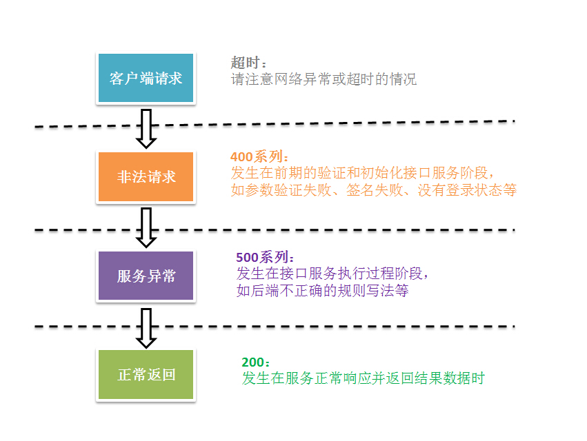
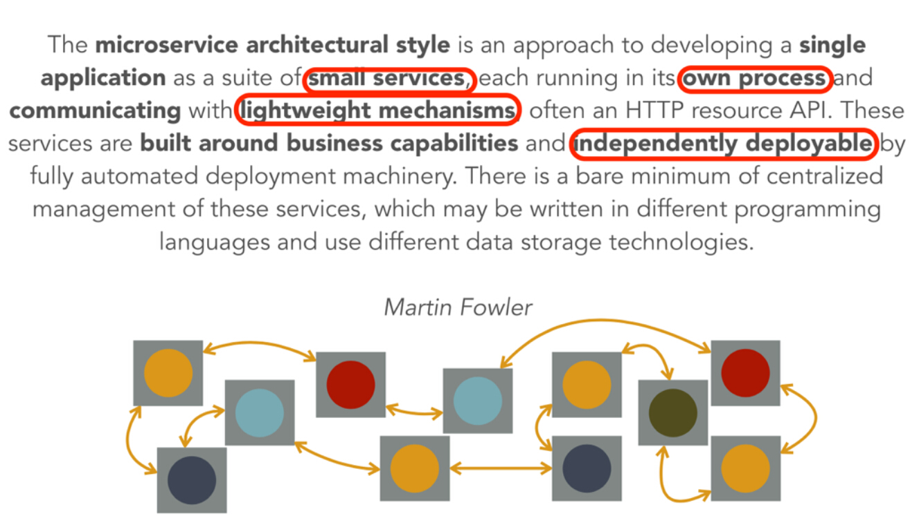
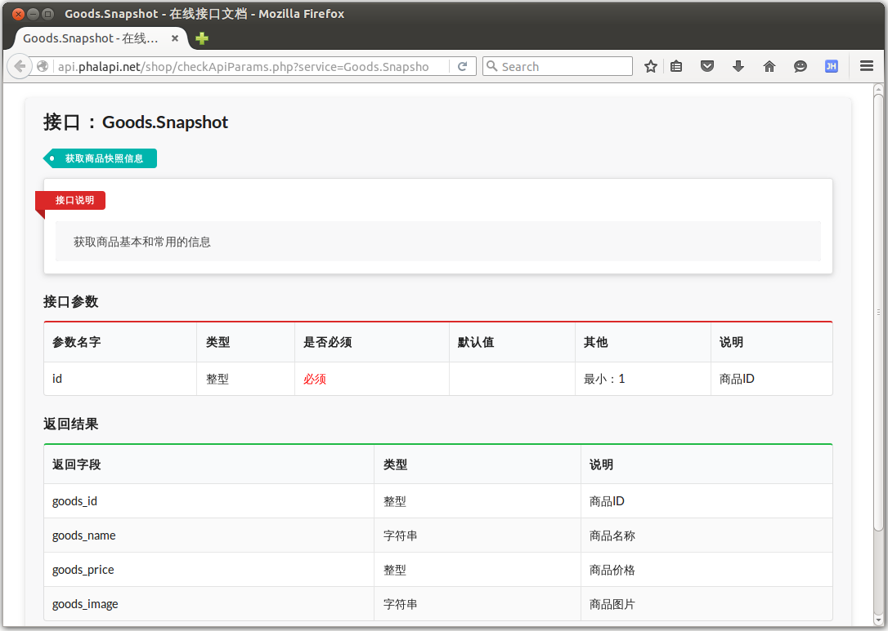

# 第2章 基础入门  

__表达，从简单开始。——Robin Williams《写给大家看的设计书》__  
  
娴熟的技艺离不开过硬扎实的基础。这一章，我们将开始学习PhalApi框架中的基础内容，包括作为客户端如何请求接口服务，作为服务端如何返回接口结果，ADM模式的含义和依赖关系，以及其他常用的基础功能。为避免内容空洞，我们会尽量结合前面的商城项目示例，进行基础内容的讲解。读者可以在边学习的过程中，边实践操作，加深理解。  

在每个小节中，我们会先学习一些基本的使用，以便能满足普遍项目开发的技术需要。对于容易误解、容易出错的地方，我们会进行温馨提示，列出注意事项以及提供正确的解决方案。在每个小节的最后，我们还会再进一步，学习如何扩展项目的能力，定制自己的功能。  

## 2.1 接口请求

PhalApi默认使用的是HTTP/HTTPS协议进行通讯，请求接口的完整URL格式则是：  
```
接口域名 + 入口路径 + ?service=Class.Action + [接口参数]
```
其中有应该单独部署的接口域名，不同项目各自的入口路径，统一约定的service参数，以及可选的接口参数。下面分别进行说明。  

### 2.1.1 接口服务URI

#### (1) 接口域名

通常，我们建议对于接口服务系统，应该单独部署一个接口域名，而不应与其他传统的Web应用系统或者管理后台混合在一起，以便分开维护。  
  
假设我们已经有一个站点，其域名为：```www.demo.com```，现需要为开发一套接口服务提供给移动App使用。直接在已有站点下添加一个入口以提供服务的做法是不推荐的，即不建议接口URI是：```www.demo.com/api```。推荐的做法是，单独配置部署一个新的接口域名，如：```api.demo.com```。当前，我们也可以发现很多公司都提供了这样独立的接口平台。例如：  

 + 优酷开放平台：https://openapi.youku.com
 + 微信公众号： https://api.weixin.qq.com
 + 新浪微博： https://api.weibo.com
  
如第1章中，我们创建的接口项目，其域名为：```api.phalapi.net```。  

#### (2) 入口路径  
入口路径是相对路径，不同的项目可以使用不同的入口。通常在这里，我们会在部署接口项目时，会把项目对外可访问的根目录设置到```./Public```目录。这里所说的入口路径都是相对这个```./Public```目录而言的。与此同时，默认使用省略```index.php```的路径写法。  
  
为了更好地理解这样的对应关系，以下是一些示例对应关系。  

项目|精简的入口路径|完整的入口路径|入口文件位置|项目源代码位置
---|---|---|---|---
默认的演示项目|/demo|/Public/demo/index.php|./Public/demo/index.php|./Demo
新建的商城项目|/shop|/Public/shop/index.php|./Public/shop/index.php|./Shop

表2-1 入口路径示例对应关系

如框架自带的演示项目，其目录是：```./Public/demo```，对应的访问入口路径是：```api.phalapi.net/demo```；而新建的商城Shop项目的目录是：```./Public/shop```，则入口路径是：```api.phalapi.net/shop```。  

这个入口路径是可选的，也可以直接使用根目录。如果是这样，则需要调整```./Public/index.php```目录，并且不便于多项目并存的情况。    

#### (3) 指定接口服务
在PhalApi中，我们统一约定使用```service```参数来指定所请求的接口服务。通常情况下，此参数使用GET方式传递，即使用```$_GET['service']```，其格式为：```?service=Class.Action```。其中```Class```是对应请求的接口剔除Api_前缀后的类名，```Action```则是待执行的接口类中的方法名。

> 温馨提示：未指定service参数时，默认使用```?service=Default.Index```。  
  
如请求默认的接口服务可用```?service=Default.Index```，则相应会调用```Api_Default::Index()```这一接口服务；若请求的是```?service=Welcome.Say```，则会调用```Api_Welcome::Say```这一接口服务。  
  
以下是一些示例。  

 + 请求默认接口服务，省略service
```
http://api.phalapi.net/shop/  
```

 + 等效于请求默认接口服务
```
http://api.phalapi.net/shop/?service=Default.Index  
```
  
 + 请求Hello World接口服务
```
http://api.phalapi.net/shop/?service=Welcome.Say
```

#### (4) 接口参数  
接口参数是可选的，根据不同的接口服务所约定的参数进行传递。可以是GET参数，POST参数，或者多媒体数据。未定制的情况下，PhalApi既支持GET参数又支持POST参数。   

如使用GET方式传递username参数：
```
$ curl "http://api.phalapi.net/shop/?service=Default.Index&username=dogstar"
```
也可以用POST方式传递username参数：
```
$ curl -d "username=dogstar" "http://api.phalapi.net/shop/?service=Default.Index"
```

至此，我们已经基本了解如何对接口服务发起请求。接下来，让我们来看下对于接口服务至关重要的要素 —— 接口参数。    

### 2.1.2 参数规则
接口参数，对于接口服务本身来说，是非常重要的。对于外部调用的客户端来说，同等重要。对于接口参数，我们希望能够既减轻后台开发对接口参数获取、判断、验证、文档编写的痛苦；又能方便客户端快速调用，明确参数的意义。由此，我们引入了**参数规则**这一概念，即：通过配置参数的规则，自动实现对参数的获取和验证，同时自动生成在线接口文档。  
  
参数规则是针对各个接口服务而配置的多维规则数组，由```PhalApi_Api::getRules()```方法返回。其中，参数规则数组的一维下标是接口类的方法名，对应接口服务的Action；二维下标是类属性名称，对应在服务端获取通过验证和转换化的最终客户端参数；三维下标```name```是接口参数名称，对应外部客户端请求时需要提供的参数名称。即：  
```
    public function getRules() {
        return array(
            '接口类方法名' => array(
                '接口类属性' => array('name' => '接口参数名称', ... ... ),
            ),
        );
    }
```  

通常情况下，接口类属性和接口参数名称一样，但也可以不一样。一种情况是客户端的接口参数名称惯用下划线分割，即蛇形(下划线)命名法，而服务端中则惯用驼峰命名法。例如对于“是否记住我”，客户端参数用```is_remember_me```，服务端用```isRememberMe```。另一种情况是如果参数名称较长，为了节省移动网络下的流量，也可以针对客户端参数使用有意义的缩写。如前面的“是否记住我”客户端缩写成```is_rem_me```。   
  
在参数规则里，可以配置多个接口类方法名，每个方法名的规则，又可以配置多个接口类属性，即有多个接口参数。  
  
配置好参数规则后，当接口参数通过验证后，就可以在接口类方法内，通过类成员属性获取相应的接口参数。  

#### (1) 一个简单的示例
假设我们现在需要提供一个用户登录的接口，接口参数有用户名和密码，那么新增的接口类和规则如下：  
```
// $ vim ./Shop/Api/User.php
<?php

class Api_User extends PhalApi_Api {

    public function getRules() {
        return array(
            'login' => array(
                'username' => array('name' => 'username'),
                'password' => array('name' => 'password'),
            ),
        );
    }

    public function login() {
        return array('username' => $this->username, 'password' => $this->password);
    }                               
}
```

当我们请求此接口服务，并类似这样带上username和password参数时：  
```
http://api.phalapi.net/shop/?service=User.Login&username=dogstar&password=123456
```
就可以得到这样的返回结果。  
```
{"ret":0,"data":{"username":"dogstar","password":"123456"},"msg":""}
```

这是因为，在接口实现类里面```getRules()```成员方法配置参数规则后，便可以通过类属性的方式，根据配置指定的名称获取对应的接口参数，如这里的：```$this->username```和```$this->password```。  

#### (2) 更完善的示例
在实际项目开发中，我们需要对接口参数有更细致的规定，如是否必须、长度范围、最值和默认值等。 

继续上面的业务场景，用户登录接口服务的用户名参数和密码参数皆为必须，且密码长度至少为6个字符，则可以参数规则调整为：  
```
'login' => array(
   'username' => array('name' => 'username', 'require' => true),
   'password' => array('name' => 'password', 'require' => true, 'min' => 6),
),
```
配置好后，如果不带任何参数再次请求```?service=User.Login```，就会被视为非法请求，并得到这样的错误提示：  
```
{
    "ret": 400,
    "data": [],
    "msg": "非法请求：缺少必要参数username"
}
```
如果传递的密码长度不对，也会得到一个错误的返回。  
> 温馨提示：当接口参数非法时，返回的ret都为400，且data为空。在这一章节中，当再次非法返回时，将省略ret与data，以节省篇幅。

#### (3) 三级参数规则配置
参数规则主要有三种，分别是：系统参数规则、应用参数规则、接口参数规则。  

系统参数是指被框架保留使用的参数。目前已被PhalApi占用的系统参数只有一个，即：service参数。类型为字符串，格式为：Class.Action，首字母不区分大小写，建议统一以大写开头。  

以下是一些示例： 

 + 推荐写法，类名和方法名开头大写
```
?service=User.Login
```

 + 正确写法，类名和方法名开头都小写，或方法名全部小写
```
?service=user.login
?service=user.getbaseinfo
```

 + 错误写法，缺少方法名、缺少点号分割、使用竖线而非点号分割
```
?service=User
?service=UserLogin
?service=User|GetBaseInfo
```

> 温馨提示：service参数中的类名只能开头小写，否则会导致linux系统下类文件加载失败。 

应用参数是指在一个接口系统中，全部项目的全部接口都需要的参数，或者通用的参数。假如我们的商城接口系统中全部的接口服务都需要必须的签名sign参数，以及非必须的版本号，则可以在```./Config/app.php```中的```apiCommonRules```进行应用参数规则的配置：  
```
//$vim ./Config/app.php
<?php
return array(
    /**
     * 应用接口层的统一参数
     */
    'apiCommonRules' => array(
        //签名
        'sign' => array(
            'name' => 'sign', 'require' => true,
        ),
        //客户端App版本号，默认为：1.4.0
        'version' => array(
            'name' => 'version', 'default' => '1.4.0', 
        ),
    ),

    ... ...
```
其配置格式和前面所说的接口参数规则配置类似，都是一个规则数组。区别是这里是二维数组，相当于全部方法的公共的接口类属性。    

接口参数是指各个具体的接口服务所需要的参数，为特定的接口服务所持有，独立配置。并且进一步在内部又细分为两种：  

 + **通用接口参数规则**：使用```*```作为下标，对当前接口类全部的方法有效。  
 + **指定接口参数规则**：使用方法名作为下标，只对接口类的特定某个方法有效。  


例如为了加强安全性，需要为全部的用户接口服务都加上长度为4位的验证码参数：  
```
    public function getRules() {
        return array(
            '*' => array(
                'code' => array('name' => 'code', 'require' => true, 'min' => 4, 'max' => 4),
            ),
            'login' => array(
                'username' => array('name' => 'username', 'require' => true),
                'password' => array('name' => 'password', 'require' => true, 'min' => 6),
            ),
        );
    }
```
现在，当再次请求用户登录接口，除了要提供用户名和密码外，我们还要提供验证码code参数。并且，对于Api_User类的其他方法也一样。  

#### (4) 多个参数规则时的优先级
当同一个参数规则分别在应用参数、通用接口参数及指定接口参数出现时，后面的规则会覆盖前面的，即具体化的规则会替换通用的规则，以保证接口参数满足特定场合的定制要求。  

简而言之，多个参数规则的优先级从高到下，分别是（正如你想到的那样）： 
  
 + 1、指定接口参数规则
 + 2、通用接口参数规则
 + 3、应用参数规则
 + 4、系统参数规则（通常忽略，当前只有service）

#### (5) 参数规则配置
具体的参数规则，根据不同的类型有不同的配置选项，以及一些公共的配置选项。目前，主要的类型有：字符串、整数、浮点数、布尔值、时间戳/日期、数组、枚举类型、文件上传和回调函数。    

类型 type|参数名称 name|是否必须 require|默认值 default|最小值 min，最大值 max|更多配置选项（无特殊说明，均为可选）
---|---|---|---|---|---
字符串|string|TRUE/FALSE，默认FALSE|应为字符串|可选|regex选项用于配置正则匹配的规则；format选项用于定义字符编码的类型，如utf8、gbk、gb2312等
整数|int|TRUE/FALSE，默认FALSE|应为整数|可选|---
浮点数|float|TRUE/FALSE，默认FALSE|应为浮点数|可选|---
布尔值|boolean|TRUE/FALSE，默认FALSE|true/false|---|以下值会转换为TRUE：ok，true，success，on，yes，1，以及其他PHP作为TRUE的值
时间戳/日期|date|TRUE/FALSE，默认FALSE|日期字符串|可选，仅当为format配置为timestamp时才判断，且最值应为时间戳|format选项用于配置格式，为timestamp时会将字符串的日期转换为时间戳
数组|array|TRUE/FALSE，默认FALSE|字符串或者数组，为非数组会自动转换/解析成数组|可选，判断数组元素个数|format选项用于配置数组和格式，为explode时根据separator选项将字符串分割成数组, 为json时进行JSON解析
枚举|enum|TRUE/FALSE，默认FALSE|应为range选项中的某个元素|---|必须的range选项，为一数组，用于指定枚举的集合
文件|file|TRUE/FALSE，默认FALSE|数组类型|可选，用于表示文件大小范围，单位为B|range选项用于指定可允许上传的文件类型；ext选项用于表示需要过滤的文件扩展名
回调|callable/callback|TRUE/FALSE，默认FALSE|---|---|callable/callback选项用于设置回调函数，params选项为回调函数的第三个参数（另外第一个为参数值，第二个为所配置的规则）  

表2-2 参数规则选项一览表  

##### 公共配置选项

公共的配置选项，除了上面的类型、参数名称、是否必须、默认值，还有说明描述、数据来源。下面分别简单说明。  
 
 + **类型 type**  
 用于指定参数的类型，可以是string、int、float、boolean、date、array、enum、file、callable，或者自定义的类型。未指定时，默认为字符串。  
  
 + **参数名称 name**  
 接口参数名称，即客户端需要传递的参数名称。与PHP变量规则一样，以下划线或字母开头。此选项必须提供，否则会提示错误。   
  
 + **是否必须require**  
 为TRUE时，表示此参数为必须值；为FALSE时，表示此参数为可选。未指定时，默认为FALSE。  
  
 + **默认值 default**  
 未提供接口参数时的默认值。未指定时，默认为NULL。  
  
 + **最小值 min，最大值 max**  
 部分类型适用。用于指定接口参数的范围，比较时采用的是闭区间，即范围应该为：[min, max]。也可以只使用min或max，若只配置了min，则表示：[min, +∞)；若只配置了maz，则表示：(-∞, max]。   

 + **说明描述 desc**  
 用于自动生成在线接口详情文档，对参数的含义和要求进行扼要说明。未指定时，默认为空字符串。  
  
 + **数据来源 source**  
 指定当前单个参数的数据来源，可以是post、get、cookie、server、request、header、或其他自定义来源。未指定时，默认为统一数据源。目前支持的source与对应的数据源映射关系如下：  

source|对应的数据源  
---|---
post     | $_POST              
get      | $_GET               
cookie   | $_COOKIE            
server   | $_SERVER            
request  | $_REQUEST           
header   | $_SERVER['HTTP_X']  

表2-3 source与对应的数据源映射关系  
  
通过source参数可以轻松、更自由获取不同来源的参数。以下是一些常用的配置示例。  
```
// 获取HTTP请求方法，判断是POST还是GET
'method' => array('name' => 'REQUEST_METHOD', 'source' => 'server'),

// 获取COOKIE中的标识
'is_new_user' => array('name' => 'is_new_user', 'source' => 'cookie'),

// 获取HTTP头部中的编码，判断是否为utf-8
'charset' => array('name' => 'Accept-Charset', 'source' => 'header'),
```

若配置的source为无效或非法时，则会抛出异常。如配置了```'source' => 'NOT_FOUND'```，会得到：     
```
"msg": "服务器运行错误: 参数规则中未知的数据源：NOT_FOUND"
```

##### 9种参数类型

对于各种参数类型，结合示例说明如下。  

 + **字符串 string**  

当一个参数规则未指定类型时，默认为string。如最简单的：  
```
array('name' => 'username')
```
> 温馨提示：这一小节的参数规则配置示例，都省略了类属性，以关注配置本身的内容。  

这样就配置了一个参数规则，接口参数名字叫username，类型为字符串。  

一个完整的写法可以为：
```
array('name' => 'username', 'type' => 'string', 'require' => true, 'default' => 'nobody', 'min' => 1, 'max' => 10)
```
这里指定了为必选参数，默认值为nobody，且最小长度为1个字符，最大长度为10个字符，若传递的参数长度过长，如```&username=alonglonglonglongname```，则会异常失败返回：
```
"msg": "非法请求：username.len应该小于等于10, 但现在username.len = 21"
```
  

当需要验证的是中文的话，由于一个中文字符会占用3个字节。所以在min和max验证的时候会出现一些问题。为此，PhalApi提供了format配置选项，用于指定字符集。如：  

```
array('name' => 'username', 'type' => 'string', 'format' => 'utf8', 'min' => 1, 'max' => 10)
```
  
我们还可以使用```regex```下标来进行正则表达式的验证，一个邮箱的例子是：  
```
array('name' => 'email', 'regex' => "/^([0-9A-Za-z\\-_\\.]+)@([0-9a-z]+\\.[a-z]{2,3}(\\.[a-z]{2})?)$/i")
```

 + **整型 int**  

整型即自然数，包括正数、0和负数。如通常数据库中的id，即可配置成：  
```
array('name' => 'id', 'type' => 'int', 'require' => true, 'min' => 1)
```

当传递的参数，不在其配置的范围内时，如```&id=0```，则会异常失败返回：
```
"msg": "非法请求：id应该大于或等于1, 但现在id = 0"
```

另外，对于常见的分页参数，可以这样配置：  
```
array('name' => 'page_num', 'type' => 'int', 'min' => 1, 'max' => 20, 'default' => 20)
```
即每页数量最小1个，最大20个，默认20个。  


 + **浮点 float**  

浮点型，类似整型的配置，此处略。 

 + **布尔值 boolean**  

布尔值，主要是可以对一些字符串转换成布尔值，如ok，true，success，on，yes，以及会被PHP解析成true的字符串，都会转换成TRUE。如通常的“是否记住我”参数，可配置成：
```
array('name' => 'is_remember_me', 'type' => 'boolean', 'default' => TRUE)
```
  
则以下参数，最终服务端会作为TRUE接收。  
```
?is_remember_me=ok
?is_remember_me=true
?is_remember_me=success
?is_remember_me=on
?is_remember_me=yes
?is_remember_me=1
```

 + **日期 date**  

日期可以按自己约定的格式传递，默认是作为字符串，此时不支持范围检测。例如配置注册时间：
```
array('name' => 'register_date', 'type' => 'date')
```
对应地，```register_date=2015-01-31 10:00:00```则会被获取到为："2015-01-31 10:00:00"。
  
当需要将字符串的日期转换成时间戳时，可追加配置选项```'format' => 'timestamp'```，则配置成：
```
array('name' => 'register_date', 'type' => 'date', 'format' => 'timestamp')
```
则上面的参数再请求时，则会被转换成：1422669600。  

此时作为时间戳，还可以添加范围检测，如限制时间范围在31号当天：  
```
array('name' => 'register_date', 'type' => 'date', 'format' => 'timestamp', 'min' =>  1422633600, 'max' => 1422719999)
```

当配置的最小值或最大值为字符串的日期时，会自动先转换成时间戳再进行检测比较。如可以配置成：  
```
array('name' => 'register_date', ... ... 'min' => '2015-01-31 00:00:00', 'max' => '2015-01-31 23:59:59')
```

 + **数组 array**  

很多时候在接口进行批量获取时，都需要提供一组参数，如多个ID，多个选项。这时可以使用数组来进行配置。如：  
```
array('name' => 'uids', 'type' => 'array', 'format' => 'explode', 'separator' => ',')
```

这时接口参数```&uids=1,2,3```则会被转换成：  
```
array ( 0 => '1', 1 => '2', 2 => '3', )
```

如果设置了默认值，那么默认值会从字符串，根据相应的format格式进行自动转换。如：  
```
array( ... ... 'default' => '4,5,6')
```
那么在未传参数的情况下，自动会得到：  
```
array ( 0 => '4', 1 => '5', 2 => '6', )
```

又如接口需要使用JSON来传递整块参数时，可以这样配置：
```
array('name' => 'params', 'type' => 'array', 'format' => 'json')
```
对应地，接口参数```&params={"username":"test","password":"123456"}```则会被转换成：
```
array ( 'username' => 'test', 'password' => '123456', )
```
> 温馨提示：使用JSON传递参数时，建议使用POST方式传递。若使用GET方式，须注意参数长度不应超过浏览器最大限制长度，以及URL编码问。  

若使用JSON格式时，设置了默认值为：  
```
array( ... ... 'default' => '{"username":"dogstar","password":"xxxxxx"}')
```
那么在未传参数的情况下，会得到转换后的：  
```
array ( 'username' => 'dogstar', 'password' => 'xxxxxx', )
```

特别地，当配置成了数组却未指定格式format时，接口参数会转换成只有一个元素的数组，如接口参数：```&name=test```，会转换成：
```
array ( 0 => 'test' )
```


 + **枚举 enum**  

在需要对接口参数进行范围限制时，可以使用此枚举型。如对于性别的参数，可以这样配置：
```
array('name' => 'sex', 'type' => 'enum', 'range' => array('female', 'male'))
```
当传递的参数不合法时，如```&sex=unknow```，则会被拦截，返回失败：
```
"msg": "非法请求：参数sex应该为：female/male，但现在sex = unknow"
```
  
关于枚举类型的配置，这里需要特别注意配置时，应尽量使用字符串的值。  
因为通常而言，接口通过GET/POST方式获取到的参数都是字符串的，而如果配置规则时指定范围用了整型，会导致底层规则验证时误判。例如接口参数为```&type=N```，而接口参数规则为：  
```
array('name' => 'type', 'type' => 'enum', 'range' => array(0, 1, 2))
```
则会出现以下这样的误判：  
```  
var_dump(in_array('N', array(0, 1, 2))); // 结果为true，因为 'N' == 0
```  
  
为了避免这类情况发生，应该使用使用字符串配置范围值，即可这样配置：  
```
array('name' => '&type', 'type' => 'enum', 'range' => array(`0`, `1`, `2`))
```
  
 + **文件 file**  

在需要对上传的文件进行过滤、接收和处理时，可以使用文件类型，如：
```
array(
    'name' => 'upfile', 
    'type' => 'file', 
    'min' => 0, 
    'max' => 1024 * 1024, 
    'range' => array('image/jpeg', 'image/png') , 
    'ext' => array('jpeg', 'png')
)
```
其中，min和max分别对应文件大小的范围，单位为字节；range为允许的文件类型，使用数组配置，且不区分大小写。 
  
如果成功，返回的值对应的是```$_FILES["upfile"]```，即会返回：
```
array(
     'name' => ..., // 被上传文件的名称
     'type' => ..., // 被上传文件的类型
     'size' => ..., // 被上传文件的大小，以字节计
     'tmp_name' => ..., // 存储在服务器的文件的临时副本的名称
)
```
对应的是：  
 + $_FILES["upfile"]["name"] - 被上传文件的名称
 + $_FILES["upfile"]["type"] - 被上传文件的类型
 + $_FILES["upfile"]["size"] - 被上传文件的大小，以字节计
 + $_FILES["upfile"]["tmp_name"] - 存储在服务器的文件的临时副本的名称
 + $_FILES["upfile"]["error"] - 由文件上传导致的错误代码
  
> 参考：以上内容来自W3School，文件上传时请使用表单上传，并enctype 属性使用"multipart/form-data"。更多请参考[PHP 文件上传](http://www.w3school.com.cn/php/php_file_upload.asp)。  

若需要配置默认值default选项，则也应为一数组，且其格式应类似如上。

其中，ext是对文件后缀名进行验证，当如果上传文件后缀名不匹配时将抛出异常。文件扩展名的过滤可以类似这样进行配置：

+ 单个后缀名 - 数组形式  
```
'ext' => array('jpg')
```

 + 单个后缀名 - 字符串形式  
```
'ext' => 'jpg'
```

 + 多个后缀名 - 数组形式  
```
'ext' => array('jpg', 'jpeg', 'png', 'bmp')
```

 + 多个后缀名 - 字符串形式（以英文逗号分割）  

```
'ext' => 'jpg,jpeg,png,bmp' 
```

  
 + **回调 callable/callback**  

当需要利用已有函数进行自定义验证时，可采用回调参数规则，如配置规则：  

```
array('name' => 'version', 'type' => 'callable', 'callback' => 'Common_Request_Version::formatVersion')
```
然后，回调时将调用下面这个新增的类函数：
```
// $ vim ./Shop/Common/Request/Version.php
<?php
class Common_Request_Version {

    public static function formatVersion($value, $rule) {
        if (count(explode('.', $value)) < 3) {
            throw new PhalApi_Exception_BadRequest('版本号格式错误');
        }
        return $value;
    }
}
```

> 温馨提示：回调函数的签名为：```function format($value, $rule, $params)```，第一个为参数原始值，第二个为所配置的规则，第三个可选参数为配置规则中的params选项。最后应返回转换后的参数值。  
  
还记得我们前面刚学的三级参数规则吗？虽然在应用参数配置中已配置公共version参数规则，但我们可以在具体的接口类中重新配置这个规则。把在Hello World接口中把这个版本参数类型修改成此自定义回调类型。即：  
```
// $ vim ./Shop/Api/Welcome.php     
class Api_Welcome extends PhalApi_Api {

    public function getRules() {
        return array(
            'say' => array(
                'version' => array('name' => 'version', 'type' => 'callable', 'callback' => 'Common_Request_Version::formatVersion'),
            )
        );
    }
... ...
```
修改好后，便可使用此自定义的回调处理了。当正常传递合法version参数，如请求```/shop/welcome/say?version=1.2.3```，可以正常响应。若故意传递非法的version参数，如请求```/shop/welcome/say?version=123```，则会提示这样的错误：  
```
"msg": "非法请求：版本号格式错误"
```
  
由于自 PHP 5.4 起可用callable类型指定回调类型callback。所以，为了减轻记忆的负担，这里使用callable或者callback来表示类型都可以，即可以配置成：```'type' => 'callable',```，也可以配置成：```'type' => 'callback',```。回调函数的选项也一样。  

  
以下是来自PHP官网的一些回调函数的示例：  
```
// Type 1: Simple callback
call_user_func('my_callback_function'); 

// Type 2: Static class method call
call_user_func(array('MyClass', 'myCallbackMethod')); 

// Type 3: Object method call
$obj = new MyClass();
call_user_func(array($obj, 'myCallbackMethod'));

// Type 4: Static class method call (As of PHP 5.2.3)
call_user_func('MyClass::myCallbackMethod');
```
> 参考：更多请参考[Callback / Callable 类型](http://php.net/manual/zh/language.types.callable.php)。  

所以上面的callback也可以配置成：  
```
'callback' => array('Common_Request_Version', 'formatVersion')
```


### 2.2.3 过滤器与签名验证

#### (1) 如何开启过滤器进行签名验证？  
当需要开启过滤器，只需要注册```DI()->filter```即可。在初始化文件init.php中去掉以下注释便可启用默认的签名验证服务。  
```
// $ vim ./Public/init.php
// 签名验证服务
DI()->filter = 'PhalApi_Filter_SimpleMD5';
```
这里的过滤器是指PhalApi在具体接口服务前所执行的过程，主要用于签名验证或实现其他预加载处理的功能。  

### (2) 默认的签名方案
PhalApi提供了一个默认签名验证方案，主要是基于md5的签名生成。这个只是作为一般性的参考，在实际项目开发中，我们应该在此基础上进行调整延伸。  
  
其默认验签的算法如下：   

 + 1、排除签名参数（默认是sign）
 + 2、将剩下的全部参数，按参数名字进行字典排序
 + 3、将排序好的参数，全部用字符串拼接起来
 + 4、进行md5运算
 + 5、追加签名参数  

如前面我们看到的，除了配置公共参数规则version外，我们还配置了公共参数规则sign。此sign参数则主要用于这里的签名验证。下面是一个具体的例子。  

假设请求的接口服务链接是：  
```
/shop/?service=Welcome.Say&version=1.2.3
```
 
则会按以下方式生成并验证签名。  

 + 1、排除签名参数（默认是sign）
```
?service=Welcome.Say&version=1.2.3
```

 + 2、将剩下的全部参数，按参数名字进行字典排序
```
service=Welcome.Say
version=1.2.3
```

 + 3、将排序好的参数，全部用字符串拼接起来
```
"Welcome.Say1.2.3" = "Welcome.Say" + "1.2.3"
```

 + 4、进行md5运算
```
35321cc43cfc1e4008bf6f1bf = md5("Welcome.Say1.2.3")
```

 + 5、追加签名参数   
```
?service=Default.Index&username=dogstar&sign=35321cc43cfc1e4008bf6f1bf
```

开启默认签名后，需要按以上算法生成签名sign，并且在每次请求接口服务时加上此参数。在缺少签名或者签名错误情况下，会提示类似以下的错误。  
```
{
    "ret": 406,
    "data": [],
    "msg": "非法请求：签名错误"
}
```

#### (3) 接口服务白名单配置
细心的读者会发现，对于默认的接口服务Default.Index是不需要进行签名验证的，这是因为在接口服务白名单中进行了配置。对于配置了白名单的接口服务，将不会触发过滤器的调用。  

接口服务白名单配置是：```app.service_whitelist```，即配置文件```./Config/app.php```里面的```service_whitelist```配置，其默认值是：  
```
    'service_whitelist' => array(
        'Default.Index',
    ),
```
配置的格式有以下四种。  

类型|配置格式|匹配规则|示例及说明  
---|---|---|---  
全部|```*.*```|匹配全部接口服务（慎用！）|如果配置了此规则，即全部的接口服务都不触发过滤器。  
方法通配|```Default.*```|匹配某个类的任何方法|即Api_Default接口类的全部方法  
类通配|```*.Index```|匹配全部接口类的某个方法|即全部接口类的Index方法  
具体匹配|```Default.Index```|匹配指定某个接口服务|即Api_Default::Index()  
  
表2-4 接口服务白名单匹配类型

如果有多个生效的规则，按短路判断原则，即有任何一个白名单规则匹配后就跳过验证，不触发过滤器。  
  
以下是更多的示例：  
```
    'service_whitelist' => array(
        '*.Index',           // 全部的Index方法
        'Test.*',            // Api_Test的全部方法
        'User.GetBaseInfo',  // Api_User::GetBaseInfo()方法
    ),
```
配置好上面的白名单后，以下这些接口服务全部不会触发过滤器：  
```
// 全部的Index方法
?service=Default.Index
?service=User.Index

// Api_Test的全部方法
?service=Test.DoSth
?service=Test.Hello
?service=Test.GOGOGO

// Api_User::GetBaseInfo()方法
?service=User.GetBaseInfo
```

### 2.2.4 扩展你的项目

#### (1) 如何定制接口服务的传递方式？
虽然我们约定统一使用```?service=Class.Action```的格式来传递接口服务名称，但如果项目有需要，也可以采用其他方式来传递。例如使用斜杠而非点号进行分割：```?service=Class/Action```，再进一步，使用r参数，即最终接口服务的参数格式为：```?r=Class/Action```。  

如果需要采用其他传递接口服务名称的方式，则可以重载```PhalApi_Request::getService()```方法。以下是针对改用斜杠分割、并换用r参数名字的实现示例：  
```
// $ vim ./Shop/Common/Request/Ch1.php
<?php

class Common_Request_Ch1 extends PhalApi_Request {

    public function getService() {
        // 优先返回自定义格式的接口服务名称
        $servcie = $this->get('r');
        if (!empty($servcie)) {
            return str_replace('/', '.', $servcie);
        }

        return parent::getService();
    }
}
```

实现好自定义的请求类后，需要在项目的入口文件```./Public/shop/index.php```进行注册。  
```
// $ vim ./Public/shop/index.php
//装载你的接口
DI()->loader->addDirs('Shop');

DI()->request = new Common_Request_Ch1();
```

这样，除了原来的请求方式，还可以这样请求接口服务。  


原来的方式|现在的方式
---|---
/shop/?service=Default.Index|?r=Default/Index   
/shop/?service=Welcome.Say|?r=Welcome/Say   

表2-5 使用?r=Class/Action格式定制后的方式

这里有几个注意事项： 

 + 1、重载后的方法需要转换为原始的接口服务格式，即：Class.Action  
 + 2、为保持兼容性，子类需兼容父类的实现。即在取不到自定义的接口服务名称参数时，应该返回原来的接口服务。  

除了在框架编写代码实现其他接口服务的传递方式外，还可以通过Web服务器的规则Rewirte来实现。假设使用的是Nginx服务器，那么可以添加以下Rewrite配置。  
```
    if ( !-f $request_filename )
    {
        rewrite ^/shop/(.*)/(.*) /shop/?service=$1.$2;
    }
```
重启Nginx后，便可得到以下这样的效果。  

原来的方式|现在的方式
---|---
/shop/?service=Default.Index|/shop/default/index   
/shop/?service=Welcome.Say|/shop/welcome/say  
  
表2-6 使用Nginx服务器Rewrite规则定制后的方式

此外，还有第三种指定传递方式的方案。使用第三方路由规则类库，然后通过简单的项目配置，从而实现更复杂、更丰富的规则定制。这部分后面会再进行讨论。  

小结一下，不管是哪种定制方式，最终都是转换为框架最初约定的方式，即：```?service=Class.Action```。  

#### (2) 更自由的数据源
何为数据源？这里说的数据源是指PhalApi从客户端接收参数的来源，主要分为三种：主数据源、备用数据源、其他数据源。下面分别对这三种数据源进行介绍，以及如何扩展定制。  

 + **如何指定主数据源？**  

主数据源是指作为默认接口参数来源的数据源，即在配置了接口参数规则后，PhalApi会比主数据源提取相应的参数从而进行验证、检测和转换等。默认情况下，使用$_REQUEST作为主数据源，即同时支持$_GET和$_POST参数。但在其他场景如单元测试，或者使用非HTTP/HTTPS协议时，则需要定制主数据源，以便切换到其他的途径。  

指定主数据源有两种方式，一种是简单地在初始化DI()->request请求服务时通过PhalApi_Request的构造函数参数来指定。例如，假设要强制全部参数使用POST方式，那么可以：  
```
//vim ./Public/index.php
DI()->request = new PhalApi_Request($_POST); 
```

又或者，在单元测试中，我们经常看到这样的使用场景：  
```
// 模拟测试数据
$data = array(...);
DI()->request = new PhalApi_Request($data);
```
这样，就可以很方便模拟构造一个接口服务请求的上下文环境，便于模拟进行请求。  


另一种方式是稍微复杂一点的，是为了应对更复杂的业务场景，例如出于安全性考虑需要对客户端的数据包进行解密。这时需要重载并实现```PhalApi_Request::genData($data)```方法。其中参数```$data```即上面的构造函数参数，未指定时为NULL。    

假设，我们现在需要把全部的参数base64编码序列化后通过$_POST['data']来传递，则相应的解析代码如下。首先，先定义自己的扩展请求类，在里面完成对称解析的动作：  
```
<?php
class Common_Request_Base64Data extends PhalApi_Request {

    public function genData($data) {
        if (!isset($data) || !is_array($data)) {
            $data = $_POST; //改成只接收POST
        }

        return isset($data['data']) ? base64_decode($data['data']) : array();
    }
}
```
接着在./Public/shop/index.php项目入口文件中重新注册请求类，即添加以下代码。  
```
//重新注册request
DI()->request = 'Common_Request_Base64Data'; 
```

然后，就可以轻松实现了接口参数的对称加密传送。至此，便可完成定制工作。  

 + **如何定制备用数据源？**  

备用数据源比较多，在前面介绍参数规则时已经提及和介绍，可以是：$_POST、$_GET、$_COOKIE、$_SERVER、$_REQUEST、HTTP头部信息。当某个接口参数需要使用非主数据源的备用数据源时，便可以使用source选项进行配置。  

备用数据源与PhalApi_Request类成员属性的映射关系为：  

类成员属性|对应的数据源  
---|---
$this->post     | $_POST              
$this->get      | $_GET   
$this->request  | $_REQUEST           
$this->header   | $_SERVER['HTTP_X']              
$this->cookie   | $_COOKIE                   

表2-6 备用数据源与PhalApi_Request类成员属性的映射关系  
  
当需要对这些备用数据源进行定制时，可以重载并实现PhalApi_Request类的构造函数，在完成对父类的初始化后，再补充具体的初始化过程。如对于需要使用post_raw数据作为POST数据的情况，可以：  
```
<?php
class My_Request_PostRaw extends PhalApi_Request{
    public function __construct($data = NULL) {
        parent::__construct($data);

        $this->post = json_decode(file_get_contents('php://input'), TRUE);    
    }  
}
```
以此类推，还可以定制```$this->get```，```$this->request```等其他备用数据源，比如进行一些前置的XSS过滤。  

最后，在接口参数规则配置时，便可使用source配置来定制后的备用数据源。如指定用户在登录时，用户名使用$_GET、密码使用$_POST。  
```
public function getRules() {
    return array(
        'login' => array(
            'username' => array('name' => 'username', 'source' => 'get'),
            'password' => array('name' => 'password', 'source' => 'post'),
        ),  
    );
}
```
这样，PhalApi框架就会从$_GET中提取```username```参数，从$_POST中提取```password```参数。

 + **如何扩展其他数据源？**  

其他数据源是除了上面的主数据源和备用数据源以外的数据源。当需要使用其他途径的数据源时，可进行扩展支持。  

若需要扩展项目自定义的映射关系，则可以重载```PhalApi_Request::getDataBySource($source)```方法，如：  
```
// $ vim ./Shop/Common/Request/Stream.php
<?php
class My_Request_Stream extends PhalApi_Request {

    protected function &getDataBySource($source) {
        if (strtoupper($source) == 'stream') {
            // TODO 处理二进制流
        }

        return parent::getDataBySource($source);
    }
}

```
然后，便可在项目中这样配置使用二进制流的数据源。  
```
// 从二进制流中获取密码
'password' => array('name' => 'password', 'source' => 'stream'),
```

#### (3) 添加新的参数类型
当PhalApi提供的参数类型不能满足项目接口参数的规则验证时，除了使用callable回调类型外，还可以扩展PhalApi_Request_Formatter接口来定制项目需要的参数类型。  
  
和前面的定制类似，主要分两步：  
 + 第1步、扩展实现PhalApi_Request_Formatter接口
 + 第2步、在DI注册新的参数类型
  
下面以大家所熟悉的邮件类型为例，说明扩展的步骤。  
  
首先，我们需要一个实现了邮件类型验证的功能类：  
```
// vim ./Shop/Common/Request/Email.php
<?php
class Common_Request_Email implements PhalApi_Request_Formatter {

	public function parse($value, $rule) {
		if (!preg_match('/^(\w)+(\.\w+)*@(\w)+((\.\w+)+)$/', $value)) {
			throw new PhalApi_Exception_BadRequest('邮箱地址格式错误');
		}

		return $value;
	}
}  
```
  
然后，在项目入口文件进行注册。注册时，服务名称格式为：_formatter + 参数类型名称（首字母大写，其他字母小写），即：  
```
// $ vim ./Public/shop/index.php
DI()->_formatterEmail = 'Common_Request_Email';
```
若不想手动注册，希望可以自动注册，扩展的类名格式须为：PhalApi_Request_Formatter_{类型名称}。  

最后，就可以像其他类型那样使用自己定制的参数类型了。新的参数类型为email，即：```'type' => 'email',```。
```
array('name' => 'user_email', 'type' => 'email')
```
   
此外，PhalApi框架已自动注册的格式化服务有：  

参数类型|DI服务名称|说明
---|---|---
string|_formatterString| 字符串格式化服务
int|_formatterInt| 整数格式化服务
float|_formatterFloat| 浮点数格式化服务
boolean|_formatterBoolean| 布尔值格式化服务
date|_formatterDate| 日期格式化服务
array|_formatterArray| 数组格式化服务
enum|_formatterEnum| 枚举格式化服务
file|_formatterFile| 上传文件格式化服务
callable|_formatterCallable| 回调格式化服务
callback|_formatterCallback| 回调格式化服务
 
表2-7 内置参数类型格式化服务

在实现扩展新的参数类型时，不应覆盖已有的格式化服务。  

#### (4) 实现项目专属的签名方案

正如前面所说，项目应该实现自己专属的签名方案，以识别是合法的接口请求。当需要实现签名验证时，只需要简单的两步即可：  


 + 第1步、实现过滤器接口```PhalApi_Filter::check()```
 + 第2步、注册过滤器服务```DI()->filter```

现以大家熟悉的微信公众号开发平台的验签为例，进行说明。  

微信的加密/校验流程如下：  
```
1. 将token、timestamp、nonce三个参数进行字典序排序
2. 将三个参数字符串拼接成一个字符串进行sha1加密
3. 开发者获得加密后的字符串可与signature对比，标识该请求来源于微信
```
> 参考：以上内容摘自[接入指南 - 微信公众平台开发者文档](http://mp.weixin.qq.com/wiki/17/2d4265491f12608cd170a95559800f2d.html)。  

首先，需要实现过滤器接口```PhalApi_Filter::check()```。通常我们约定返回ret = 402时表示验证失败，所以当签名失败时，我们可以返回ret = 402以告知客户端签名不对。根据微信的检验signature的PHP示例代码，我们可以快速实现自定义签名规则，如：
```
//$ vim ./Shop/Common/Request/WeiXinFilter.php
<?php

class Common_Request_WeiXinFilter implements PhalApi_Filter {

    public function check() {
        $signature = DI()->request->get('signature');
        $timestamp = DI()->request->get('timestamp');
        $nonce = DI()->request->get('nonce');

        $token = 'Your Token Here ...'; // TODO
        $tmpArr = array($token, $timestamp, $nonce);
        sort($tmpArr, SORT_STRING);
        $tmpStr = implode($tmpArr);
        $tmpStr = sha1( $tmpStr );

        if ($tmpStr != $signature) {
            throw new PhalApi_Exception_BadRequest('wrong sign', 1);
        }
    }
}

```

随后，我们只需要再简单地注册一下过滤器服务即可，在对应项目的入口文件index.php中添加：  
```
//$ vim ./Public/shop/index.php 
// 微信签名验证服务
DI()->filter = 'Common_Request_WeiXinFilter';
```
  
当我们再次请求接口时，此时的签名方案就会从原来默认的md5加密算法切换到这个新的签名验证方案上。实现的要点是，当签名失败时，抛出401错误码。而异常类PhalApi_Exception_BadRequest表示客户端非法请求，其异常码的基数是400，所以第二个构造函数参数传1即可。  

## 2.2 接口响应

对于接口响应，PhalApi默认使用了HTTP＋JSON。通过HTTP/HTTPS协议进行通讯，返回的结果则使用JSON格式进行传递。正常情况下，当接口服务正常响应时，如前面的Hello World接口，可能看到以下这样的响应头部信息和返回内容。  
```
HTTP/1.1 200 OK
Content-Type: application/json;charset=utf-8
... ...

{"ret":200,"data":"Hello World","msg":""}
```

而当接口项目抛出了未捕捉的异常，或者因PHP语法问题而出现Error时，则没有内容返回，并且得到一个500的响应状态码。类似如下：  
```
HTTP/1.1 500 Internal Server Error
```
若运行环境中PHP的display_errors配置为On时，还是会返回200的，并直接显示错误信息。在生产环境上，则切记需要把display_errors设置为Off。  

下面，我们将重点学习正常响应情况下的响应结构和返回格式，在线调试以及异常情况下如何进行问题排查与定位。  

### 2.2.1 响应结构
继续来回顾一下默认接口服务返回的内容。类似如下：  
```
{
    "ret": 200,
    "data": {
        "title": "Hello World!",
        "content": "PHPer您好，欢迎使用PhalApi！",
        "version": "1.4.0",
        "time": 1492776704
    },
    "msg": ""
}
```
ret字段是返回状态码，200表示成功；data字段是项目提供的业务数据，由接口开发人员定义；msg是异常情况下的错误提示信息。下面分别说之。  

#### (1) 业务数据 data
业务数据data为接口和客户端主要沟通对接的数据部分，可以为任何类型，由接口开发人员定义定义。但为了更好地扩展、向后兼容，建议都使用可扩展的集合形式，而非原生类型。也就是说，应该返回一个数组，而不应返回整型、布尔值、字符串这些基本类型。所以，Hello Wolrd接口服务返回的数据类型是不推荐的，因为返回的是整型。  

业务数据主要是在Api层中返回，即对应接口类的方法的返回结果。如下面的默认接口服务```?service=Default.Index```的实现代码。  
```
// $ vim ./Shop/Api/Default.php
<?php
class Api_Default extends PhalApi_Api {
    ... ...
    public function index() {
        return array(
            'title' => 'Hello World!',
            'content' => T('Hi {name}, welcome to use PhalApi!', array('name' => $this->username)),
            'version' => PHALAPI_VERSION,
            'time' => $_SERVER['REQUEST_TIME'],
        );
    }
```

实际上，具体的业务数据需要一段复杂的处理，以满足特定业务场景下的需要。后面我们会对如何开发接口服务和使用数据库、高效缓存再进行讨论讲解。这里暂且知道接口结果是在Api层返回，对应接口类成员方法返回的结果即可。  

#### (2) 返回状态码 ret
返回状态码ret，用于表示接口响应的情况。参照自HTTP的状态码，ret主要分为三类：正常响应、非法请求、服务器错误。  

分类|ret范围|基数|说明
---|---|---|---
正常响应|200～299|200|表示接口服务正常响应
非法请求|400～499|400|表示客户端请求非法
服务器错误|500～599|500|表示服务器内容错误

表2-8 返回状态码的分类


正常响应时，通常返回ret = 200，并且同时返回data部分的业务数据，以便客户端能实现所需要的业务功能。 

常见的2XX系列的状态码有： 

 + 200：正常响应，并实时返回结果  
 + 202：计划任务响应，所请求的服务已经被接受，并会有后台计划任务进行

非法请求是由客户端不正确调用引起的，如请求的接口服务不存在，或者接口参数提供错误，或者验证失败等等。当这种情况发生时，客户端开发人员需要按相应的错误提示进行调整，再重新尝试请求。 

当需要返回4XX系列错误码时，可以在项目中抛出非法请求异常PhalApi_Exception_BadRequest。例如前面过滤器中进行签名验证失败后，会抛出以下异常：  
```
throw new PhalApi_Exception_BadRequest('wrong sign', 1);
```
PhalApi_Exception_BadRequest构造函数的第一个参数，是返回给客户端的错误提示信息，对应下面将讲到的msg字段。第二个参数是返回状态码的叠加值，也就是说最终的ret状态码都会在400的基数上加上这个叠加值，即：401 = 400 + 1。

常见的4XX系列的状态码有：  

 + 400：参数非法
 + 401：验签失败，缺少登录态
 + 403：权限不足
 + 404：接口服务不存在或者非法

服务器内部错误是应该避免的，但当客户端发现有这种情况时，应该知会后台接口开发人员进行修正。这类错误是可控的，通常是由于开发人员开发不当而引起的，如当配置的参数规则不符合要求时，或者获取了不存在的参数等即会触发此类异常错误。通常由PhalApi框架抛出，项目一般不应抛出这类异常。  

常见的5XX系统状态码有：  

 + 500：服务器内部错误

从上面，可以归结出状态码产生的时机。  
  

图2-1 各状态码产生的时机

很多时候，很多业务场景，客户端在完成一个接口请求并获取到所需要的数据后，需要进行不同的处理的。 
 
* 就登录来说，当登录失败时，可能需要知道：
* 是否用户名不存在？
* 是否密码错误？
* 是否已被系统屏蔽？
* 是否密码错误次数超过了最大的重试次数？
* ...

显然，这里也应该返回一个操作状态码。更准切来说，是业务操作状态码。此类的状态依接口不同而不同，很难做到统一。我们建议的，在进行接口服务开发时，在业务数据data里面再统一添加一个状态码，例如使用code字段，完整路径即： **data.code** 。然后约定code = 0时表示操作成功，非0时为不同的失败场景。如上面的登录：  

* code = 0 登录成功
* code = 1 用户名不存在
* code = 2 密码错误
* code = 3 系统已屏蔽此账号
* code = 4 密码错误次数超过了最大的重试次数
* ...

这样，客户端在获取到接口返回的数据后，先统一判断ret是否正常响应并正常返回结果，即ret = 200；若是，则再各自判断操作状态码code是否为0，若不为0，则提示相应的文案并进行相应的引导，若为0，则走正常流程！  

总而言之，最外层的ret状态码是针对技术开人员的，是用于开发阶段的。而data中的操作状态码，如code，是面向最终用户的，是用于生产阶段的。  

#### (3) 错误提示信息 msg

当接口不是正常响应，即ret不在2XX系列内时，msg字段会返回相应的错误提示信息。即当有异常（如上面所说的客户端非法请求和服务端运行错误两大类）触发时，会自动将异常的错误信息作为错误信息msg返回。  

但对于服务端的异常，出于对接口隐私的保护，框架在错误信息时没有过于具体地描述；相反，对于客户端的异常，由会进行必要的说明，以提醒客户端该如何进行调用调整。  

此外，我们根据需要可以考虑是否需要进行国际化的翻译。如果项目在可预见的范围内需要部署到国外时，提前做好翻译的准备是很有帮助的。例如前面的签名失败时，可以将异常错误信息进行翻译后再返回。  
```
throw new PhalApi_Exception_BadRequest(T('wrong sign'), 1);
```

#### (4) 设置头部信息 header

当使用的是HTTP/HTTPS协议时，并且需要设置头部header时，可以使用```PhalApi_Response::addHeaders()```进行设置。对于JSON格式的返回默认设置的头部有：```Content-Type:"application/json;charset=utf-8"```。  

更多设置HTTP头部信息的示例如下：  
```
// 设置允许指定的域名跨域访问
DI()->response->addHeaders('Access-Control-Allow-Origin', 'www.phalapi.net');

// 设置CDN缓存
DI()->response->addHeaders('Cache-Control, 'max-age=600, must-revalidate');
```
后面相同的头部信息会覆盖前面的。  

### 2.2.2 返回格式
很明显地，默认情况下，我们选择了JSON作为统一的返回格式。这里简单说明一下选取JSON统一返回的原因：  

* JSON当前很流行，且普通接口都采用此格式返回
* JSON在绝大部分开发语言中都支持，跨语言
* JSON在浏览器浏览时，有可视化插件支持

鉴于大家普通对JSON已经熟悉，这里不再赘述。  

### 2.2.3 领域特定设计与Fiat标准

在《RESTful Web APIs》一书中提及到，标准可以划归到4个分类，分别是：fiat标准、个人标准、公司标准以及开放标准。  
  
显然，我们这里推荐的**JSON + ret-data-msg** 返回格式既不是个人标准，也不是公司标准（就笔者观察的范筹而言，未发现某个公司定义了此格式）。而且，这也不属于开放标准，因为也还没达到此程度。更多的，它是fiat标准。我们很容易发现，身边的应用、系统以及周围项目都在使用诸如此类的返回结构格式。  
  
当然，我们可希望可以消除语义上的鸿沟，以便在接口服务开发上有一个很好地共识。  
  
同时，**JSON + ret-data-msg** 返回格式也是一种领域特定的格式，它更多是为app多端获取业务数据而制作的规范。虽然它不是很完美，不具备自描述消息，也没有资源链接的能力，但我们认为它是一种恰到好处的格式。在基于JSON通用格式的基础上，加以 **ret-data-msg** 的约束，它很好地具备了统一性，从而降低门槛，容易理解。  

### 2.2.4 在线调试

#### (1) 开启调试调试

开启调试模式很简单，主要有两种方式：  

 + **单次请求开启调试**：默认添加请求参数```&__debug__=1```  
 + **全部请求开启调试**：把配置文件```./Config/sys.php```文件中的配置改成```'debug' => true,```  
  
请特别注意，在实际项目中，调试参数不应使用默认的调试参数，而应各自定义，使用更复杂的参数，从而减少暴露敏感或者调试信息的风险。例如：   

 + 不推荐的做法：```&__debug__=1```  
 + 一般的做法：```&__phalapi_debug__=1```  
 + 更好的做法：```&__phalapi_debug__=202cb962ac59075b964b07152d234b70```  
  
#### (2) 调试信息有哪些？  
> 温馨提示：调试信息仅当在开启调试模式后，才会返回并显示。  
  
正常响应的情况下，当开启调试模式后，会返回多一个```debug```字段，里面有相关的调试信息。如下所示：  
```
{
    "ret": 200,
    "data": {
    },
    "msg": "",
    "debug": {
        "stack": [  // 自定义埋点信息
        ],
        "sqls": [  // 全部执行的SQL语句
        ]
    }
}
```

在发生未能捕捉的异常时，并且开启调试模式后，会将发生的异常转换为对应的结果按结果格式返回，即其结构会变成以下这样：  
```
{
    "ret": 0,  // 异常时的错误码
    "data": [],
    "msg": "", // 异常时的错误信息
    "debug": {
        "exception": [  // 异常时的详细堆栈信息
        ],
        "stack": [  // 自定义埋点信息
        ],
        "sqls": [  // 全部执行的SQL语句
        ]
    }
}
```

 + **查看全部执行的SQL语句**

debug.sqls中会显示所执行的全部SQL语句，由框架自动搜集并统计。最后显示的信息格式是：  
```
[序号 - 当前SQL的执行时间ms]所执行的SQL语句及参数列表
```
示例：  
```
[1 - 0.32ms]SELECT * FROM tbl_user WHERE (id = ?); -- 1
```
表示是第一条执行的SQL语句，消耗了0.32毫秒，SQL语句是```SELECT * FROM tbl_user WHERE (id = ?);```，其中参数是1。  
  
 + **查看自定义埋点信息**  

debug.stack中埋点信息的格式如下：  
```
[#序号 - 距离最初节点的执行时间ms - 节点标识]代码文件路径(文件行号)
```
示例：  
```
[#0 - 0ms]/path/to/PhalApi/Public/index.php(6)
```
表示，这是第一个埋点（由框架自行添加），执行时间为0毫秒，所在位置是文件```/path/to/PhalApi/Public/index.php```的第6行。即第一条的埋点发生在框架初始化时：  
```
// $ vim ./Public/init.php
if (DI()->debug) {
    // 启动追踪器
    DI()->tracer->mark();
    ... ...
}
```
  
与SQL语句的调试信息不同的是，自定义埋点则需要开发人员根据需要自行纪录，可以使用全球追踪器```DI()->tracer```进行纪录，其使用如下：  
```
// 添加纪录埋点
DI()->tracer->mark();

// 添加纪录埋点，并指定节点标识
DI()->tracer->mark('DO_SOMETHING');
```
通过上面方法，可以对执行经过的路径作标记。你可以指定节点标识，也可以不指定。对一些复杂的接口，可以在业务代码中添加这样的埋点，追踪接口的响应时间，以便进一步优化性能。当然，更专业的性能分析工具推荐使用XHprof。  
> 参考：用于性能分析的[XHprof扩展类库](http://git.oschina.net/dogstar/PhalApi-Library/tree/master/Xhprof)。  
  
例如在Hello World接口服务中，添加一个操作埋点。  
```
// $ vim ./Shop/Api/Welcome.php
    public function say() {
        DI()->tracer->mark('欢迎光临');

        return 'Hello World';
    }  
```

再次请求，并使用```&__debug__=1```开启调试模式后会看到类似这样的返回结果。  
```
{
    "ret": 200,
    "data": "Hello World",
    "msg": "",
    "debug": {
        "stack": [
            "[#0 - 0ms]/path/to/PhalApi/Public/shop/index.php(6)",
            "[#1 - 5.4ms - 欢迎光临]/path/to/PhalApi/Shop/Api/Welcome.php(13)"
        ],
        "sqls": []
    }
}
```
  
可以看出，在“开始读取数据库”前消耗了5.4毫秒，以及相关的代码位置。  

 + **查看异常堆栈信息**  

当有未能捕捉的接口异常时，开启调试模式后，框架会把对应的异常转换成对应的返回结果，并在debug.exception中体现。而不是像正常情况直接500，页面空白。这些都是由框架自动处理的。  
  
继续上面的示例，让我们故意制造一些麻烦，手动抛出一个异常。  
```
// $ vim ./Shop/Api/Welcome.php
    public function say() {
        DI()->tracer->mark('欢迎光临');

        throw new Exception('这是一个演示异常调试的示例', 501);

        return 'Hello World';
    }  
```

再次请求后，除了SQL语句和自定义埋点信息外，还会看到这样的异常堆栈信息。  
```
{
    "ret": 501,
    "data": [],
    "msg": "这是一个演示异常调试的示例",
    "debug": {
        "exception": [
            {
                "function": "say",
                "class": "Api_Welcome",
                "type": "-&gt;",
                "args": []
            },
            ... ...
        ],
        "stack": ... ...,
        "sqls": ... ...
    }
}
```

然后便可根据返回的异常信息进行排查定位问题。  

 + **添加自定义调试信息**

当需要添加其他调试信息时，可以使用```DI()->response->setDebug()```进行添加。  
  
如： 
```
$x = 'this is x';
$y = array('this is y');
DI()->response->setDebug('x', $x);
DI()->response->setDebug('y', $y);
```
请求后，可以看到：  
```
    "debug": {
        "x": "this is x",
        "y": [
            "this is y"
        ]
    }
```

### 2.2.5 扩展你的项目
#### (1) 调整响应结构
默认返回的是ret字段、data字段和msg字段。如果需要使用其他字段名称，可以重载```PhalApi_Response::getResult()```，然后重新注册即可。请在父类返回的基础上再作调整，以保持对调试模式和后续新增基础功能的支持。 

重载并实现后，需要重新注册```DI()->response```服务，这里不再赘述。  

#### (2) 使用其他返回格式
除了使用JSON格式返回外，还可以使用其他格式返回结果。  

例如在部分H5混合应用页面进行异步请求的情况下，客户端需要服务端返回JSONP格式的结果，则可以这样在初始化文件./Public/init.php中去掉以下注释。  
```
if (!empty($_GET['callback'])) {
    DI()->response = new PhalApi_Response_JsonP($_GET['callback']);
}
```

当需要返回一种当前PhalApi没提供的格式，需要返回其他格式时，可以：  

 + 1、实现抽象方法```PhalApi_Response::formatResult($result)```并返回格式化后结果
 + 2、重新注册```DI()->response```服务


这里以扩展XML返回格式为例，简单说明。首先，添加并实现一个子类，把结果转换为XML：  
```
// $ vim ./Shop/Common/Response/XML.php
<?php
class Common_Response_XML extends PhalApi_Response {

    protected function formatResult($result) {
        // TODO：把数组$result格式化成XML ...
    }
}
```
> 温馨提示：关于数组转XML，可参考[将PHP数组转成XML](http://www.oschina.net/code/snippet_54100_1548)，或[Convert array to XML in PHP](http://www.codexworld.com/convert-array-to-xml-in-php/)。  

随后，在Shop项目的入口文件中重新注册。  
```
// $ vim ./Public/shop/index.php
DI()->response = 'Common_Response_XML';
```

再次请求Hello World接口服务时，可以看到结果已经改用XML返回。  
```
<?xml version="1.0" encoding="utf-8"?>
<data><ret>200</ret><data>Hello World</data><msg></msg></data>
```

## 2.3 细说ADM模式

前面我们已经学习了接口请求与接口响应，若把接口服务视为一个黑盒子，我们相当于已经了解这个黑盒子的输入与输出。但作为专业的软件开发工程师，我们还应洞悉这个黑盒子其中的构造、原理和细则。在全方位掌握整个接口服务流程的构建后，才能更清楚该如何编排代码的层级，同时通过关注点分离对每个层级的职责有个统一的共识，从而便于产生灵活、规范、高质量、容易维护的代码。  

### 2.3.1 何为Api-Domain-Model模式？

在传统Web框架中，惯用MVC模式。可以说，MVC模式是使用最为广泛的模式，但同时也可能是误解最多的模式。然而，接口服务这一领域，与传统的Web应用所面向的领域和需要解决的问题不同，最为明显的是接口服务领域中没有View视图。如果把MVC模式生搬硬套到接口服务领域，不但会产生更多对MVC模式的误解，还不利于实际接口服务项目的开发和交付。  

仔细深入地再思考一番，接口服务除了需要处理输入和输出，以及从持久化的存储媒介中提取、保存、删除、更新数据外，还有一个相当重要且不容忽视的任务——处理特定领域的业务规则。而这些规则的处理几乎都是逻辑层面上对数据信息的加工、转换、处理等操作，以满足特定场景的业务需求。对于这些看不见，摸不着，听不到的领域规则处理，却具备着交付有价值的业务功能的使命，与此同时也是最为容易出现问题，产生线上故障，引发损失的危险区。所以，在接口服务过程中，我们应该把这些领域业务规则的处理，把这些受市场变化而频繁变动的热区，单独封装成一层，并配套完备的自动化测试体系，保证核心业务的稳定性。  

基于以上考虑，在MVC模式的基础上，我们去掉了View视图层，添加了Domain领域业务层。从而涌现了Api-Domain-Model模式，简称ADM模式。  

### 2.3.2 会讲故事的Api接口层

在2015年大会上，我所敬仰的偶像Martin Fowler，通过下面这张Slice再次分享了何为微服务。  

  
图2-2 Martin Fowler对微服务的定义  

这里提到的**微服务**概念，对应PhalApi框架中的接口服务，主要体现在Api接口服务层。微服务与接口服务有些微妙的区别，但不管何种说法，我们都应该关注微服务里所提及到的这几点重要特质：  
  
 + 小，且专注于做一件事情
 + 独立的进程中
 + 轻量级的通信机制
 + 松耦合、独立部署
   
Api接口服务层，主要是负责响应客户端的请求，在抽象层面进行决策并对领域层进行调度，最后返回相应的结果。

#### (1) 接口服务的定义

在实际项目开发过程中，绝大部分我们编写的接口服气都是提供给别的开发工程师使用的，包括但不限于客户端开发人员，前端开发人员和其他后端系统开发人员。为了提高并行开发的速度，我们不能等到接口服务开发完成后才提供相应接口文档，而应尽早提供具体描述了接口服务定义的接口文档。   
  
所以，使用接口服务的开发人员时常会问：什么时候可以提供接口文档？  
  
我们提倡“接口先行”，即接口服务应该在使用方使用前就完成开发并通过自测，但往往在多任务、多项目并行的情况下很难百分百做到这一点，毕竟多变的需求促发多变的情境。此时，我们可以快速提供接口服务的定义。  

接口服务的定义，是指声明接口服务的函数签名，并对接口服务的功能、接口参数和返回结果进行相应说明。在设计模式中，其中一个很重要的原则是：“针对接口编程,而不是针对实现编程”。我们在这里定义的接口服务，也正是很好体现了这一点。一开始通过关注客户端业务场景需要的视角，在规约层面定义好接口服务的功能，以及相关的签名、参数和返回结果，而不过多对实现的细节作深入地展开。  

在PhalApi中定义一个接口服务，具体过程为：   
  
 + 1、创建接口服务类并添加成员函数
 + 2、描述接口服务功能
 + 3、配置接口参数规则
 + 4、添加成员函数返回结果的注释
   
下面以在Shop商城项目中添加获取商品快照信息服务为例，进行讲解。  

 + 1、创建接口服务类并添加成员函数

假设此获取商品快照信息服务名称为：Goods.Snapshot，则先在Shop项目的Api层创建一个新的类文件并添加一个继承自PhalApi_Api的接口服务类Api_Goods，然后添加一个成员函数```Api_Goods::snapshot()```。 
```
//$ vim ./Shop/Api/Goods.php
<?php
class Api_Goods extends PhalApi_Api {
 
    public function snapshot() {
    }
} 
```

 + 2、描述接口服务功能

接口服务的功能，可以在成员函数的标准文档注释中进行说明，并且可使用```@desc```注解进行详细说明。如下：  
```
    /**
     * 获取商品快照信息
     * @desc 获取商品基本和常用的信息
     */
    public function snapshot() {
    }
```

 + 3、配置接口参数规则

参数规则的配置，则是前面所说的接口参数规则配置，需要在```Api_Goods::getRules()```成员函数中进行配置，假设这里只需要一个商品ID的参数。  
```
    public function getRules() {
        return array(
            'snapshot' => array(
                'id' => array('name' => 'id', 'require' => true, 'type' => 'int', 'min' => 1, 'desc' => '商品ID'),
            ),
        );
    }
```

 + 4、添加成员函数返回结果的注释

最后，需要对接口返回的结果结构及字段进行说明，这部分也是在成员函数的标准文档注释中进行说明，并遵循```@return```注解的格式。假设此快照服务返回的结构格式和字段如下：    
```
    /**
     * 获取商品快照信息
     * @return int      goods_id    商品ID
     * @return string   goods_name  商品名称 
     * @return int      goods_price 商品价格
     * @return string   goods_image 商品图片
     */
    public function snapshot() {
    }
```

至此，我们便完成了获取商品快照信息服务的雏形，即完成了对此接口服务的定义。简单尝试请求一下：  
```
curl "http://api.phalapi.net/shop/?service=Goods.Snapshot&id=1"
{"ret":200,"data":null,"msg":""}
```
可以看到上面定义的接口服务已经可以访问。因为还没具体实现，所以暂时没有业务数据返回。  

那我们是要把这个接口服务链接提供给使用方吗？是，但不全面。我们最终要提供给使用方的是在线接口服务说明文档。请注意，在完成上面这4个步骤后，我们将会看到一份很酷、很实用、并且是自动实时生成的在线接口服务说明文档。  

请在浏览器，打开以下链接并访问。  
```
http://api.phalapi.net/shop/checkApiParams.php?service=Goods.Snapshot
```
可以看到类似这样的截图效果。  
  
图2-3 Goods.Snapshot在线接口服务说明文档  

由前面创建的类和编写的代码、配置的规则以及文档注释，最终生成了这份接口文档。即使在未完成接口服务的开发情况下，通过此在线文档，使用方也能明确接口服务的功能，以及需要传递的参数和返回结果的说明，从而不影响他们的开发进度。 

> 温馨提示：这里省略了公共参数中的签名参数和版本参数。关于在线文档的使用，后续会再进行详细说明。  

#### (2) 在TDD下讲故事

在完成了接口服务定义后，可以说，我们为讲述故事铺垫好了背景，部署好了场景上下文。接下来，我们推荐遵循测试驱动开发的理念，在意图导向编程的引导下继续完成故事的讲述。主要的方向是，为了验证业务场景的正确性，应该先编写不断引导我们前往正确目的地的单元测试，再开始编写具体的代码。 

继续上面的获取商品快照信息接口服务，我们可以使用PhalApi提供的脚本命令快速生成测试骨架。其用法如下：  
```
$ cd ./Shop/Tests
$ php ../../PhalApi/phalapi-buildtest ../Api/Goods.php Api_Goods ./test_env.php > ./Api/Goods_Test.php
```
> 温馨提示：关于phalapi-buildtest脚本命令的使用，详细请见后续说明。  

上面主要是生成了```Goods.Snapshot```接口服务对应的测试骨架代码，并保存在文件./Api/Goods_Test.php里。然后，稍微修改完善生成的测试代码。  
```
$ vim ./Shop/Tests/Api/Goods_Test.php
require_once dirname(__FILE__) . '/../test_env.php'; // 调整测试环境文件的加载

... ...

    public function testSnapshot()
    {
        // Step 1. 构建请求URL
        $url = 'service=Goods.Snapshot';
        $params = array(
            'id' => 1,
        );

        // Step 2. 执行请求
        $rs = PhalApi_Helper_TestRunner::go($url, $params);
        //var_dump($rs);

        //Step 3. 验证
        $this->assertNotEmpty($rs);
        $this->assertArrayHasKey('goods_id', $rs);
        $this->assertArrayHasKey('goods_name', $rs);
        $this->assertArrayHasKey('goods_price', $rs);
        $this->assertArrayHasKey('goods_image', $rs);
    }
```
上面的单元测试，根据构建-执行-验证模式，对商品ID为1的信息进行验证，主要是验证是否包含goods_id、goods_name、goods_price、goods_image这四个字段。  

试执行一下此单元测试，明显是失败的。  
```
Tests$ phpunit ./Api/Goods_Test.php 

.F

There was 1 failure:

1) PhpUnderControl_ApiGoods_Test::testSnapshot
Failed asserting that a NULL is not empty.

/path/to/Shop/Tests/Api/Goods_Test.php:56
```
> 温馨提示：PHPUnit的安装请参考[安装 PHPUnit](https://phpunit.de/manual/3.7/zh_cn/installation.html) 

到这里，我们讲述了一个失败的故事，因为这个故事讲不下去了。但我们知道错在哪里。要想让这个故事讲得通，我们可以先简单模拟一些数据，即先讲一个假故事。  

修改Goods.Snapshot接口服务的源代码，添返回以下模拟的商品数据。  
```
    public function snapshot() {
        return array(
            'goods_id' => 1,
            'goods_name' => 'iPhone 7 Plus',
            'goods_price' => 6680,
            'goods_image' => '/images/iphone_7_plus.jpg',
        );
    }
```
此时，再运行单元测试，是可以通过的了。到这一步，虽然我们最终尚未实现接口服务的开发，但已经是非常 接近了。因为我们已经提供了在线接口说明文档给使用方，现在又可以有一份模拟的接口返回数据，虽然是假的。而这些文档和模拟数据，都已经可以帮忙客户端完成主流程的业务功能开发。  

接下来，让我们再进一步，把这个故事讲得更真实，更动听，更丰满一点。  

还记得我们Api层的职责吗？Api层主要负责请求响应、进行决策和高层的调度。下面是Goods接口层调整后的代码实现：  
```
    public function snapshot() {     
        $domain = new Domain_Goods();
        $info = $domain->snapshot($this->id);
        return $info;
    }
```
即根据客户端传递的商品ID，把具体的快照信息提取委托给领域业务层Domain_Goods进行，最后返回结果给客户端。  

那么什么是领域业务层呢？  

### 2.3.3 专注领域的Domain业务层
### 2.3.4 广义的Model数据层

### 2.3.5 ADM调用关系


## 2.4 配置  
前提

## 2.5 数据库操作
### 基于NotORM的操作
### CURD基本操作
### 分表策略
### 其他数据库的链接

## 2.6 缓存策略

## 2.7 日记

## 2.8 COOKIE


## 2.9 国际化

