# 第3章 高级主题

__设计软件有两种方法：一种是简单到明显没有缺陷，另外一种复杂到缺陷不那么明显。——托尼.霍尔__   

在学习了前面第2章的基础入门后，已经可以能够胜任一般性的接口服务功能开发，和应付根据项目具体情况而定制扩展的业务场景。但在更高层面，对于为什么需要这样实现，以及各种开发实现背后所蕴含的理念、规范和原理，则需要通过这一章的学习来获得。在这一章，我们将会找到能更好指导进行恰如其分接口开发的抽象思想。例如对各种后端资源服务的管理，类文件的命名规范和自动加载，以及架构明显的编程风格。除此之外，高级主题还会包含更高层面、更广范畴上对PhalApi的使用讲解，例如脚本命令的使用、扩展类库的介绍和接口查询语言及SDK包等，而不再像是基础入门那样只限于某个类的使用。   

## 3.1 让资源更可控的依赖注入

伟大的毛主席曾言，“不到长城非好汉，屈指行程二万。”而对于使用和学习PhalApi的时，如果不了解或掌握其中的依赖注入，就不能称得上是优秀的PhalApi开发人员。因为依赖注入在PhalApi中扮演着重要、不可或缺的角色，可以说依赖注入是PhalApi中的“一等公民”。  

### 3.1.1 何为依赖注入？

依赖注入，即Dependency Injection，简称DI，属于控制反转的一种类型，目的是了减少耦合性，简单来说就是使用开放式来初始化、管理和维护资源。这里说的资源主要是在后端所使用到的资源或组件，包括但不限于配置、数据库、高效缓存、接口请求与响应以及项目级的实例。而这些资源通常会存在依赖关系，如果处理不当，则会引发混乱，甚至循环依赖。  

让我们来看一些简单例子，感受下使用依赖注入降低软件开发复杂性的快感。假设A类依赖于B类，则可以这样实现：    
```
<?php
class A {
    protected $b;
 
    public function __construct() {
        $this->b = new B();      
    }
}
```
这种方式在A内限制约束了B的实例对象，当改用B的子类或者改变B的构建方式时，A需要作出调整。这时可以通过依赖来改善这种关系。  
```
<?php
class A {
    protected $b;
 
    public function __construct($b) {
        $this->b = $b;       
    }
}
```

再进一步，可以使用依赖注入对B对象乃至全部的资源进行统一管理。  
```
<?php
class A {
    public function __construct() {       
    }
 
    public function doSth() {
        // 在需要使用B的地方
        $b = DI()->get('B');
    }
}
```
其中，```DI()```快速函数将会返回一个依赖注入式的管理容器实例，下面会详细讲到。  

这样的好处是什么呢？一方面，对于使用A的客户（这里指的是开发人员），不需要再添加一个B的成员变量，特别不是全部类的成员函数都需要使用B类服务时；另一方面在外部多次初始化A实例时，可以统一对B的实例进行构建。  

依赖注入在PhalApi中扮演着重要、不可或缺的角色，可以说依赖注入是PhalApi中的“一等公民”。在过去的框架中，可能会使用无处不在的全局变量维护、管理各种资源，而在PhalApi中，则是使用定义良好、规范的容器统一管理。在下面PhalApi框架UML静态类结构中，也可以明显看出DI所处于的重要的位置和扮演的角色。    
  
图3-1 DI在PhalApi静态类结构中的位置

### 3.1.2 依赖注入的基本使用

如前面所言，使用```DI()```快速函数可以获取一个依赖注入式的管理容器实例，其用法等效于获取PhalApi_DI单例的```PhalApi_DI::one()```静态方法。后文中，我们将统一称此容器实例简称为DI。DI的使用主要是对资源服务进行注册与获取，调用的方式有：set/get方法、setter/getter访问器、类成员属性、数组形式，初始化的途径有：直接赋值、类名延迟加载、匿名函数延迟加载。  

假设已有如下演示类。  
```
<?php
class Simple {
    public function __construct() {
    }
}
```

 + **set/get方法**  

在对DI进行设置和获取资源时，可以使用set/get方法，即：```PhalApi_DI::set($key, $value)```和```PhalApi_DI::get($key, $default = NULL)```方法。下面是使用示例：  
```
// 直接赋值
DI()->set('aString', 'Hello Dependency Injection!');

// 使用类名延迟加载
DI()->set('aObject', 'Simple');

// 使用匿名函数延迟加载
DI()->set('aClosure', function(){
    return new Simple();
});

// 获取
var_dump(DI()->get('aString'));
var_dump(DI()->get('aObject'));
var_dump(DI()->get('aClosure'));
```

 ```PhalApi_DI::get($key, $default = NULL)```方法的第二个参数为默认值，当资源未注册时将返回此默认值。例如： 
```
// 输出默认值 2017
echo DI()->get('aInt', 2017);
```

 + **setter/getter访问器**  

也可以使用setter/getter访问器对资源进行设置与获取，这时资源名称的首写字母需要大写。上面示例，改用访问器，等效实现如下。   
```
// 直接赋值
DI()->setAString('Hello Dependency Injection!');

// 使用类名延迟加载
DI()->setAObject('Simple');

// 使用匿名函数延迟加载
DI()->setAClosure(function(){
    return new Simple();
});

// 获取
var_dump(DI()->getAString());
var_dump(DI()->getAObject());
var_dump(DI()->getAClosure());
```

在使用getter时，第一个参数为默认值，即当资源未注册时将返回此默认值。例如： 
```
// 输出默认值 2017
echo DI()->getAInt(2017);
```

 + **类成员属性**  

我们还可以通过类成员属性的方式对资源进行设置与获取，这时资源名称需要符合PHP的变量命名要求，即应该以下划线或字母开头，由数字、字母、下划线组成。上面示例，改用类成员属性方式，等效实现如下：  
```
// 直接赋值
DI()->aString = 'Hello Dependency Injection!';

// 使用类名延迟加载
DI()->aObject = 'Simple';

// 使用匿名函数延迟加载
DI()->aClosure = function(){
    return new Simple();
};

// 获取
var_dump(DI()->aString);
var_dump(DI()->aObject);
var_dump(DI()->aClosure);
```

使用这种类成员属性的方式获取资源时，不能指定默认值。并且可以看到PhalApi大部分情况下也是使用了这种方式，例如在初始化文件./Public/init.php对各种资源的初始和注册。但当需要指定默认值时，则需要使用前面set/get方法，或setter/getter访问器。  

 + **数组形式**  

对DI设置和获取资源，还有一种方式就是使用数组形式。这时，为了更好地演示，需要使用一个临时变量```$di```来存放DI实例。前面示例的等效实现如下：  
```
$di = DI();

// 直接赋值
$di['aString'] = 'Hello Dependency Injection!';

// 使用类名延迟加载
$di['aObject'] = 'Simple';

// 使用匿名函数延迟加载
$di['aClosure'] = function(){
    return new Simple();
};

// 获取
var_dump($di['aString']);
var_dump($di['aObject']);
var_dump($di['aClosure']);
```

如同类成员属性的方式一样，此数组形式也不能指定默认值。  
  
可以看到，对于设置和获取资源，我们可以根据自己的喜爱而选择不同的操作方式。但这四种操作方式之间又有一些微妙的区别，例如类成员属性和数组形式不支持指定默认值，使用类成员属性和setter访问器时不能使用非法的变量名称。通过类名的方式来进行延迟加载，需要等初始化的类提供public访问级别无参数的构造函数。如果还有其他需要初始化的工作，可以放置在onInitialize()成员函数内，DI会在对类实例化时自动触发此函数的调用。  

### 3.1.3 架构明显的编程风格

#### (1) 开发-配置-使用模式

在基础入门的各个章节最后，我们都可以看到“扩展你的项目”这样的内容，是因为通过DI统一管理和维护资源外，便可以使用**开发-配置-使用模式**轻松对资源进行替换、升级。开发-配置-使用 模式即：开发实现-配置注册-客户使用模式。此模式能够有效解决框架固有功能与日益多样化项目开发需求之间的鸿沟。  

 + **开发实现**  

开发实现主要是指实现组件、公共服务或者基础设施的功能，此部分通常由者有经验的开发工程师来完成。  

例如对项目的接口签名的验证拦截、一个完成了对七牛云存储接口调用的扩展、又或者是项目内部加密的方案等，这些以包或者接口提供，为外部使用提供配套的配置说明、使用示例和文档说明。更为重要的是，应该提供完善、具备自我验证能力、高代码覆盖率的单元测试，以保证实现功能的稳定性。此类实现应该是稳定的，即没有明显或者隐藏的BUG。即使有，原作者也可以快速进行定位和解决，包括后期的扩展和升级也是。  

如果实现的是PhalApi框架中的功能，则应该实现对应的接口，如：加解密接口、日志接口、缓存接口等。这样的示例，在前面讲解基础内容时已遇到了很多。这里再来稍微回顾一下其中的数据库日志示例。   
```
<?php
class Common_Logger_DB extends PhalApi_Logger {
    
    public function log($type, $msg, $data) {
        // TODO 数据库的日志写入 ...
    } 
}
```
具体实现类，通过可以放置在项目的Common目录下，也可以根据自身项目的情况放置到任意地方。如果是功能更丰富的包，则可以考虑放到扩展类库目录下。  

 + **配置注册**  

一旦上面实现好具体的功能后，不同的项目都可以轻松引入然后使用了。这块通常由项目的负责人来操作，因为在进行项目构建部署时，需要考虑哪些资源是必须的，这些资源又应以何种方式进行初始化和装配。打个比方，前面我们已经准备好了很多原材料，很多工具，但在开始构建一个房子时，还需要请项目负责人把这些材料和工具有效地结合安排起来，以便体现它们的最大价值。  

这里的使用方式，应该是简明的，包括简明的安装，简明的配置。所以，自然而言，就涉及到了依赖注入。通过DI，项目负责人，可以轻松地将已通过严格测试的组件或服务注册进来。完成此步骤后，一切都整装待发，剩下的就是如何使用的问题了。  

如使用上面的数据库日志重新注册```DI()->logger```服务。  
```
DI()->logger = new Common_Logger_DB(
    PhalApi_Logger::LOG_LEVEL_DEBUG | PhalApi_Logger::LOG_LEVEL_INFO | PhalApi_Logger::LOG_LEVEL_ERROR);
```

 + **客户使用**  

项目总会有不断变化的新需求，而团队也会因此同步增加吸纳新开发同学进来负责新模块新功能的开发。而对于新来的同学，往往需要使用已有的功能，以便快速实现具体的业务逻辑、规则和功能。但如果他们需要重复实现这些基础重要的功能，还要考虑如何与现在项目整合，则会过多分散他们的关注点。此外，即使很好地实现了，也会常常因为考虑不周或者编程风格各异而产出一些与项目期望不符的代码，惭而产生更多的熵。  

若换一种工作的方式，即如果新来的项目成员使用已有的组件进行一些特定领域业务的开发，会是怎样？我想，情况应该会大有改观。比如，新来的项目成员，使用```DI()->logger```就可以写一条日志了。  
```
DI()->logger->debug('app enter');
```

新手总是喜欢追问一些问题，他们可能会问到，怎样才能将一些参数（当时日志的上下文）也进行纪录呢？你可以很骄傲地说：也是可以的，你只需要这样写就可以了.  
```
DI()->logger->debug('app enter', array('device' => 'iOS', 'version' => '1.1.0'));
```

特别地，当需要把日志纪录从文件存储切换到其他存储媒介，如数据库时，这对原来的使用是无影响的。而且，新手在感知不到的情况下，就能轻松实现切换了。  

#### (2) 创建和使用分离

开发-配置-使用模式也符合了创建和使用分离的思想。不同的项目，不同的应用，需要的初始化服务不一样；不同的规模，对不同的技术解决方案也不一样；不同的环境，配置也不一样。即便这样，新手还是可以一如既往地使用之前注册的服务，也就是不需要修改任何调用代码。也就是说，底层的调整或者环境的变更，对新手的使用都是透明的。为了更好地理解这些概念，这里补充一些案例场景。  

继续以我们熟悉的日志使用为例。假设我们有个项目A，分别部署到内网测试环境和外网生产环境，显然内外网环境的配置是不一样的。我们希望在内网环境为日志开启debug模式以方便开发人员进行调试，在外网则希望将其关闭以减少系统的性能开销。在一开始使用文件作为日志存储方案时，对应的内网环境初始化代码如下： 
```
// 日志纪录
DI()->logger = new PhalApi_Logger_File(API_ROOT . '/Runtime', 
    PhalApi_Logger::LOG_LEVEL_DEBUG | PhalApi_Logger::LOG_LEVEL_INFO | PhalApi_Logger::LOG_LEVEL_ERROR);
```

在外网环境中，只需要去掉PhalApi_Logger::LOG_LEVEL_DEBUG即可： 
```
// 日志纪录
DI()->logger = new PhalApi_Logger_File(API_ROOT . '/Runtime', 
    PhalApi_Logger::LOG_LEVEL_INFO | PhalApi_Logger::LOG_LEVEL_ERROR);
```

随着项目的不断发展，我们有了一批又一批的新用户。产品经理为此很开心，也请我们开发吃了好几顿大餐。但谨慎的我们发现了现在文件日记的一些限制。如即时文件读写带来了I/O瓶颈，而且不能将分布式的日记文件自动收集起来。所以，我们决定对logger进行更深层次的探索……  

至于最后是使用了Hive还是Hadoop，还是异步后台队列的方式实现，我们这里不具体指定。假设全新的智能logger研发成功后，我们便可以轻松对原有的文件日记组件进行升级，实现完美切换：  
```
// 升级后的日记纪录
DI()->logger = new Common_Logger_Smart(PhalApi_Logger::LOG_LEVEL_INFO | PhalApi_Logger::LOG_LEVEL_ERROR);
```
这不仅是几行代码上的区别，而是针对不同问题不同技术解决方案的抉择。这也是有经验的开发和新手之间的区别，因为你选择的技术解决方案要和面临的风险相匹配。例如用牛刀来杀鸡，就是一个不匹配的做法，就如同使用高级的Hive来实现单一小项目的日记存储一样。   

这是令人值得兴奋的。在很多遗留项目里面，当遇到瓶颈时，会请一些外部的专家来指导或优化。但即使拥有着各种“法宝”以及知道何时该使用哪种方案的专家，对于这种残留的代码也会步履维艰基于束手无策。因为，各种初始化和调用的代码，分遍在项目的“全国各地，四面八方”。即使你优化了，你会发现还要手动一个个地进行切换升级。更重要的是，很多时候不是你想优化就能优化的，即会受限于已有的上下文场景。  

我曾经遇到过这样一个遗留系统。它是在UcHome基础上而进行的二次开发，但对于它的数据库使用，开发人员没有过多地优化，如：没有使用缓存，没有进行批量合并查询优化，重复查询相同的数据，没有建立索引，等等。这样的后果就是，请求一次接口，会触发150条到500条SQL语句不等。后来我在底层添加了在线查看调试SQL语句的功能，尝试进行了一些合并查询，但当我想为数据库的表添加索引时，发现它用的却是虚拟表视图！

#### (3) 扩展类库对“开发-配置-使用”模式的应用

如果说DI是微观上对“开发-配置-使用”模式的使用，那么PhalApi的扩展类库则是宏观上对此模式的应用。PhalApi扩展类库也是由第三方开发实现的，可能是PhalApi开发团队、项目的其他成员或者你自己，然后再通过简单配置或者无配置，就可以使用扩展类库的功能了。例如邮件发送、Ecxel的操作诸如此类。之所以提供扩展类库的形式，是因为DI资源更适合于单个类以及几个操作接口，而扩展类库则提供更丰富的功能操作和一系列的接口。这样以后，项目就可以简单快速共享已有的扩展类库。难道这不是一件令人兴奋的事情吗？毕竟“哈啊！我又找到了一个可以直接用的代码类库”，要比“唉，又要写一堆重复的代码，还要测试、联调……”更能让人心情愉悦。   

#### (4) 回顾Yii框架的发现

程序、系统和框架，其作用太多数都体现在动态的功能上，而不是静态有限的功能。而动态的功能则很大程序上依赖于各种配置，如Tomcat下各层级xml配置。有些框架对配置这块提供了丰富的支持，但为此的代码是，配置难以掌控。以Yii框架为例（Yii是一个很优秀的框架，这里只是以事论事），当你需要在视图渲染一个数据表格时，你可以使用CGridView，并类似这样配置： 

```
$columns = array(
    array('name' => 'mId', 'header' => '序号'),
    array('name'=>'id', 'header'=>'事件ID'),
    array('name'=>'title', 'header'=>'标题'),
    array('name'=>'content', 'header'=>'内容', 'type' => 'html'),
);

$this->widget('bootstrap.widgets.TbGridView', array(
    'type'=>'striped bordered condensed',
    'dataProvider'=>$dataProvider,
    'columns'=> $columns,
));
```

更为复杂的情况可以是：
```
$columns = array(
    // ... ...
    array('class' => 'CDataColumn', 'header' => '内容', 'type' => 'html', 'name' => 'content', 'htmlOptions' => array('width' => '200px')),
    array(
        'class'=>'CButtonColumn',
        'template'=>'{showEvent}<br/>{deleteEvent}',
        'header'=>'操作',
        'buttons'=>array
        (
            'showEvent' => array(
                'label' => '查看',
                'url' => '"?r=DailyOperations/eventManagerShow&user_iduser_id=' . $userId  . '&eventId=". $data["id"];',
                'options' => array('target' => '_blank'),
            ),
            'deleteEvent' => array(
                'label'=>'删除',
                'url'=>'"javascript:void(0)"',
                'imageUrl'=>'/images/delete_24.png',
                'deleteConfirmation'=>"js:'Record with ID '+$(this).parent().parent().children(':first-child').text()+' will be deleted! Continue?'",
                'click'=>'js:function(){if (confirm("此操作将删除：ID = " + $(this).parent().parent().children(\':first-child\').text() + " \n是否确定？")) {deleteEvent($(
this).parent().parent().children(\':first-child\').text());};}',
            ),
        ),
    ),
);

// ... ...
```

对于我这么笨，记忆特别差的人来说，不管是简单的配置，还是复杂的配置，每次当需要使用这些功能时，我都非常害怕且需要从以下三方便获取帮助： 
 + 找曾经写过类似的代码并拷贝过来修改
 + “耐心”（耐着心）查看官方的文档
 + 网上搜索相关的例子
  
因为，每次我都记不住这些配置，但又不得不承认它的实现效果很好。然后我觉得其缺点至少有两点：  
 + 缺点1：尽管是很简单的功能也需要用配置来实现，从而导致配置羞涩难懂
 + 缺点2：配置太复杂，对人的记忆要求太高
  
这是我对Yii框架配置的体会。  

最初，感受到配置式的开发，是在大学的时候做一个OutLook的插件。这个插件需要同步本地和远程服务器的联系人，其中当有冲突时，就有这么几种策略：冲突时以本地为准、冲突时以远程为准、冲突时提醒我、忽略冲突。这有点像我们常用的SVN的处理方式。然而当我在尝试开发实现时，我发现过程很复杂，但处理又是如此相似。这里的区别很微妙，特别这些策略又是由外部用户指定时。最后，我惊讶地发现，如果我使用配置来做的话，会非常简单且明了！因为在这几种策略实现中，有很多重复的功能，如果重复实现势必会导致臃肿的代码。但不同策略又需要体现在不同的实现流程中，最后我采用了配置式的开发方式，并小结得出“优先考虑配置编程，而不实现编程”。 
  
但那时，只是初体会。现在，经过了几年的开发，我才慢慢发现，可以把这种开发模式总结为：开发-配置-使用模式。不知是否有其他模式和此新发现的模式类似？而再结合DI资源服务管理，则可以产出更优质的项目代码。

### 3.1.4 依赖注入的好处

 + 好处1：减少对各个类重复编写单例的开发量  

DI相当于一个容器，里面可以放置基本的变量，也可以放置某类对象实例，甚至是像文件句柄这些的资源。在这容器里面，各个被注册的资源只会存在一份，也就是当被注册的资源为一个实例对象时，其效果就等于单例模式。因此，保存在DI里面的类，不需要再编写获取单例的代码，直接通过DI提供的接口便可巴拉圭单例获取。  

假设很多API的服务组件以及其他的一些业务功能类，都实现了单例获取。分别如：  

微博接口调用：  
```
<?php
class Weibo_Api
{
    protected static $_instance = null;
 
    public static function getInstance()
    {
        if (!isset(self::$_instance)) {
            self::$_instance = new Weibo_Api();
        }
        return self::$_instance;
    }
}
```

七牛云存储接口调用：
```
<?php
class Qiniu_Api {
    private static $_instance = null; //实例对象
 
    public static function getInstance()
    {
        if (self::$_instance === null) {
            self::$_instance = new Qiniu_Api();
        }
        return self::$_instance;
    }
}
```

QQ开放平台接口调用：
```
<?php
class QQ_Api { 
    private static $_instance = null; //实例对象
 
    public static function getInstance()
    {
        if (self::$_instance === null) {
            self::$_instance = new QQ_Api();
        }
        return self::$_instance;
    }
}
```

以上明显是重复性的编码，如果使用DI对上面这些服务进行统一管理，则这三个类乃至其他的需要实现单例获取的代码都可以忽略不写。改用DI注册服务的代码如下： 
```
DI()->aStockApi = 'Weibo_Api';
DI()->aDioAopi = 'Qiniu_Api';
DI()->aShopApi = 'QQ_Api';
```
而原来的代码实现，去掉单例模式的代码后简化成：  
```
<?php
class Weibo_Api {	
}
class Qiniu_Api {	
}
class QQ_Api {	
}
```

 + 好处2：统一资源注册，便于后期维护管理

这里引入DI，更多是为了“一处创建，多处使用”这一理念， 而不是各自创建，各自使用。

考虑以下场景：假设需要缓存业务数据，则可事先注册一个实现了缓存机制的实例服务。 
```
DI()->cache = new FileCache();
```
然后提供给多个客户端使用：
```
// 缓存页面内容
DI()->cache->set('indexHtml', $indexContent, 600);   

// 缓存公共配置
DI()->cache->set('config', $config, 86400);  

// 缓存数组数据
DI()->cache->set('artistList', $artistList, 60);   
```
当需要切换文件缓存到高效缓存，如Redis缓存时，只需要重新注册缓存服务即可，如：  
```
DI()->cache = new RedisCache();
```
其他原来的使用保持不变。  

依赖注入的一个很大的优势就在于可以推迟决策，当需要用到某个对象时，才对其实例化。可以让开发人员在一开始时不必要关注过多的细节实现，同时也给后期的扩展和维护带来极大的方便。再上一层，假设未来我们需要更高级的缓存服务，那么我们可以在不影响客户端使用的情况下，轻松升级。例如这里演示的缓存，当有需要时，我们也可以轻易升级切换到多级缓存，还记得前面所学的多级缓存策略吗？  

 + 好处3：延迟式加载，提高性能

延迟加载可以通过DI中的类名初始化、匿名函数这两种方式来实现。  

延迟加载有时候是非常有必要的，如在初始化项目的配置时，随着配置项的数据增加，服务器的性能也将逐渐受到影响，因为配置的内容可能是硬编码，可能来自于数据库，甚至需要通过接口从后台调用获取， 特别当很多配置项不需要使用时。而此时，支持延时加载将可以达到很好的优化，不用担心在需要使用的时候忘记了初始化，同时可以提高服务器性能，提高响应速度。  

如对一些耗时的资源可用匿名函数的进行注册。   
```
DI()->hightResource = function() {
    // 获取返回耗性能的资源
    //return $resource; 
}
```

 + 好处4：以优雅的方式取代滥用的全局变量  

在我个人看来，在实际项目开发中，不应该使用PHP所提供的global关键字，也不应该使用全局变量$_GLOBALS，更不应该到处随意使用。  

而对于全局的变量，应该使用DI来统一管理，即可这样注册： 
```
DI()->debug = true;
```
而不是传统地：  
```
$_GLOBALS['debug'] = true;
```

也许有人会想，这不就是仅仅换了个地方存放变量而已吗？其实不然，而是换一种思想管理和使用资源。以此延伸，DI还可用于改善优化另外两个地方：通过include文件途径对变量的使用和变量的多层传递。 变量的多层传递，通俗来说就是漂洋过海的变量。  

### 3.1.5 DI资源速查表  

#### (1) 速查表

需要注册的DI资源有很多，为了大家统一共识，避免混乱，特将目前已有的DI资源整理如下。  

表3-1 DI资源速查表  

资源名称|是否启动时自动注册|是否必须|接口/类|作用说明
---|---|---|---|---
loader|否|是|[PhalApi_Loader](http://www.phalapi.net/docs/classes/PhalApi_Loader.html)|自动加载：负责PEAR风格下类的自动加载，需要手动注册，指定项目路径
config|否|是|[PhalApi_Config](http://www.phalapi.net/docs/classes/PhalApi_Config.html)|配置：负责项目配置的读取，需要手动注册，指定存储媒介，默认是[PhalApi_Config_File](http://www.phalapi.net/docs/classes/PhalApi_Config_File.html)
logger|否|是|[PhalApi_Logger](http://www.phalapi.net/docs/classes/PhalApi_Logger.html)|日记纪录：负责日记的写入，需要手动注册，指定日记级别和存储媒介，默认是[PhalApi_Logger_File](http://www.phalapi.net/docs/classes/PhalApi_Logger_File.html)
request|是|是|[PhalApi_Request](http://www.phalapi.net/docs/classes/PhalApi_Request.html)|接口参数请求：用于收集接口请求的参数
response|是|是|[PhalApi_Response](http://www.phalapi.net/docs/classes/PhalApi_Response.html)|结果响应：用于输出返回给客户端的结果，默认为[PhalApi_Response_Json](http://www.phalapi.net/docs/classes/PhalApi_Response_Json.html)
notorm|否|推荐|[PhalApi_DB_NotORM](http://www.phalapi.net/docs/classes/PhalApi_DB_NotORM.html)|数据操作：基于NotORM的DB操作，需要手动注册，指定数据库配置
cache|否|推荐|[PhalApi_Cache](http://www.phalapi.net/docs/classes/PhalApi_Cache.html)|缓存：实现缓存读写，需要手动注册，指定缓存
filter|否|推荐|[PhalApi_Filter](http://www.phalapi.net/docs/classes/PhalApi_Filter.html)|拦截器：实现签名验证、权限控制等操作
crypt|否|否|[PhalApi_Crypt](http://www.phalapi.net/docs/classes/PhalApi_Crypt.html)|对称加密：实现对称加密和解密，需要手动注册
curl|否|否|[PhalApi_CUrl](http://www.phalapi.net/docs/classes/PhalApi_CUrl.html)|CURL请求类：通过curl实现的快捷方便的接口请求类，需要手动注册
cookie|否|否|[PhalApi_Cookie](http://www.phalapi.net/docs/classes/PhalApi_Cookie.html)|COOKIE的操作
tracer|是|是|[PhalApi_Helper_Tracer](http://www.phalapi.net/docs/classes/PhalApi_Helper_Tracer.html)|内置的全球追踪器，支持自定义节点标识（1.4.0及上以版本支持）  
debug|否|否|boolean|应用级的调试开关，通常可从配置读取，为true时开启调试模式
_formatterArray|否|否|[PhalApi_Request_Formatter_Array](http://www.phalapi.net/docs/classes/PhalApi_Request_Formatter_Array.html)|数组格式化服务（系统内部使用）
_formatterBoolean|否|否|[PhalApi_Request_Formatter_Boolean](http://www.phalapi.net/docs/classes/PhalApi_Request_Formatter_Boolean.html)|布尔值格式化服务（系统内部使用）
_formatterCallable|否|否|[PhalApi_Request_Formatter_Callable](http://www.phalapi.net/docs/classes/PhalApi_Request_Formatter_Callable.html)|回调格式化服务（系统内部使用）
_formatterDate|否|否|[PhalApi_Request_Formatter_Date](http://www.phalapi.net/docs/classes/PhalApi_Request_Formatter_Date.html)|日期格式化服务（系统内部使用）
_formatterEnum|否|否|[PhalApi_Request_Formatter_Enum](http://www.phalapi.net/docs/classes/PhalApi_Request_Formatter_Enum.html)|枚举格式化服务（系统内部使用）
_formatterFile|否|否|[PhalApi_Request_Formatter_File](http://www.phalapi.net/docs/classes/PhalApi_Request_Formatter_File.html)|上传文件格式化服务（系统内部使用）
_formatterFloat|否|否|[PhalApi_Request_Formatter_Float](http://www.phalapi.net/docs/classes/PhalApi_Request_Formatter_Float.html)|浮点数格式化服务（系统内部使用）
_formatterInt|否|否|[PhalApi_Request_Formatter_Int](http://www.phalapi.net/docs/classes/PhalApi_Request_Formatter_Int.html)|整数格式化服务（系统内部使用）
_formatterString|否|否|[PhalApi_Request_Formatter_String](http://www.phalapi.net/docs/classes/PhalApi_Request_Formatter_String.html)|字符串格式化服务（系统内部使用）


上面以下划线开头的资源名称，表示这些资源会由PhalApi框架自动使用，不需要开发人员手动调用。  

#### (2) DI资源是否已注册的判断误区

当需要判断一个DI资源服务是否已被注册，出于常识会这样判断：  
```
if (isset(DI()->cache)) {
    // 永远无法进入这里
}
```
但这样的判断永远为FALSE，不管注册与否。追其原因在于，DI类使用了魔法方法的方式来提供类成员属性，并存放于```PhalApi_DI::$data```中。这就导致了如果直接使用```isset(DI()->cache)```的话，不会触发魔法方法```PhalApi_DI::__get($name)```的调用，因为确实没有```PhalApi_DI::$cache```这样的成员属性，最终判断都为FALSE。  
  
简单来说，以下两种判断，永远都为FALSE。  
```
var_dump(isset(DI()->XXX));
var_dump(!empty(DI()->XXX));
```

正确判断的写法是：先获取，再判断。例如：  
```
$cache = DI()->cache;
var_dump(isset($cache));
var_dump(!empty($cache));
```  
  
在进行某个资源服务是否存在于DI时，需要注意这一点。   

## 3.2 PEAR包命名规范下的自动加载

首先，PhalApi的自动加载机制很简单；其次，PhalApi不强制只使用一种加载机制。有些框架，单单在类文件的自动加载这一块就弄得非常复杂，以致开发人员需要在使用这些框架的同时添加一些自己的类文件时，往往困难重重，甚至明明用引入了却又不见生效。 而在PhalApi，我们秉承的原则是：简单、统一、规范。  

### 3.2.1 PEAR包命名规范

PEAR包的类文件路径和类名映射非常简单，如下图：
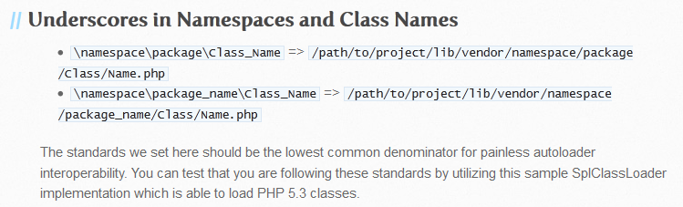  
图3-2 来自Autoloading Standard的截图  

出于简单性，PhalApi暂时不使用命名空间，所以namespace这一块可省去。可以看出，这里的映射规则是：把类名中的下划线换成目录分割符，并在最后加上“.php”文件后缀，便可得到类对应的文件路径位置。  

例如，Api_User、Domain_User、Model_User这三个类，分别对应以下路径的文件。  
```
.
|-- Api
|   `-- User.php
|-- Domain
|   `-- User.php
|-- Model
|   `-- User.php
```

再举一个稍微复杂的示例，如类Api_Game_User_Equitment对应的文件路径为：```./Api/Game/User/Equitment.php```。需要注意的是，应该严格区分大小写，因为在Linux、Mac等操作系统，文件路径是区分大小写的。  

下面是一些错误的示例。  

表3-2 错误的类命名  

类名|类文件|错误原因
---|---|---
Api_user|./Api/User.php|类名user小写，导致无法加载
Api_User|./Api/user.php|文件名user小写，导致无法加载
Api_User|./Api_User.php|类文件位置错误，导致无法加载

### 3.2.2 挂靠式自动加载

在准备好类和文件后，怎样才能让这些类被框架自动加载呢？这里提供的方式是：**挂靠式自动加载**。熟悉Linux系统的同学可能很容易明白，还没接触到Linux的同学也是可以很快理解的。这里稍微说明一下。所谓的 挂靠就是将项目内的子目录添加到自动加载器。例如我们在入口文件所看到的，添加商城新项目的项目目录，可以：  
```
DI()->loader->addDirs('Shop');
```
  
当有多个目录时，可以传递一个目录数组。  
```
DI()->loader->addDirs(array('Demo', 'Shop'));
```
需要注意的是，上面相对路径的都需要放置在应用项目的目录API_ROOT下面，暂时不能添加项目以外的目录。  
  
通过```PhalApi_Loader::addDirs($dirs)```方式挂靠的路径，都是强制在目录API_ROOT下面。所传递的目录路径都应该是相对路径。在Linux系统上，下面的三种方式是等效的。  
```
// 路径：API_ROOT/Demo
DI()->loader->addDirs('Demo');

// 路径：API_ROOT/./Demo
DI()->loader->addDirs('./Demo');

// 路径：API_ROOT/Demo
DI()->loader->addDirs('/Demo');
```
如果需要挂靠的目录不在项目目录下，在Linux可以通过软链来解决。  

对于单个文件的引入，可以通过```PhalApi_Loader::loadFile($filePath)```来引入，这里的文件路径可以是相对路径，也可以是绝对路径。注意以下两种写法的区别：  
```
// 路径：API_ROOT/Demo/Tool.php
DI()->loader->loadFile('Demo/Tool.php');

// 路径：/path/to/Demo/Tool.php
DI()->loader->loadFile('/path/to/Demo/Tool.php');
```

在添加代码目录后，便可实现该目录下类文件的自动加载。例如通过```DI()->loader->addDirs('Shop');```添加了Shop项目的源代码目录后，此Shop目录下符合PEAR命名规范的类，都能实现自动加载。
```
$ tree ./Shop/
./Shop/
├── Api
│   ├── Default.php
│   ├── Goods.php
│   └── Welcome.php
├── Common
│   ├── Crypt
│   │   └── Base64.php
│   ├── DB
│   │   └── MSServer.php
│   ├── Logger
│   │   └── DB.php
│   ├── Request
│   │   └── WeiXinFilter.php
│   └── Response
│       └── XML.php
├── Domain
│   └── Goods.php
├── Model
│   └── Goods.php
```  
上面是Shop项目下的部分类文件，当使用类Api_Welcome时，会自动加载./Shop/Api/Welcome.php文件；当使用类Common_Response_XML时，会自动加载./Shop/Common/Response/XML.php文件；当使用类Domain_Goods时，则会自动加载./Shop/Domain/Goods.php文件，以此类推。  

对于面向过程中的函数，而非类，则可以使用```PhalApi_Loader::loadFile($filePath)```来手动引入。  

### 3.2.3 初始化文件和入口文件的区别

使用一个类，其过程可归结为三个步骤。  

 + 1、实现该类
 + 2、自动加载该类
 + 3、在恰当的地方使用该类  

当发现找不到某个类时，应该从这三个步骤分别排查原因。如果尚未实现该类，那么肯定是找不到的，这时可以补充实现。如果已经实现该类但还找不到，则应该检查类名或者类文件路径是否遵循PEAR命名规范。  

例如，有一行这样的代码，却提示类Domain_Goods不存在。  
```
$domain = new Domain_Goods();
```

导致这种情况的可能以下这几种。  

 + 未使用目录分割符而导致错误的类文件路径，如：  
```
// $ vim ./Shop/Domain_Goods.php
<?php
class Domain_Goods{ }
```

 + 因小写而导致错误的类文件路径，如：  
```
// $ vim ./Shop/Domain/goods.php
<?php
class Domain_Goods{ }
```

 + 拼写不完整而导致错误的类名，如：  
```
// $ vim ./Shop/Domain/Goods.php
<?php
class Goods{ }
```

最后如果类名、类文件这些都正确，但仍然还是提示找不到类时，则应该核对第三步，是否在恰当的地方使用该类？恰当的地方是指在添加代码目录之后的调用位置。即在挂靠代码目录前不能使用此目录下的类，而应在挂靠之后使用。用代码示例来表示，则很好理解。例如：  
```
// 错误：未挂靠Shop目录就使用
DI()->response = new Common_Response_XML();

DI()->loader->addDirs('Shop');
```
正确的用法是在挂靠Shop目录后才使用Shop目录里面的类，即：  
```
// 正确：先挂靠Shop目录再使用
DI()->loader->addDirs('Shop');

DI()->response = new Common_Response_XML();
```

到这里，大家有没发现一些有趣的规律，或者一种似曾相识的感觉？上面的示例和背后的原理，大家应该很容易理解，当出现Common_Response_XML类未找到时也能很容易明白错误的原因。但当把这些简单的知识点，隐藏于复杂的上下文场景中时，就会容易导致一些令人感到费解的问题。还记得初始化文件./Public/init.php与项目入口文件./Public/shop/index.php吗？还记得为什么有些资源服务需要在初始化文件中注册，而有些则需要在入口文件中注册？为了唤起记忆，这里稍微回顾一下在这两个文件中分别注册的部分资源。  

初始化文件中的注册：  
```
$loader = new PhalApi_Loader(API_ROOT, 'Library');

// 配置
DI()->config = new PhalApi_Config_File(API_ROOT . '/Config');

// 数据操作 - 基于NotORM
DI()->notorm = new PhalApi_DB_NotORM(DI()->config->get('dbs'), DI()->debug);
```

Shop项目入口文件中的注册：  
```
//装载你的接口
DI()->loader->addDirs('Shop');

// 微信签名验证服务
DI()->filter = 'Common_Request_WeiXinFilter';

// XML返回
DI()->response = 'Common_Response_XML';
```

细心的读者可以发现，在初始化文件中，使用的都是框架已经的类，因为框架本身的类会默认全部能自动被加载。而对于Shop项目中的类，则需要在项目入口文件中使用，这是因为只有手动添加了Shop目录后，该目录下的类文件才能被自动加载。如果在初始化文件中，使用了Shop项目中的类，则会导致类找不到，因为那时尚未加载对应的Shop目录。尤其使用的是类名延迟加载方式时，会把问题隐藏得更深而难以排查。  

这里的经验法则是，先挂靠再使用，在初始化文件中使用框架提供的类，在项目入口文件中使用项目实现的类。如果确实需要在初始化文件中使用项目实现的类，怎么办呢？解决方案可以有多种，例如可以把这些公共的代码放置在扩展类库下，因为扩展类库目录会在初始化文件中默认添加。另一种方案是在初始化文件一开始也把项目目录添加进去，但这样该目录下的全部类都会被自动加载。最后还可以把这些公共的类统一放置在某一个与项目目录无关的目录下，再在初始化文件中进行添加。  

## 3.3 自动生成的在线文档

在线接口文档，主要有两种：  

 + **接口列表文档**
 显示当前项目下全部可用的接口服务，以及各个接口服务的名称、说明信息，如果需要，也可以显示扩展类库下提供的接口服务。  

 + **接口详情文档**
 针对单个接口服务的文档说明，用于显示该接口服务的基本信息、接口说明、接口参数、返回结果以及异常情况等。  
   
下面分别进行解释。  

### 3.3.1 在线接口列表文档

#### (1) 如何访问接口列表文档？

在创建项目后，便可以通过访问Public目录下该项目目录内的```listAllApis.php```文件来访问接口列表文档。例如前面创建的Shop项目，其访问链接为：  
```
http://api.phalapi.net/shop/listAllApis.php
```  
打开后，其文档显示的内容，类似如下：  
  
图3-3 在线接口列表文档的访问效果  

在左边，是全部接口服务类的列表，按接口类名称的字典顺序进行排序。页面右边，是各个接口服务类所提供的全部服务，包括了接口服务、接口名称、更多说明等。  

#### (2) 接口列表文档的注释规范
在上面的访问效果中，有部分的信息提示了“//请使用@desc 注释”或“//请检测接口服务注释”等字样，这是因为接口列表文档的生成，除了依赖于源代码，更大程序上还依赖于规范的注释。  

接口列表的注释比较简单，主要有：  

 + 接口服务类说明

对应接口类文件中文档注释的第一行注释说明。例如，上面提示的“//请检测接口服务注释(Api_Welcome) ”，可以修改对应类文件的注释来调整。  
```
// $ vim ./Shop/Api/Welcome.php
<?php
/**
 * Hello Wolrd示例类
 */
class Api_Welcome extends PhalApi_Api {
```

 + 序号

自动生成，不需要注释。把接口服务名称```Class.Action```按字典排序后从小到大依次编号。 

 + 接口服务

自动生成，通过反射自动获取接口类的全部可访问的方法，并提取可用的接口服务，即对应service参数的接口服务名称。  

 + 接口名称

接口中文名称，不带任何注解的注释，通常为接口类成员函数的第一行注释。如上面提示的“//请使用@desc 注释”，可以通过类成员函数的注释来调整。  
```
    /**
     * 欢迎光临
     */
    public function say() {
```

 + 更多说明

对应接口类成员函数的```@desc```注释。如上面提示的“//请使用@desc 注释”，可以添加```@desc```注释来调整。  
```
    /**
     * 欢迎光临
     * @desc 简单的Hello Wolrd返回
     */
    public function say() {
```

按上面的注释规范调整好后，刷新刚才的接口列表页面，可以看到在线文档已经实时同步更新。  
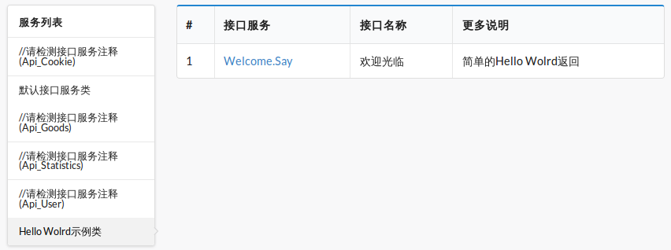  
图3-4 调整后的在线接口文档  

#### (3) 显示扩展类库的接口服务

查看```listAllApis.php```文件的源代码，可以看到默认情况下，已添加了若干个扩展类库的接口服务显示，包括User扩展、Auth扩展、七牛扩展。

```
//$ vim ./Public/shop/listAllApis.php
$libraryPaths = array(
    'Library/User/User',    // User扩展
    'Library/Auth/Auth',    // Auth扩展
    'Library/Qiniu/CDN',    // 七牛扩展
);

// 初始化
require_once implode(D_S, array($root, '..', 'init.php'));

// 处理项目
DI()->loader->addDirs($apiDirName);
```
如果需要显示其他扩展类库下的接口服务，则需要将对应的项目目录参考上面的写法添加进来。添加好后，记得要在```checkApiParams.php```文件中同步添加。 

顺便提一下，框架的一致性，在这里也得到了体现。那就是任何类的使用，都应先挂靠再使用。在添加了扩展类库的目录后，在线接口列表文档才能显示对应扩展类库下的接口服务。  

### 3.3.2 在线接口详情文档

### (1) 如何访问在线接口详情文档？

在进入上面的在线接口列表文档后，点击对应的接口服务即可跳转到对应的接口详情文档。或者，也可以手动拼接访问。它的访问路径与```listAllApis.php```类似，但需要访问的是```checkApiParams.php```文件，并且需要使用service参数指定需要查看的接口服务。例如查看我们之前定义的获取商品快照信息的接口服务。  

在浏览器访问打开：   
```
http://api.phalapi.net/shop/checkApiParams.php?service=Goods.Snapshot
```
打开后，访问效果类似如下：  
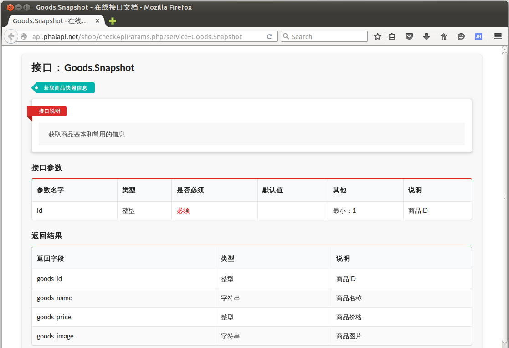
图3-5 商品快照信息的在线接口详情文档  

### (2) 在线接口详情文档的注释规范

接口文档的注释较多，开发人员可在进行项目开发时按需注释。但各部分的规范也是简单明了的。结合上面的访问效果和商品快照信息接口类这一示例，从上到下，依次讲解各部分的使用规范。    

 + 接口

当前接口服务的service名称，即：```Class.Action```。  

 + 接口名称

接口中文名称，不带任何注解的注释，通常为接口类成员函数的第一行注释。如：     
```
    /**
     * 获取商品快照信息
     */
    public function snapshot() {
```

 + 接口说明

对应接口类成员函数的```@desc```注释。如：
```
    /**
     * @desc 获取商品基本和常用的信息
     */
    public function snapshot() {
```

 + 接口参数

根据接口类配置的参数规则自动生成，即对应当前接口类```getRules()```方法中的返回。其中最后的“说明” 字段对应参数规则中的desc选项。可以配置多个参数规则。此外，配置文件./Config/app.php中的公共参数规则也会显示在此接口参数里。这里的参数规则是：     
```
    public function getRules() {
        return array(
            'snapshot' => array(
                'id' => array('name' => 'id', 'require' => true, 'type' => 'int', 'min' => 1, 'desc' => '商品ID'),
            ),
        );
    }
```

 + 返回结果

对应接口类成员函数的```@return```注释，可以有多组，格式为：```@return 返回类型 返回字段 说明```。这里是：  
```
    /**
     * @return int      goods_id    商品ID
     * @return string   goods_name  商品名称 
     * @return int      goods_price 商品价格
     * @return string   goods_image 商品图片
     */
    public function snapshot() {
```

 + 异常情况

对应```@exception```注释，可以有多组，格式为：```@exception 错误码 错误描述信息```。例如，我们可以在此示例中补充异常情况。  
```
    /**
     * @exception 406 签名失败
     */
    public function snapshot() {
```
刷新后，可以看到新增的异常情况说明。  
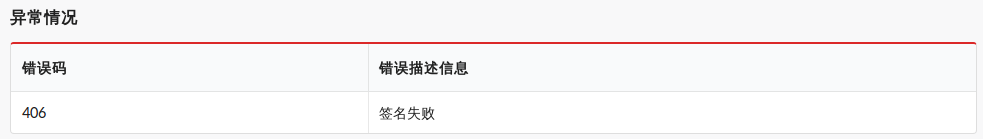
图3-6 添加了异常情况后的效果  

以上获取商品快照信息接口服务的参数规则和注释，完整的代码为：  
```
// $ vim ./Shop/Api/Goods.php 
<?php
class Api_Goods extends PhalApi_Api {

    public function getRules() {
        return array(
            'snapshot' => array(
                'id' => array('name' => 'id', 'require' => true, 'type' => 'int', 'min' => 1, 'desc' => '商品ID'),
            ),
        );
    }

    /**
     * 获取商品快照信息
     * @desc 获取商品基本和常用的信息
     * @return int      goods_id    商品ID
     * @return string   goods_name  商品名称 
     * @return int      goods_price 商品价格
     * @return string   goods_image 商品图片
     * @exception 406 签名失败
     */
    public function snapshot() {
        ... ...
    }
}
```

## 3.5 接口查询语言与SDK包


### 3.5.1 用一句话来描述接口请求

为了统一规范客户端请求调用接口服务的使用，在尽量保证简单易懂的前提下也兼顾使用的流畅性，为此我们专门设计了内部领域特定语言：**接口查询语言**（Api Structured Query Language）。通过接口查询语言，最后可以用一句话来描述接口请求。  
   
从外部DSL的角度来看此接口查询的操作，可总结为创建、初始化、重置、参数设置和请求等操作。  
```
create

withHost host
withFilter filter
withParser parser

reset   #特别注意：重复查询时须重置请求状态

withService service
withParams paramName1 paramValue1
withParams paramName2 paramValue2
withParams ... ...
withTimeout timeout

request
```
  
根据此设计理念，任何语言都可实现此接口查询的具体操作。  

### 3.5.2 接口查询语言设计理念与使用示例

接口查询语言的文法是：```create -> with -> request```。所用到的查询文法解释如下。虽然顺序不强制，但通常是从上往下依次操作。  

表3-3 接口查询的文法   

操作|参数|是否必须|是否可重复调用|作用说明
---|---|---|---|---
create|无|必须|可以，重复调用时新建一个实例，非单例模式|需要先调用此操作创建一个接口实例
withHost|接口域名|必须|可以，重复时会覆盖|设置接口域名，如：http://api.phalapi.net/
withFilter|过滤器|可选|可以，重复时会覆盖|设置过滤器，与服务器的DI()->filter对应，需要实现PhalApiClientFilter接口
withParser|解析器|可选|可以，重复时会覆盖|设置结果解析器，仅当不是JSON返回格式时才需要设置，需要实现PhalApiClientParser接口
reset|无|通常必须|可以|重复查询时须重置请求状态，包括接口服务名称、接口参数和超时时间
withService|接口服务名称|通常必选|可以，重复时会覆盖|设置将在调用的接口服务名称，如：Default.Index
withParams|接口参数名、值|可选|可以，累加参数|设置接口参数，此方法是唯一一个可以多次调用并累加参数的操作
withTimeout|超时时间|可选|可以，重复时会覆盖|设置超时时间，单位毫秒，默认3秒
request|无|必选|可以，重复发起接口请求|最后执行此操作，发起接口请求

以JAVA客户端为例，先来演示如何调用SDK包调用接口服务。  

最简单的调用，也就是默认接口的调用。只需要设置接口系统域名及入口路径，不需要指定接口服务，也不需要添加其他参数。      
```
PhalApiClientResponse response = PhalApiClient.create()
       .withHost("http://demo.phalapi.net/")   //接口域名
       .request();                             //发起请求
```
  
通常的调用，需要设置接口服务名称，添加接口参数，并指定超时时间。  
```
PhalApiClientResponse response = PhalApiClient.create()
       .withHost("http://demo.phalapi.net/")
       .withService("Default.Index")          //接口服务
       .withParams("username", "dogstar")     //接口参数
       .withTimeout(3000)                     //接口超时
       .request();
```
  
更高级、更复杂的调用，可根据需要再设置过滤器、解析器，以完成定制化扩展的功能。    
```
PhalApiClientResponse response = PhalApiClient.create()
       .withHost("http://demo.phalapi.net/")
       .withService("Default.Index")
       .withParser(new PhalApiClientParserJson()) //设置JSON解析，默认已经是此解析，这里仅作演示
       .withParams("username", "dogstar")
       .withTimeout(3000)
       .request();
```

当接口请求超时时，统一返回```ret = 408```表示接口请求超时。此时可进行接口重试。  
  
需要重试时，可先判断返回的状态码再重新请求。    
```
PhalApiClient client = PhalApiClient.create()
     .withHost("http://demo.phalapi.net/")

PhalApiClientResponse response = client.request();

if (response.getRet() == 408) {
     response = client.request(); //请求重试
}
```

### 3.5.3 更好的建议

#### (1) 不支持面向对象的实现方式
上面介绍的接口查询的用法是属于基础的用法，其实现与宿主语言有强依赖关系，在不支持面向对象语言中，可以使用函数序列的方式，例如下面面向过程的伪代码示例。    
```
create();
withHost('http://demo.phalapi.net/');
withService('Default.Index');
withParams('username', 'dogstar');
withTimeout(3000);
rs = request();
```

#### (2) 封装自己的接口实例
通常，在一个项目里面我们只需要一个接口实例即可，但此语言没默认使用单例模式，是为了大家更好的自由度。基于此，大家在项目开发时，可以再进行封装：提供一个全局的接口查询单例，并组装基本的接口公共查询属性。即分两步：初始化接口实例，以及接口具体的查询操作。  
  
如第一步先初始化：
```
PhalApiClient client = PhalApiClient.create()
     .withHost("http://demo.phalapi.net/")
     .withParser(new PhalApiClientParserJson());
```
  
第二步进行具体的接口请求：  
```
PhalApiClientResponse response = client.reset()  //重复查询时须重置
     .withService("Default.Index")
     .withParams("username", "dogstar")
     .withTimeout(3000)
     .request();
```
  
这样，在其他业务场景下就不需要再重复设置这些共同的属性（如过滤器、解析器）或者共同的接口参数。

### 3.5.4 Java版SDK包的使用说明

虽然上面简单演示了JAVA版SDK包的使用，但为了给实际项目开发提供更详细的参考，这里再补充一下更具体的使用说明。首先，需要将框架目录下的./SDK/JAVA/net目录中的全部代码拷贝到项目，然后便可以开始使用了。  

#### (1) 使用说明

首先，我们需要导入SDK包：
```
import net.phalapi.sdk.*;
```

然后，准备一个子线程调用，并在此线程中实现接口请求：
```
    /**
     * 网络操作相关的子线程
     */  
    Runnable networkTask = new Runnable() {  
      
        @Override  
        public void run() {  
            // TODO 在这里进行 http request.网络请求相关操作  
            
        	PhalApiClient client = PhalApiClient.create()
	       			    .withHost("http://demo.phalapi.net/");
	       	
	       	PhalApiClientResponse response = client
	       			    .withService("Default.Index")
	       			    .withParams("username", "dogstar")
	       			    .withTimeout(3000)
	       			    .request();

	   		String content = "";
	   		content += "ret=" + response.getRet() + "\n";
	   		if (response.getRet() == 200) {
				try {
					JSONObject data = new JSONObject(response.getData());
					content += "data.title=" + data.getString("title") + "\n";
					content += "data.content=" + data.getString("content") + "\n";
					content += "data.version=" + data.getString("version") + "\n";
				} catch (JSONException ex) {
					  
				}
	   		}
			content += "msg=" + response.getMsg() + "\n";
			
			Log.v("[PhalApiClientResponse]", content);
            
            Message msg = new Message();  
            Bundle data = new Bundle();  
            data.putString("value", content);  
            msg.setData(data);  
            handler.sendMessage(msg); 
        }  
    }; 
```
  
接着，实现线程回调的hander：
```
    Handler handler = new Handler() {  
        @Override  
        public void handleMessage(Message msg) {  
            super.handleMessage(msg);  
            Bundle data = msg.getData();  
            String val = data.getString("value");  
            Log.i("mylog", "请求结果为-->" + val);  
            // TODO  
            // UI界面的更新等相关操作  
        }  
    }; 
``` 
  
最后，在我们需要的地方启动：
```
    View.OnClickListener mDummyBtnClickListener = new View.OnClickListener() {
        
        @Override
        public void onClick(View arg0) {
            // 开启一个子线程，进行网络操作，等待有返回结果，使用handler通知UI  
            new Thread(networkTask).start();  
            
            // ....
        }
    };
```

当我们需要再次使用同一个接口实例进行请求时，需要先进行重置，以便清空之前的接口参数，如：
```
//再一次请求
response = client.reset() //重置
		.withService("User.GetBaseInfo")
		.withParams("user_id", "1")
		.request();


content = "";
content += "ret=" + response.getRet() + "\n";
if (response.getRet() == 200) {
	try {
		JSONObject data = new JSONObject(response.getData());
		JSONObject info = new JSONObject(data.getString("info"));
		
		content += "data.info.id=" + info.getString("id") + "\n";
		content += "data.info.name=" + info.getString("name") + "\n";
		content += "data.info.from=" + info.getString("from") + "\n";
	} catch (JSONException ex) {
		  
	}
}
content += "msg=" + response.getMsg() + "\n";

Log.v("[PhalApiClientResponse]", content);
```
  
异常情况下，即ret != 200时，将返回错误的信息，如：
```
//再来试一下异常的请求
response = client.reset()
		.withService("Class.Action")
		.withParams("user_id", "1")
		.request();

content = "";
content += "ret=" + response.getRet() + "\n";
content += "msg=" + response.getMsg() + "\n";

Log.v("[PhalApiClientResponse]", content);
```

运行后，查询log，可以看到：
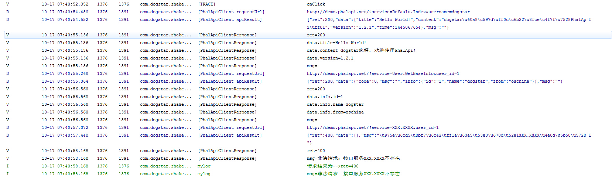
图3-7 JAVA版SDK包运行后的效果截图  

可以注意到，在调试模式时，会有接口请求的链接和返回的结果日记。   
```
10-17 07:40:55.268: D/[PhalApiClient requestUrl](1376): http://demo.phalapi.net/?service=User.GetBaseInfo&user_id=1
10-17 07:40:55.364: D/[PhalApiClient apiResult](1376): {"ret":200,"data":{"code":0,"msg":"","info":{"id":"1","name":"dogstar","from":"oschina"}},"msg":""}
```

#### (2) 扩展你的过滤器和结果解析器

 + 扩展过滤器

当服务端接口需要接口签名验证，或者接口参数加密传送，或者压缩传送时，可以实现此过滤器，以便和服务端操持一致。  
  
当需要扩展时，分两步。首先，需要实现过滤器接口：  
```
class MyFilter implements PhalApiClientFilter {

        public void filter(String service, Map<String, String> params) {
            // TODO ...
        }
}
```
然后设置过滤器：
```
PhalApiClientResponse response = PhalApiClient.create()
		   .withHost("http://demo.phalapi.net/")
		   .withFilter(new MyFilter())
		   // ...
		   .request();
```

 + 扩展结果解析器

当返回的接口结果不是JSON格式时，可以重新实现此接口。  
  
当需要扩展时，同样分两步。类似过滤器扩展，这里不再赘述。 

### 3.5.5 Ruby版SDK包的使用说明

遵循前面制定的接口查询语言，不同语言的SDK的使用是类似的。为了说明这一点，并且强调接口查询语言的文法，这里再以Ruby版本的SDK为例，进一步简单说明。  

当需要使用Ruby版的SDK包时，先将框架目录下的./SDK/Ruby/PhalApiClient目录中的全部代码拷贝到项目。 

#### (1) 使用说明

首先，我们需要导入SDK包：
```
# demo.rb
require_relative './PhalApiClient/phalapi_client'
```

然后，创建客户端实例，发起接口请求。  
```
a_client = PhalApi::Client.create.withHost('http://demo.phalapi.net')
a_response = a_client.withService('Default.Index').withParams('username', 'dogstar').withTimeout(3000).request()

puts a_response.ret, a_response.data, a_response.msg
```
 
运行后，可以看到：  
```
200
{"title"=>"Hello World!", "content"=>"dogstar您好，欢迎使用PhalApi！", "version"=>"1.2.1", "time"=>1445741092}
```

当需要重复调用时，需要先进行重置操作reset，如：
```
# 再调用其他接口
a_response = a_client.reset \
    .withService("User.GetBaseInfo") \
    .withParams("user_id", "1") \
    .request

puts a_response.ret, a_response.data, a_response.msg
```
  
当请求有异常时，返回的ret!= 200，如：
```
# 非法请求
a_response = a_client.reset.withService('XXXX.noThisMethod').request

puts a_response.ret, a_response.data, a_response.msg
```
  
以上的输出为： 
```
400
非法请求：接口服务XXXX.noThisMethod不存在
```

#### (2) 扩展你的过滤器和结果解析器

 + 扩展过滤器  

当服务端接口需要接口签名验证，或者接口参数加密传送，或者压缩传送时，可以实现此过滤器，以便和服务端操持一致。  
 
当需要扩展时，分两步。首先，需要实现过滤器接口：  
```
class MyFilter < PhalApi::ClientFilter 
        def filter(service, *params)
            #TODO ...
        end
}
```

然后设置过滤器：
```
a_response = PhalApi::Client.create.withHost('http://demo.phalapi.net') \
	   .withFilter(MyFilter.new) \
	   # ... \
	   .request
```

 + 扩展结果解析器  

当返回的接口结果不是JSON格式时，可以重新实现此接口。  
 
当需要扩展时，同样分两步。类似过滤器扩展，这里不再赘述。

除了Java和Ruby外，目前已提供的SDK包还有C#版、Golang版、Object-C版、Javascript版、PHP版、Python版等。其他语言的SDK包使用类似，这里不再赘述。  

## 3.6 脚本命令的使用

自动化是提升开发效率的一个有效途径。PhalApi致力于简单的接口服务开发，同时也致力于通过自动化提升项目的开发速度。为此，提供了创建项目、生成单元测试骨架代码、生成数据库建表SQL、生成接口文件代码这些脚本命令。应用这些脚本命令，能快速完成重复但消耗时间的工作。下面将分别进行说明。  

在使用这些脚本命令前，需要注意以下几点。  

第一点是执行权限，当未设置执行权限时，脚本命令会提示无执行权限，类似这样。  
```
$ ./PhalApi/phalapi-buildapp 
-bash: ./PhalApi/phalapi-buildapp: Permission denied
```
那么需要这样设置脚本命令的执行权限。  
```
$ chmod +x ./PhalApi/phalapi-build*
```
  
其次，对于Linux平台，可能会存在编码问题，例如提示：  
```
$ ./PhalApi/phalapi-buildapp 
bash: ./PhalApi/phalapi-buildapp: /bin/bash^M: bad interpreter: No such file or directory
```
这时，可使用dos2unix命令转换一下编码。  
```
$ dos2unix ./PhalApi/phalapi-build*
dos2unix: converting file ./PhalApi/phalapi-buildapp to Unix format ...
dos2unix: converting file ./PhalApi/phalapi-buildcode to Unix format ...
dos2unix: converting file ./PhalApi/phalapi-buildsqls to Unix format ...
dos2unix: converting file ./PhalApi/phalapi-buildtest to Unix format ...
```

最后一点是，在任意目录位置都是可以使用这些命令的，但会与所在的项目目录绑定。通常，为了更方便使用这些命令，可以将这些命令软链到系统命令下。例如：  
```
$ cd /pah/to/PhalApi/PhalApi
$ sudo ln -s /path/to/phalapi-buildapp /usr/bin/phalapi-buildapp
$ sudo ln -s /path/to/phalapi-buildsqls /usr/bin/phalapi-buildsqls
$ sudo ln -s /path/to/phalapi-buildtest /usr/bin/phalapi-buildtest
$ sudo ln -s /path/to/phalapi-buildcode /usr/bin/phalapi-buildcode
```

### 3.6.1 phalapi-buildapp命令

phalapi-buildapp命令，可用于创建一个新的项目，最终效果和在线安装向导类似。其使用说明如下：  
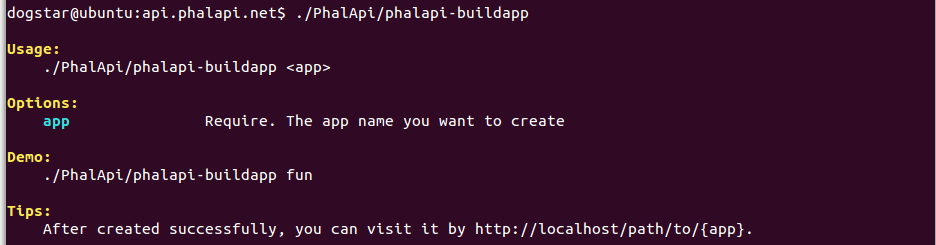  
图3-8 phalapi-buildapp命令的使用说明  
  
其中，

 + 第一个参数app：是待创建的项目名称，通常以字母开头，由字母和数字组成  

例如，现在让我们来创建一个新的项目，假设是用来提供活动相关接口服务的，名称为：act，那么可以执行以下命令。  
```
$ ./PhalApi/phalapi-buildapp act
```

执行后，会看到类似以下的输出。  
```
create Act ...
create Act tests ...
create Act bootstarp ...

OK! Act has been created successfully!
```

最后，可以看到会增加了以下两个目录，一个是放置act项目源代码和单元测试的目录。  
```
$ tree ./Act/
./Act/
├── Api
│   └── Default.php
├── Common
├── Domain
├── Model
└── Tests
    ├── Api
    │   └── Api_Default_Test.php
    ├── Common
    ├── Domain
    ├── Model
    ├── phpunit.xml
    └── test_env.php

9 directories, 4 files
```

另一个是该项目对外访问的目录，包括入口文件、在线文档访问文件。
```
$ tree ./Public/act/
./Public/act/
├── checkApiParams.php
├── index.php
└── listAllApis.php

0 directories, 3 files
```

我们还可以试请求一下默认接口服务，发现也是可以正常响应的。  
```
$ curl "http://api.phalapi.net/act/"
{"ret":200,"data":{"title":"Hello World!","content":"PHPer\u60a8\u597d\uff0c\u6b22\u8fce\u4f7f\u7528PhalApi\uff01","version":"1.4.0","time":1494343386},"msg":""}
```

最后需要注意的是，在创建新项目时，是以Demo项目为模板进行创建的。所以在使用phalapi-buildapp命令创建新项目时，应确保默认的Demo项目目录和文件未被删除，否则会导致创建异常。默认的Demo项目目录包括放置源代码的目录./Demo和对外可访问的目录./Public/demo。  

另外，当重复创建相同的项目时，会提示项目已存在。如再次创建act项目。  
```
$ ./PhalApi/phalapi-buildapp act
Error: Act exists!
```

### 3.6.2 phalapi-buildtest命令

当需要对某个类进行单元测试时，可使用phalapi-buildtest命令生成对应的单元测试骨架代码，其使用说明如下：  
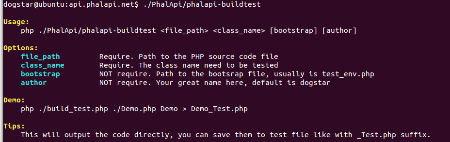  
图3-9 phalapi-buildtest命令的使用说明  
  
其中，

 + 第一个参数file_path：是待测试的源文件相对/绝对路径  
 + 第二个参数class_name：是待测试的类名  
 + 第三个参数bootstrap：是测试启动文件，通常是/path/to/test_env.php文件  
 + 第四个参数author：你的名字，默认是dogstar  
   
通常，可以先写好类名以及相应的接口，然后再使用此脚本生成单元测试骨架代码。以Shop项目中Hello World接口为例为例，当需要为Api_Welcome类生成单元测试骨架代码时，可以依次这样操作。  
```
$ cd ./Shop/Tests
$ ../../PhalApi/phalapi-buildtest ../Api/Welcome.php Api_Welcome ./test_env.php > ./Api/Api_Welcome_Test.php
```
  
最后，需要将生成好的骨架代码，重定向保存到你要保存的位置。通常与产品代码对齐，并以“{类名} + _Test.php”方式命名，如这里的Api_Welcome_Test.php。  

生成的骨架代码类似如下，为节省边幅，注释已省略。  
```
// Tests$ vim ./Api/Api_Welcome_Test.php
<?php
//require_once dirname(__FILE__) . '/test_env.php';

if (!class_exists('Api_Welcome')) {
    require dirname(__FILE__) . '/../Api/Welcome.php';
}

class PhpUnderControl_ApiWelcome_Test extends PHPUnit_Framework_TestCase
{
    public $apiWelcome;

    protected function setUp()
    {
        parent::setUp();

        $this->apiWelcome = new Api_Welcome();
    }

    protected function tearDown()
    {
    }

    public function testGetRules()
    {
        $rs = $this->apiWelcome->getRules();
    }

    public function testSay()
    {
        $rs = $this->apiWelcome->say();
    }
}
```
这里，还需要根据情况手动更改一下test_env.php测试环境文件的位置，即去掉注释并改成：  
```
// Tests$ vim ./Api/Api_Welcome_Test.php
require_once dirname(__FILE__) . '/../test_env.php';
```

此时生成的单元测试骨架，会对public访问级别的成员函数生成一一对应的测试用例，并具备一些基本的验证功能。对于刚生成的单元测试，可以试运行一下。  
```
Tests$ phpunit ./Api/Api_Welcome_Test.php 
PHPUnit 4.3.4 by Sebastian Bergmann.

..

Time: 7 ms, Memory: 6.50Mb

OK (2 tests, 0 assertions)
```

phalapi-buildtest命令还有一些很有趣的功能。单元测试可按照构建-执行-验证的模式来编写，所以使用phalapi-buildtest生成的骨架代码，除了会生成执行环节的代码外，还可以生成构建和验证的代码。让我们来看一些具体的示例。  

继续来看一下获取商品快照信息接口服务的领域层的实现，可以看到之前的代码是这样的。  
```
// $ vim ./Shop/Domain/Goods.php 
<?php
class Domain_Goods {

    public function snapshot($goodsId) {
        $model = new Model_Goods();
        $info = $model->getSnapshot($goodsId);

        if (empty($info) || $info['goods_price'] <= 0) {
            return array();
        }

        return $info;
    }
}
```
暂且先不关注这里具体的实现。这里需要一个没有缺省值的```$goodsId```参数，并且返回的是一个数组。phalapi-buildtest命令会自动识别参数列表，以及使用参数缺省值填充，但对于返回值的类型验证，则需要依据成员函数的```@return```注解。为此，我们可以先添加返回类型为数组的注解。  
```
    /**
     * @return array 快照信息
     */
    public function snapshot($goodsId) {
```
随后，根据phalapi-buildtest命令的使用说明，为Domain_Goods生成单元测试骨架代码，并保存到对应的测试目录。这一次，让我们先进入Shop项目的Tests目录，再使用命令，因为通常情况下使用单元测试时我们都是在此目录下的。可以看到，所在目录位置对phalapi-buildtest命令的使用是不影响的。  
```
cd Shop/Tests/
Tests$ ../../PhalApi/phalapi-buildtest ../Domain/Goods.php Domain_Goods
```
籍此机会，顺便再来分解下phalapi-buildtest命令的使用过程。对于待测试的类是独立的类时，即不继承于其他类，则可以忽略第三个参数bootstrap，因为这里不需要用到框架的自动加载。同时，在保存生成的骨架代码前，可以先预览一下所生成的代码是否正确。在执行完上面这行命令后，可以看到类似这样的输出。  
```
<?php
/**
 * PhpUnderControl_DomainGoods_Test
 *
 * 针对 ../Domain/Goods.php Domain_Goods 类的PHPUnit单元测试
 *
 * @author: dogstar 20170510
 */

//require_once dirname(__FILE__) . '/test_env.php';

if (!class_exists('Domain_Goods')) {
    require dirname(__FILE__) . '/../Domain/Goods.php';
}

class PhpUnderControl_DomainGoods_Test extends PHPUnit_Framework_TestCase
{
    ... ...
```

预览确认生成的骨架代码没问题后，再重定向保存到测试文件。  
```
Tests$ ../../PhalApi/phalapi-buildtest ../Domain/Goods.php Domain_Goods > ./Domain/Domain_Goods_Test.php
```
测试文件名为待测试的类名，加上“_Test.php”后缀。保存后，记得再适当调整一下test_env.php文件的引入路径。  
```
// Tests$ vim ./Domain/Domain_Goods_Test.php
require_once dirname(__FILE__) . '/../test_env.php';
```

然后，执行一下此测试文件，可以看到是可以正常执行并通过测试的。之所以通常，是因为在找不到对应的商品信息时，默认返回空数组。  
```
Tests$ phpunit ./Domain/Domain_Goods_Test.php 
PHPUnit 4.3.4 by Sebastian Bergmann.

.

Time: 35 ms, Memory: 6.50Mb

OK (1 test, 1 assertion)
```

再回头看一下这里生成的骨架代码，看下最终生成了哪些构建的代码，又生成了哪些验证的代码。  
```
// Tests$ vim ./Domain/Domain_Goods_Test.php
    public function testSnapshot()
    {
        $goodsId = '';

        $rs = $this->domainGoods->snapshot($goodsId);

        $this->assertTrue(is_array($rs));
    }
```
由于```$goodsId```参数没有缺省值，所以这里给了空字符串，一来不管参数是数值还是字符串都方便填充测试数据，二来不会导致生成的代码语法上出错。在最后，还进行了简单的断言，对```Domain_Goods::snapshot($goodsId)```方法返回值的类型进行了检测，判断是否为期望的数组类型。是不是觉得很有趣？你也可以亲自动手，试下参数带有缺省值的情况。   

phalapi-buildtest命令除了能根据参数列表生成构建代码，根据```@return```注解生成类型断言代码外，还可以根据```@testcase```注解生成对应的测试用例代码。```@testcase```注解的格式是：```@testcase 期望返回结果 参数1,参数2,参数3 ...```，第一个是期望返回的结果，后面是提供给待测试函数的参数列表，用英文逗号分割。目前此方式适合用于参数和返回值是基本类型的场景。由于上面商品快照返回的类型是数组，非基本类型，为了演示```@testcase```注解的效果，让我们来看另一个示例。  

假如我们现在有一个实现了加法运算的简单计算器类，并通过```@testcase```注解添加了两组测试用例，分别是```2 = 1 + 1```和```-5 = -10 + 5```。实现代码和注释如下。  
```
<?php
class Calculator {
    /**
     * 求两数和
     *
     * @testcase 2 1,1
     * @testcase -5 -10,5
     * @return int
     */
    public function add($left, $right) {
        return $left + $right;
    }
}
```
使用phalapi-buildtest命令生成骨架代码后，可以发现除了下面默认的测试用例外，还根据```@testcase```注解生成了两个测试用例。  
```
    public function testAdd()
    {
        $left = '';
        $right = '';

        $rs = $this->calculator->add($left, $right);

        $this->assertTrue(is_int($rs));
    }
```

根据```@testcase 2 1,1```注释生成的测试用例是：  
```
    public function testAddCase0()
    {
        $rs = $this->calculator->add(1,1);

        $this->assertEquals(2, $rs);
    }
```
根据```@testcase -5 -10,5```注释生成的测试用例是： 
```
    public function testAddCase1()
    {
        $rs = $this->calculator->add(-10,5);

        $this->assertEquals(-5, $rs);
    }
```

关于单元测试的维护，以及如何针对不同的场景编写单元测试，如何采用测试驱动进行开发，将会在后面深入讲解。  

### 3.6.3 phalapi-buildsqls命令

当需要创建数据库表时，可以使用phalapi-buildsqls脚本命令，再结合数据库配置文件./Config/dbs.php即可生成建表SQL语句。此命令在创建分表时尤其有用，其使用如下：  
  
图3-10 phalapi-buildsqls命令的使用说明  
  
其中，

 + 第一个参数dbs_config：是指向数据库配置文件的路径，如./Config/dbs.php，可以使用相对路径  
 + 第二个参数table：是需要创建sql的表名，每次生成只支持一个  
 + 第三个参数engine：可选参数，是指数据库表的引擎，MySQL可以是：Innodb或者MyISAM  
  
> 温馨提示：需要提前先将建表的SQL语句，排除除主键id和ext_data字段，放置到./Data/目录下，文件名为：{表名}.sql。  
  
例如，我们需要生成10张user_session用户会话分表的建表语句，那么需要先添加数据文件./Data/user_session.sql，并将除主键id和ext_data字段外的其他建表语句保存到该文件。   
```
      `user_id` bigint(20) DEFAULT '0' COMMENT '用户id',
      `token` varchar(64) DEFAULT '' COMMENT '登录token',
      `client` varchar(32) DEFAULT '' COMMENT '客户端来源',
      `times` int(6) DEFAULT '0' COMMENT '登录次数',
      `login_time` int(11) DEFAULT '0' COMMENT '登录时间',
      `expires_time` int(11) DEFAULT '0' COMMENT '过期时间',
```
  
然后，进入到项目根目录，执行命令：  
```
$ php ./PhalApi/phalapi-buildsqls ./Config/dbs.php user_session
```
  
正常情况下，会看到生成好的SQL语句，类似下面这样的输出。    
```
CREATE TABLE `phalapi_user_session_0` (
      `id` bigint(20) unsigned NOT NULL AUTO_INCREMENT,
      `user_id` bigint(20) DEFAULT '0' COMMENT '用户id',
      `token` varchar(64) DEFAULT '' COMMENT '登录token',
      `client` varchar(32) DEFAULT '' COMMENT '客户端来源',
      `times` int(6) DEFAULT '0' COMMENT '登录次数',
      `login_time` int(11) DEFAULT '0' COMMENT '登录时间',
      `expires_time` int(11) DEFAULT '0' COMMENT '过期时间',
      `ext_data` text COMMENT 'json data here',
      PRIMARY KEY (`id`)
) ENGINE=InnoDB DEFAULT CHARSET=utf8;

CREATE TABLE `phalapi_user_session_1` (
      `id` bigint(20) unsigned NOT NULL AUTO_INCREMENT,
      ... ...
      `ext_data` text COMMENT 'json data here',
      PRIMARY KEY (`id`)
) ENGINE=InnoDB DEFAULT CHARSET=utf8;

CREATE TABLE `phalapi_user_session_2` ... ...
CREATE TABLE `phalapi_user_session_3` ... ...
CREATE TABLE `phalapi_user_session_4` ... ...
CREATE TABLE `phalapi_user_session_5` ... ...
CREATE TABLE `phalapi_user_session_6` ... ...
CREATE TABLE `phalapi_user_session_7` ... ...
CREATE TABLE `phalapi_user_session_8` ... ...
CREATE TABLE `phalapi_user_session_9` ... ...
```
  
最后，便可把生成好的SQL语句，导入到数据库，完成建表的操作。  

值得注意的是，生成的SQL建表语句默认会带有自增ID主键id和扩展字段ext_data这两个字段。所以保存在./Data目录下的建表语句可省略主键字段，以免重复。    
```
      `id` bigint(20) unsigned NOT NULL AUTO_INCREMENT,
      ... ...
      `ext_data` text COMMENT 'json data here',
```

### 3.6.4 phalapi-buildcode命令

当需要编写开发一个新的接口服务时，可以使用phalapi-buildcode命令生成基本的Api类、Domain类和Model类的基本代码。此脚本虽然功能不是很强悍，开发人员可以根据项目的情况以及个人喜好使用，或者修改定制自己的模板。其使用，如同上面的命令一样，执行一下便可看到其使用说明如下：  

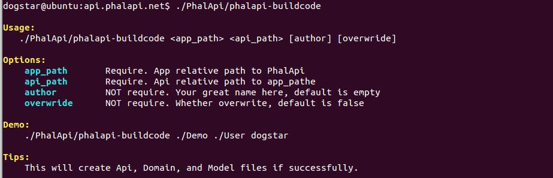  
图3-11 phalapi-buildcode命令的使用说明  

其中，  

 + 第一个参数app_path：是指根目录到你项目的相对路径  
 + 第二个参数api_path：是指待创建接口相对于项目的相对路径，支持多级目录，可不带.php后缀  
 + 第三个参数author：可选参数，你的名字，默认为空
 + 第四个参数overwrite：可选参数，是否覆盖已有的代码文件，默认为否
  
例如，我们现在要新增一个针对库存维度的接口服务类Stock，则可以使用这个命令创建配套的一系列代码模板，包括接口类Api_Stock、领域业务类Domain_Stock、数据模型类Model_Stock。在根目录，执行以下命令，其输出如下：  
```
$ ./PhalApi/phalapi-buildcode Shop Stock
Start to create file /path/to/PhalApi/PhalApi/../Shop/Api/Stock.php ...
Start to create file /path/to/PhalApi/PhalApi/../Shop/Domain/Stock.php ...
Start to create file /path/to/PhalApi/PhalApi/../Shop/Model/Stock.php ...

OK! Stock has been created successfully!
```

创建好代码模板后，可以看到多了几个代码文件。生成的代码文件有：    
```
$ find ./Shop/ -name "Stock*"
./Shop/Api/Stock.php
./Shop/Domain/Stock.php
./Shop/Model/Stock.php
```

查看各个文件，可以看到类似下面这样的代码内容。  

生成的接口类文件，默认带有go()成员函数，并简单调用领域业务类。  
```
$ cat ./Shop/Api/Stock.php 
<?php
/**
 * Api_Stock
 * @author  2017-05-10 01:39:33
 */

class Api_Stock extends PhalApi_Api {

    public function getRules() {
        return array(
            'go' => array(
            ),
        );
    }

    /**
     * go接口
     * @desc go接口描述
     * @return int code 状态码，0表示成功，非0表示失败
     * @return string msg 状态提示
     */
    public function go() {
        $rs = array('code' => 0, 'msg' => '');

        // TODO
        $domain = new Domain_Stock();
        $domain->go();

        return $rs;
    }
}
```

生成的领域业务类，同样带有go()成员函数，并简单调用数据模型类。
```
$ cat ./Shop/Domain/Stock.php 
<?php
/**
 * Domain_Stock
 * @author  2017-05-10 01:39:33
 */

class Domain_Stock {

    public function go() {
        // TODO
        $model = new Model_Stock();
    }
}
```

生成的数据模型类，默认情况下继承于PhalApi_Model_NotORM类。  
```
$ cat ./Shop/Model/Stock.php 
<?php
/**
 * Model_Stock
 * @author  2017-05-10 01:39:33
 */

class Model_Stock extends PhalApi_Model_NotORM {

    protected function getTableName($id) {
        return 'stock';
    }
}
```

随后便可以这代码模板基础上进行快速开发。也可以先尝试访问一下。   
```
$ curl "http://api.phalapi.net/shop/?service=Stock.Go"
{"ret":200,"data":{"code":0,"msg":""},"msg":""}
```

访问在线接口列表文档，也可以看到实时添加了此新建的接口服务```Stock.Go```。

图3-12 新增的Stock接口类  

同样，接口服务```Stock.Go```对应的在线接口详情文档也是可以实时访问的了。  

若重复创建接口服务时，会提示代码已存在，但可以通过使用第四个参数强制覆盖。  
```
$ ./PhalApi/phalapi-buildcode Shop Stock
/path/to/PhalApi/PhalApi/../Shop/Api/Stock.php exists! Stop creating again!
```

当待创建的接口服务类有多级目录时，可以使用目录分割符，例如现在需要创建一个支付宝支付相关的接口服务类Pay_Alipay，则可以：  

```
$ ./PhalApi/phalapi-buildcode Shop Pay/Alipay
Start to create folder /path/to/PhalApi/PhalApi/../Shop/Api/Pay ...
Start to create folder /path/to/PhalApi/PhalApi/../Shop/Domain/Pay ...
Start to create folder /path/to/PhalApi/PhalApi/../Shop/Model/Pay ...
Start to create file /path/to/PhalApi/PhalApi/../Shop/Api/Pay/Alipay.php ...
Start to create file /path/to/PhalApi/PhalApi/../Shop/Domain/Pay/Alipay.php ...
Start to create file /path/to/PhalApi/PhalApi/../Shop/Model/Pay/Alipay.php ...

OK! Pay/Alipay has been created successfully!
```
由于是多级目录，所以在创建代码模板文件前，会先创建未存在的目录。生成的代码和上面类似，这里不再赘述。   

注意，参数应该传Pay/Alipay，而不是Pay_Alipay。即下面这样的使用是错误的：  
```
$ ./PhalApi/phalapi-buildcode Shop Pay_Alipay
```

## 3.7 可重用的扩展类库

PhalApi开源接口框架的一大特色，是提供了可重用的扩展类库，致力于与更多的开源项目一起提供企业级的解决方案。虽然此部分的扩展很多都是基于已有的第三方开源开发实现，但我们所做的不仅仅是代码的搬运工，在某个程度上是在系统架构上对组件库的重用，以及在此通过引入防腐层，避免陷入供应商锁定（Vendor Lock-In）。 

除此之外，在PhalApi框架基础上，快速引入符合实际项目开发需求的扩展类库。你会发现，原来编程本来就是一件如此简单的事情，就像搭积木一样。也正如我们一直推崇的：接口，从简单开始！ 

### 3.7.1 扩展类库简介

PhalApi扩展类库的项目名称为PhalApi-Library，其Github地址是：  
```
https://github.com/phalapi/phalapi-library
```
在国内码云的项目地址是：  
```
http://git.oschina.net/dogstar/PhalApi-Library
```
这两个仓库的代码会同步一致，开发人员可根据自己的喜欢选择使用。  

此仓库下每个目录代表一个扩展类库，，各扩展类库之间相互独立，可以根据需要自动下载安装使用。  

目前，截止编写此书时，已有30多个扩展类库。相信随着开源社区的不断分享，后续将会有更多优秀、可重用的扩展类库。  

表3-4 当前扩展类库列表  

扩展类库目录|扩展类库名称|简要说明
---|---|---
APK|APK文件解包处理|对APK进行解包，支持绝大部分APK文件处理。
Auth|Auth权限扩展|实现了基于用户与组的权限认证功能，与RBAC权限认证类似，主要用于对服务级别的功能进行权限控制。
CLI|CLI扩展类库|可用于开发命令行应用，基于GetOpt，主要作用是将命令参数进行解析和处理。 
Cluster|基于PhalApi的DB集群拓展|为了解决大量数据写入分析的问题，支持大量select、和大量insert。
CryptTraffic|移动设备通信加密|用于移动设备通信加密。 
Excel|PhalApi-Excel|读取Excel。  
Facepp|face++接口|face++接口。
FastRoute|FastRoute快速路由|基于FastRoute实现，通过配置实现自定义路由配置，从而轻松映射service接口服务。
Image|PhalApi-Image图像处理|按照尺寸压缩上传图片，参考自ThinkPhP图形处理。  
KafKa|简单舒适的PHP-KafKa拓展|基于rdKafKa封装的一个简单舒适KafKa拓展。
Log4php|基于log4php的日志扩展|兼容PhalApi日志的接口操作，同时基于log4php完成更多出色的日志工作。
Medoo|Medoo数据库驱动|Medoo数据库驱动。  
OSS|PhalApi-OSS阿里云OSS包|对阿里云的OSS文件服务器的封装。
PHPExcel|PhalApi-PHPExcel扩展|提供了更为强大的Excel处理功能。
PHPMailer|基于PHPMailer的邮件发送|用于发送邮件。
PHPRPC|代理模式下phprpc协议的轻松支持|可用于phprpc协议的调用，服务端只需要简单添加入口即可完美切换。
Pay|基于PhalApi的第三方支付扩展|支持微信支付和支付宝支付。
Payment|微信支付及支付宝支付扩展|支持微信支付和支付宝支付。
Qiniu|七牛云存储接口调用|可用于将图片上传到七牛云存储，或者七牛SDK包提供的其他功能。
RabbitMQ|PhalApi-RabbitMQ队列拓展|基于队列标杆中的RabbitMQ的队列扩展。
Redis|基于PhalApi的Redis拓展|提供更丰富的Redis操作，并且进行了分库处理可以自由搭配。
SMS|PhalApi-SMS容联云短信服务器扩展|基于容联云通讯，发送短信。
Smarty|基于PhalApi的Smarty扩展|基于老牌的PHP模版引擎Smarty，提供视图渲染功能。
SOAP|SOAP扩展|使用PHP官方提供的SOAP协议，用于搭建Web Services。
Swoole|Swoole扩展|基于swoole，支持的长链接和异步任务实现。
Task|计划任务扩展|用于后台计划任务的调度。
ThirdLogin|第三方登录扩展|第三方登录。
Translate|PhalApi-Translate百度地图翻译扩展|基于百度翻译的翻译。
UCloud|图片上传扩展|用于图片文件上传。
User|User用户扩展|提供用户、会话和集成第三方登录。
View|Vuew视图扩展|提供视图渲染功能。
Wechat|微信开发扩展|可用于微信的服务号、订阅号、设备号等功能开发。
Xhprof|性能分析工具PhalApi-Xhprof|对Facebook开源的轻量级PHP性能分析工具进行了封装拓展。
YoukuClient|优酷开放平台接口扩展|用于调用优酷开放平台的接口。
Zip|PhalApi-Zip压缩文件处理|用于处理文件压缩。


### 3.7.2 安装、配置注册与使用

对于某个扩展类库，当需要使用时，可以安装、配置、使用这样的步骤顺序整合到项目。  

#### (1) 安装

扩展类库的安装很简单，直接将PhalApi-Library目录所需要的扩展类库复制到项目的Library目录下即可。  

例如，需要使用七牛云存储扩展Qiniu时，如未签出PhalApi-Library项目，可以签出或下载。  
```
git clone https://git.oschina.net/dogstar/PhalApi-Library.git
```

随后，将七牛云存储扩展的目录Qiniu拷贝到你项目的Library目录下。
```
$ cp /paht/to/PhalApi-Library/Qiniu ./Library/ -R
```

至此，便完成了扩展类库的安装，相当简单。  

#### (2) 配置注册

根据不同的扩展类库，其配置和注册的情况不同，有些不需要配置也不需要注册，有些需要配置、注册中的一种，有些可能配置、注册都需要。这里说的配置是指在项目配置文件./Config/app.php内添加对应扩展类库的配置，配置选项的路径通常为：```app.扩展类库名称```。此外，有的扩展类库可能还需要配置数据库配置文件./Config/dbs.php。而注册则是指将对应的扩展类库注册到DI，注册的服务名称通常为扩展类库的小写名称。  

例如，这里七牛云存储扩展所需要的配置是在./Config/app.php配置文件中追加以下扩展配置。  
```
// $ vim ./Config/app.php
<?php
return array(
    ... ...
    /**
     * 七牛相关配置
     */
    'Qiniu' =>  array(
        // 统一的key
        'accessKey' => '*****',
        'secretKey' => '****',
        // 自定义配置的空间
        'space_bucket' => '自定义配置的空间',
        'space_host' => 'http://XXXXX.qiniudn.com',
    ),
);
```
以上配置值，可结合项目情况相应修改。此七牛云存储扩展目录名称为Qiniu，所在对应的配置路径为：```app.Qiniu```，即对应这样的配置读取：```DI()->config->get('app.Qiniu')```。  

配置好后，便可在初始化文件或者在项目入口文件进行DI注册。  
```
// $ vim ./Public/init.php
DI()->qiniu = new Qiniu_Lite();
```

注册好后，便可以在项目需要的位置进行调用了。  

#### (3) 使用

不同的扩展类库，其提供的功能不同，所以具体的使用也不尽相同。当使用到某个扩展类库时，可以参考对应的文档说明。有的扩展可能需要调用其内部接口才能实现对应的功能，有些扩展可能提供了直接可用的接口服务。  

例如这里的七牛云存储扩展类库，则是提供了直接可用的接口服务。刷新在线接口列表文档后，可以看到多了```Qiniu_CDN.UploadFile```这一接口服务。  
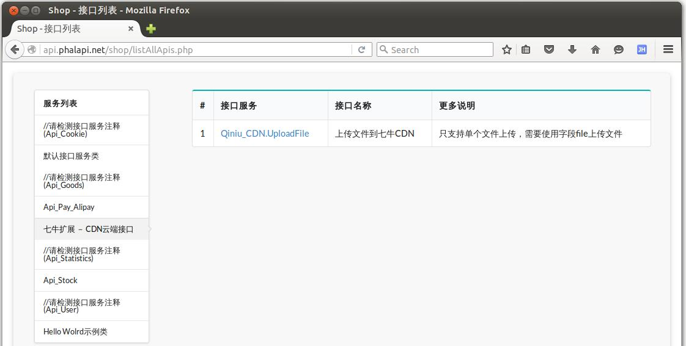   
图3-13 七牛云存储扩展类库提供的接口服务  

我们可以编写一个简单的文件上传页面，测试一下。  
```
// $ vim ./Public/shop/test_qiniu.html
<html>
    <form method="POST" action="/shop/?service=Qiniu_CDN.UploadFile" enctype="multipart/form-data">
        <input type="file" name="file">
        <input type="submit">
    </form>
</html>
```
随后在浏览器访问该页面，并上传一张图片。  
```
http://api.phalapi.net/shop/test_qiniu.html
```
在未正确配置七牛的相关扩展配置前，文件上传是会失败的，例如这里的。  
```
{
    "ret": 200,
    "data": {
        "code": 2,
        "url": "",
        "msg": "fail to upload file"
    },
    "msg": ""
}
```
正确配置后，即可实现上传文件到七牛云存储。

### 3.7.3 常用扩展类库介绍

上面通过七牛云存储扩展，说明了对于扩展类库的安装、配置注册与使用。下面将继续讲解几个有代表性、常用的扩展类库。一个是PhalApi框架内置的扩展：计划任务Task；一个是自主研发的微型框架：Webchat微信开发；最后一个是基于第三方开源框架开发的PHPMailer邮件发送扩展。还有很多其他优秀的扩展类库，由于边幅有限，这里不一一详细讲解。

#### (1) 计划任务Task内置扩展

此扩展类型用于后台计划任务的调度，主要功能点有：

 + 1、提供了Redis/文件/数据库三种MQ队列
 + 2、提供了本地和远程两种调度方式
 + 3、以接口的形式实现计划任务
 + 4、提供统一的crontab调度

下面按安装、使用配置、使用的顺序，依次讲解。最后，我们还会一起来探讨一下此扩展类库的核心设计。   

 + **Task扩展的安装**

此Task扩展已默认内置在PhalApi框架中，位于./Library/Task，所以不需要安装便可直接使用。  

 + **Task扩展的配置**

我们需要在./Config/app.php配置文件中，为此Task扩展追加以下配置： 
```
    /**
     * 计划任务配置
     */
    'Task' => array(
        // MQ队列设置，可根据使用需要配置
        'mq' => array(
            'file' => array(
                'path' => API_ROOT . '/Runtime',
                'prefix' => 'shop_task',
            ),
        ),

        // Runner设置，如果使用远程调度方式，请加此配置
        'runner' => array(
            'remote' => array(
                'host' => 'http://api.phalapi.net/shop/',
                'timeoutMS' => 3000,
            ),
        ),
    ),
```
以上内容看情况需要而配置，如这里使用的是文件队列，你也可以根据需要使用Redis或数据库队列或其它。  

当使用数据库MQ列队时，还需要将以下数据库的配置追加到./Config/dbs.php中的tables配置项。  
```
    'tables' => array(
    	... ...
        // 10张表，可根据需要，自行调整表前缀、主键名和路由
        'task_mq' => array(
            'prefix' => 'phalapi_',
            'key' => 'id',
            'map' => array(
                array('db' => 'db_demo'),
                array('start' => 0, 'end' => 9, 'db' => 'db_demo'),
            ),
        ),
    )
```
同时，需要将/Library/Task/Data/phalapi_task_mq.sql文件的SQL建表语句导入到你的数据库。你也可以在配置数据库后，使用phalapi-buildsql命令重新生成最新的SQL建表语句再导入数据库。

 + **Task扩展的注册**

首先，我们需要在入口文件进行对Task的初始化：
```
// 可以选择你需要的MQ
$mq = new Task_MQ_Redis();  
DI()->taskLite = new Task_Lite($mq);
```

上面示例使用的是Redis队列，而Redis的MQ队列需要以下配置。 
```
    'Task' => array(
        'mq' => array(
            'redis' => array(
                'host' => '127.0.0.1',
                'port' => 6379,
                'prefix' => 'phalapi_task',
                'auth' => '',
            ),
        ),
    ),
```

其中：  

表3-5 Redis的MQ队列配置说明  

选项|是否必须|默认值|说明
---|---|---|---
host|否|127.0.0.1|redis的HOST
port|否|6379|redis的端口
prefix|否|phalapi_task|key的前缀
auth|否||redis的验证，不为空时执行验证

可以这样创建Redis MQ队列：
```
// 方法一：使用app.Task.mq.redis配置
$mq = new Task_MQ_Redis();

// 方法二：外部依赖注入
$redisCache = new PhalApi_Cache_Redis(array('host' => '127.0.0.1'));
$mq = new Task_MQ_Redis($redisCache);
```

Memcached/Memcache的MQ队列，通常队列条目大小不能超过1M，有效期为29天。当需要使用此MQ列列时，需要的配置为：
```
    'Task' => array(
        'mq' => array(
            'mc' => array(
                'host' => '127.0.0.1',
                'port' => 11211,
            ),
        ),
    ),
```

其中：  

表3-6 Memcached/Memcache的MQ队列配置说明    

选项|是否必须|默认值|说明
---|---|---|---
host|否|127.0.0.1|MC的host
port|否|11211|MC端口
  
可以这样创建文件MQ队列：
```
// 方法一：使用app.Task.mq.mc配置
$mq = new Task_MQ_Memcached();

// 方法二：外部依赖注入
$mc = new PhalApi_Cache_Memcached(array('host' => '127.0.0.1', 'port' => 11211));
$mq = new Task_MQ_File($mc);
```

也可以使用文件MQ队列，但通常不能共享，队列大小不限制，有效期为一年。文件MQ需要的配置为：  
```
    'Task' => array(
        'mq' => array(
            'file' => array(
                'path' => API_ROOT . '/Runtime',
                'prefix' => 'phalapi_task',
            ),
        ),
    ),
```

其中：  
  
表3-7 文件MQ队列配置说明  

选项|是否必须|默认值|说明
---|---|---|---
path|否|API_ROOT/Runtime|缓存的文件目录
prefix|否|phalapi_task|key的前缀
  
可以这样创建文件MQ队列：
```
// 方法一：使用app.Task.mq.file配置
$mq = new Task_MQ_File();

// 方法二：外部依赖注入
$fileCache = new PhalApi_Cache_File(array('path' => '/tmp/cache'));
$mq = new Task_MQ_File($fileCache);
```

持久化的MQ队列，还可以使用数据库。数据库MQ队列需要的配置为：
```
    'tables' => array(
        // 10张表，可根据需要，自行调整表前缀、主键名和路由
        'task_mq' => array(
            'prefix' => 'phalapi_',
            'key' => 'id',
            'map' => array(
                array('db' => 'db_demo'),
                array('start' => 0, 'end' => 9, 'db' => 'db_demo'),
            ),
        ),
    )
```
与上面的配置不同，这里是指数据库的配置./Config/dbs.php，而不是项目的配置./Config/app.php。  
  
可以这样创建数据库MQ队列：
```
$mq = new Task_MQ_DB();
```  

最后，还可以使用数组MQ队列。顾明思义，组MQ队列是将MQ存放在PHP的数组里面，用于单元测试或者是一次性、临时性的计划任务调度。
  
可以这样创建数据库MQ队列：
```
$mq = new Task_MQ_Array();
```

配置完MQ队列后，还需要配置调度的方式。调度的方式有两种：本地和远程调度。

本地调度的创建如下：
```
// 每批次弹出10个进行处理
$runner = new Task_Runner_Local($mq, 10);  
```
需要注意的是，每次执行一个计划任务，都会重新初始化必要的DI资源服务。且此调度方式不能用于接口请求时的同步调用。  

远程调度，需要先添加以下配置： 
```
    /**
     * 计划任务配置
     */
    'Task' => array(
        // Runner设置，如果使用远程调度方式，请加此配置
        'runner' => array(
            'remote' => array(
                'host' => 'http://api.phalapi.net/shop/',
                'timeoutMS' => 3000,
            ),
        ),
    ),
```

其中：  
  
表3-8 远程调度配置说明  

选项|是否必须|默认值|说明
---|---|---|---
host|是||接口域名链接
timeoutMS|否|3000|接口超时时间，单位毫秒
  
然后可以这样创建：
```
// 使用默认的连接器 - HTTP + POST的方式
// 每批次弹出10个进行处理
$runner = new Task_Runner_Remote($mq, 10);

// 或者，指定连接器
$connector = new Task_Runner_Remote_Connector_Impl();
$runner = new Task_Runner_Remote($mq, 10, $connector);
```

 + **Task扩展的使用**

Task扩展的使用，又分为两个环节。首先是把待执行的接口服务和相关参数加入到MQ队列，然后再通过统一调度在后台异步执行。  

在上面注册了```DI()->task```服务后，便可通过```Task_MQ::add($service, $params = array())```接口添加待执行的接口服务和相关参数到MQ队列，第一个参数```$service```是待执行的接口服务，第二个可选参数```$params```是传递给待执行接口服务的参数。  

例如待执行的接口服务为```Task.DoSth```，且需要的参数是```&id=1```，那么可以：  
```
DI()->taskLite->add('Task.DoSth', array('id' => 1));
```

这样，就可以把相关的信息加入队列了，通过对应的存储媒介，可以查看到对应的队列信息。在产生了队列后，接下来就是要对此队列进行消费，也就是通过计划任务来进行消费、调度。  

下面是第二个环节的讲解：计划任务的启动。在启动计划任务前，我们需要编写简单的脚本，一如这样：  
```
#!/usr/bin/env php
<?php
require_once '/path/to/Public/init.php';

DI()->loader->addDirs('Demo');

if ($argc < 2) {
    echo "Usage: $argv[0] <service> \n\n";
    exit(1);
}

$service = trim($argv[1]);

$mq = new Task_MQ_Redis();
$runner = new Task_Runner_Local($mq);
$rs = $runner->go($service);

echo "\nDone:\n", json_encode($rs), "\n\n";
```
然后使用nohup或者crontab启动即可。注意上面的挂靠的项目，应该是待执行接口服务所在的目录。而使用的MQ队列，应该和前面配置的MQ保持一致，以便保证写入和消费的是同一个MQ。  

除了上面简单的启动方式外，Task扩展还提供一种具体的、统一的启动方式，即使用crontab的方式。  
  
首先，创建以下表，或参见./Library/Task/Data/phalapi_task_progress.sql文件自行调整表名称前缀。  
```
CREATE TABLE `phalapi_task_progress` (
      `id` bigint(20) NOT NULL AUTO_INCREMENT,
      `title` varchar(200) DEFAULT '' COMMENT '任务标题',
      `trigger_class` varchar(50) DEFAULT '' COMMENT '触发器类名',
      `fire_params` varchar(255) DEFAULT '' COMMENT '需要传递的参数，格式自定',
      `interval_time` int(11) DEFAULT '0' COMMENT '执行间隔，单位：秒',
      `enable` tinyint(1) DEFAULT '1' COMMENT '是否启动，1启动，0禁止',
      `result` varchar(255) DEFAULT '' COMMENT '运行的结果，以json格式保存',
      `state` tinyint(1) DEFAULT '0' COMMENT '进程状态，0空闲，1运行中，-1异常退出',
      `last_fire_time` int(11) DEFAULT '0' COMMENT '上一次运行时间',
      PRIMARY KEY (`id`)
) ENGINE=InnoDB DEFAULT CHARSET=utf8;
```
  
接着，在Linux系统上添加crontab计划任务。  
```
$ crontab -e

*/1 * * * * /usr/bin/php /path/to/PhalApi/Library/Task/crontab.php >> /tmp/phalapi_task_crontab.log 2>&1
```
记得相应调整此crontab.php中挂靠的项目目录，以便能正常自动加载待执行的接口服务。还记得我们一致的风格吗？先挂靠，再使用。  

最后，在数据库配置计划任务。 
```
INSERT INTO `phalapi_task_progress`(title, trigger_class, fire_params, interval_time)  VALUES('你的任务名字', 'Task_Progress_Trigger_Common', 'Task_Demo.DoSth&Task_MQ_File&Task_Runner_Local', '300');
```
注意，在配置时，需要指明MQ和Runner的类型。各个字段的说明，可参考上面的表字段的说明。  

  
这些都配置好后，当再```Task.DoSth```加入到MQ队列时，后台将会定时执行对应的接口服务。即下面这样的代码。  
```
<?php
class Api_Task extends PhalApi_Api {

      public function doSth() {
            // ...
      }
}
```

##### 延伸：计划任务的核心设计解读

在Task这个计划任务中，为了让领域业务更清晰明了，我们采用了设计模式进行了巧妙的设计。下面将介绍这一设计过程。主要是以桥接模式为主模式，慢慢融入适配器模式、模板方法，同时辅以单元测试和小步重构。  

 + **桥接模式 - 数据与行为独立变化**

为了给计划任务一个执行的环境，我们提供了**计划任务调度器**，即：Task_Runner。每个计划任务需要调度的接口是不一样的，即不同的接口服务决定不同的行为；每个行为需要的数据也不一样，即不同的接口参数决定不同的数据。  
  
自然而言的，Task_Runner按照桥接模式，其充当的角色如下：  
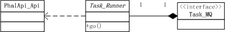  
图3-14 Task_Runner充当的角色  

然后，我们可以分另各自实现接口服务和MQ队列，而让这两者互不影响。  
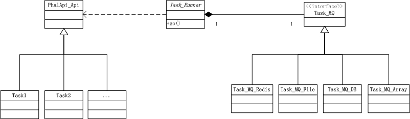 
图3-15 桥接模式在Task扩展中的应用  

 + **适配器模式 - 对象适配器和类适配器**

在对MQ进行实现时，我们提供的Redis MQ队列、文件MQ队列和数据库MQ队列等，都使用了适配器模式，以重用框架已有的功能。其中，Redis MQ队列和文件MQ队列是属于对象适配器，数据库MQ队列是类适配器。对于对象适配器，我们也提供了外部注入，以便客户端在使用时可以轻松定制扩展，当然也可以使用默认的缓存。  
  
至此，整体的UML静态类结构如下所示。  
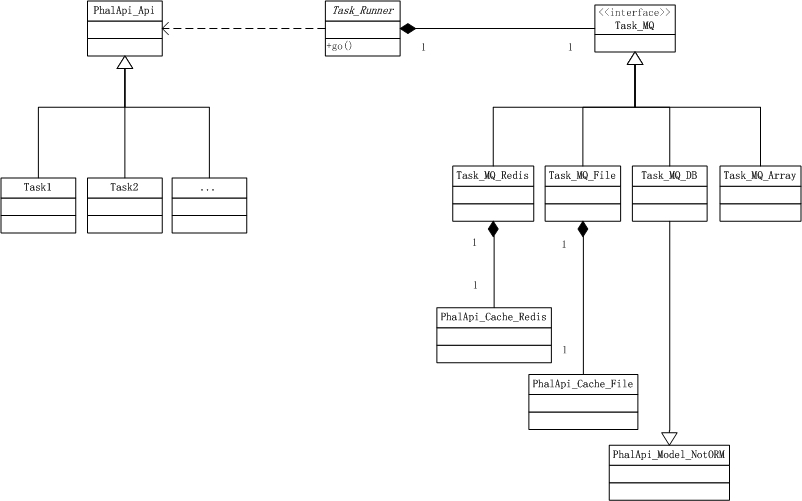  
图3-16 添加适配器后的静态结构  

这样以后，我们可以这样根据创建不同的MQ队列，创建MQ的形式多种多样。 
```
// Redis MQ队列
$mq = Task_MQ_Redis();
// 或
$mq = Task_MQ_Redis(new PhalApi_Cache_Redis(array('host' => '127.0.0.1', 'port' => 6379)));

// 文件MQ队列
$mq = new Task_MQ_File();
// 或
$mq = new Task_MQ_File(new PhalApi_Cache_File(array('path' => '/tmp/cache')));

// 数据库MQ队列
$mq = new Task_MQ_DB();

// 数组MQ队列
$mq = new Task_MQ_Array();
```

 + **模板方法 - 本地和远程两种调度策略**

在完成底层的实现后，我们可以再来关注如何调度的问题，目前可以有本地调度和远程调度两种方式。 

 + 本地调度：是指本地模拟接口的请求，以实现接口的调度
 + 远程调度：是指通过计划任务充当接口客户端，通过请求远程服务器的接口以完成接口的调度
   
为此，我们的设计演进成了这样：
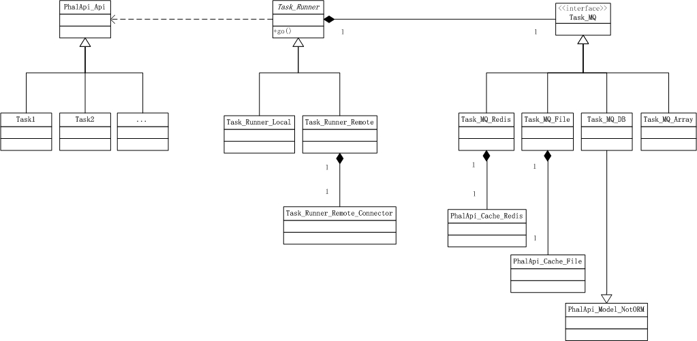  
图3-17 细化调度方式后的静态结构    

上图多了两个调度器的实现类，并且远程调度器会将远程的接口请求功能委托给连接器来完成。  
  
 + **设计审视**

好了！让我们再回头审视这样的设计，是否是属于良好的设计，是否是恰如其分的设计。  
  
首先，我们在高层，也就是规约层得到了很好的约定。不必过多地深入理解计划任务内部的实现细节，也可以轻松得到以下这样的概念流程：    
计划任务调度器（Task_Runner）从MQ队列（Task_MQ）中不断取出计划任务接口服务(PhalApi_Api)进行消费。所以在概念是它是清晰的，很好地体现了计划任务这一领域的核心业务流程。  
   
再往下一层，则是具体的实现，即我们所说的实现层。客户可以根据自己的需要进行选取使用，也可以扩展他们需要的MQ队列。重要的是，他们需要自己实现计划任务的接口服务。  
  
根据爱因斯坦说的，要保持简单，但不要过于简单。为了更好地理解计划任务的运行过程，我们提供了简单的时序图。   
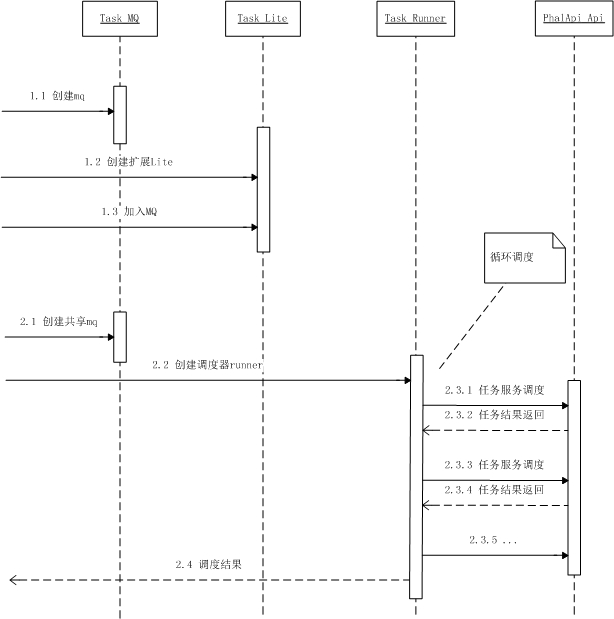  
图3-18 计划任务的时序图  
  
上图主要体现了两个操作流程：加入MQ和MQ消费。其中，注意这两个流程是共享同一个MQ的，否则不能共享数据。同时调度是会进行循环式的调度，并且穷极之。

 + **没有引入工厂方法的原因**

我们在考虑是否需要提供工厂方法来创建计划任务调度器，或者MQ。但发现，设计是如此明了，不必要再引入工厂方法来增加使用的复杂性，因为存在组合的情况。而且，对于后期客户端进行扩展也不利。  
  
当需要启动一个计划任务时，可以这样写：
```
$mq = new Task_MQ_Redis();
$runner = new Task_Runner_Local($mq);

$runner->go('MyTask.DoSth');
```
上面简单的组合可以有：4种MQ * 2种调度 = 8种组合。所以，我们最后决定不使用工厂方法，而是把这种自由组合的权利交给客户端。  

 + **失败重试与并发问题**

除了对计划任务使用什么模式进行探讨外，我们还需要关注计划任务其他运行时的问题。  
  
一个考虑的是失败重试，这一点会发生在远程调度中，因为接口请求可能会超时。这时我们采用的是失败轮循重试。即，把失败的任务放到MQ的最后，等待下一批次的尝试。连接器在进行请求时，也会进行一定次数的超时重试。这里主要是为了预防接口服务器崩溃后的计划任务丢失。  
  
另一个则是并发的问题。这里并没有过多地进行加锁策略。而是把这种需要的实现移交给了客户端。因为加锁会使得计划任务更为复杂，而且有时不一定需要使用，如一个计划任务只有一个进程时，也就是单个死循环的脚本进程的情况。  

 + **完备的单元测试体系**

如果我们未能发现代码中隐藏的问题，或者编写的代码不够优雅，我觉得，要么是因为我们根本尚未使用单元测试，要么是即使应用了单元测试但未频繁使用。来稍微看一下此Task扩展所具备的单元测试体系。对于各种MQ队列，以及两种调度方式都是有对应的单元测试的，而且总入口的测试也有。  

```
$ tree ./Library/Task/Tests/
./Library/Task/Tests/
├── MQ
│   ├── Task_MQ_Array_Test.php
│   ├── Task_MQ_DB_Test.php
│   ├── Task_MQ_File_Test.php
│   ├── Task_MQ_Memcached_Test.php
│   └── Task_MQ_Redis_Test.php
├── Runner
│   ├── Task_Runner_Local_Test.php
│   └── Task_Runner_Remote_Test.php
├── Task_Lite_Test.php
├── Task_Progress_Test.php
├── Task_Runner_Test.php
└── test_env.php

2 directories, 11 files
``` 
在开发扩展类库，包括其他功能开发时，一个比较好的建议是，坚持测试驱动开发，恰当引入设计模式，并小步重构，不断演进。  

 + **客户端的使用**

最后，客户端的使用就很简单了。  
```
$mq = new Task_MQ_Redis();
$taskLite = new Task_Lite();

$taskLite->add('MyTask.DoSth', array('id' => 888));
```

#### (2) Webchat微信开发扩展 

此扩展可用于微信的服务号、订阅号、企业号等功能开发，在PhalApi框架下简单配置即可开发使用。如同Task扩展一样，我们将继续按安装、使用配置、使用的顺序，依次讲解。最后，也会一起来探讨下此扩展类库的核心设计。  

 + **Webchat的安装**

下载PhalApi-Library扩展库后，将Wechat微信开发扩展目录拷贝到你的项目，如：
```
cp /path/to/PhalApi-Library/Wechat ./PhalApi/Library/ -R
```
  
到此安装完毕！接下是扩展的配置。

 + **Webchat的配置**

为了让微信扩展能接收来自微信服务器的信息以及返回信息给用户，需要在./Config/app.php配置文件中追加以下扩展配置。  
```
    /**
     * 微信扩展 - 插件注册
     */
    'Wechat' => array(
        'plugins' => array(
            Wechat_InMessage::MSG_TYPE_TEXT => array('Plugin_Money', 'Plugin_Menu',),
            Wechat_InMessage::MSG_TYPE_IMAGE => array(),
            Wechat_InMessage::MSG_TYPE_VOICE => array(),
            Wechat_InMessage::MSG_TYPE_VIDEO => array(),
            Wechat_InMessage::MSG_TYPE_LOCATION => array(),
            Wechat_InMessage::MSG_TYPE_LINK => array(),
            Wechat_InMessage::MSG_TYPE_EVENT => array(),
            Wechat_InMessage::MSG_TYPE_DEVICE_EVENT => array(),
            Wechat_InMessage::MSG_TYPE_DEVICE_TEXT => array(),
        ),
    ),
```
简单说明一下上面配置的作用，很明显，plugins数组的key对应微信的消息类型，如：文本、位置、语音、图片等；然后是各种消息类型对应的处理的类名，可以有多个，从上到下依次处理。如果觉得配置很多，可以只配置需要用到的消息类型。  

 + **Webchat的注册**

对于微信的开发，我们通常会单独创建一个项目。即使不另建一个单独的项目，也至少需要创建一个单独的访问入口。参考以下入口代码：  
```
$ vim ./Public/shop/weixin.php
<?php
// echo $_GET['echostr'];
// die();

if (!isset($GLOBALS['HTTP_RAW_POST_DATA'])) {
    die('Access denied!');
}

require_once dirname(__FILE__) . '/../init.php';

//装载你的接口
DI()->loader->addDirs('Shop');

/** ---------------- 微信轻聊版 ---------------- **/

$robot = new Wechat_Lite('YourTokenHere...', true);
$rs = $robot->response();
$rs->output();
```

由于微信访问的方式比较独特，在这里不再是简单地进行DI注册即可，我们还要切换到微信下的处理和响应。如上面入口文件中的微信响应，而不再是原来默认的接口响应方式。 
```
$robot = new Wechat_Lite('YourTokenHere...', true);
$rs = $robot->response();
$rs->output();
```

特别地，当首次接入微信时，需要将开头的两句注释去掉，以便通过微信的验证，即：
```
echo $_GET['echostr'];
die();
```

 + **Webchat的使用**

这里通过一个模拟的业务场景，来看一下如何使用此Wechat扩展进行微信下的功能开发。假设快要过年了，各大企业都在派红包，这里，我们也模拟一下微信服务号上红包的派发。   
  
通常地，当需要添加一个新的微信服务号的功能时，可以为两步走：先开发插件，再注册插件。 

插件的功能开发，视具体业务而定。这里由于是模拟红包派发，而非派发真正的微信红包，所以实现非常简单。只需实现Wechat_Plugin_Text文本消息接口，并返回一条图文信息即可。  
```
// $ vim ./Shop/Plugin/Money.php
<?php
class Plugin_Money implements Wechat_Plugin_Text {

    public function handleText($inMessage, &$outMessage) {
        $outMessage = new Wechat_OutMessage_News();

        $item = new Wechat_OutMessage_News_Item();
        $item->setTitle('让红包飞~')
            ->setDescription(sprintf('您已领取到一个%d元红包~', rand(1, 100)))
            ->setPicUrl('http://webtools.qiniudn.com/172906_61c8663a_121026.jpeg')
            ->setUrl('https://www.phalapi.net/');

        $outMessage->addItem($item);
    }
}
````

开发好插件后，需要在配置文件中添加对哪种消息开启使用此新插件。在/Config/app.php配置文件中追加以下配置。  
```
  'Wechat' => array(
    'plugins' => array(
        // 在前面追加红包插件，处理顺序由左到右
        Wechat_InMessage::MSG_TYPE_TEXT => array('Plugin_Money', 'Plugin_Menu', ), 
        ... ...
```

最后，在微信公众号中，访问的效果如下。  
  
图3-19 发红包运行效果，消息中的氛围图来自网络  

 + **Webchat的调试**

为了便于进行微信开发的调试，可使用模拟微信请求的脚本send_wechat_text.php，快速模拟发起请求。以下是对上面发红包的模拟请求。  
```
$ php ./Library/Wechat/Tests/send_wechat_text.php http://api.phalapi.net/shop/weixin.php demo

<xml>
<ToUserName><![CDATA[oWNXvjipYqRViMpO8GZwXxE43pUY]]></ToUserName>
<FromUserName><![CDATA[gh_43235ff1360f]]></FromUserName>
<CreateTime>1494427723</CreateTime>
<MsgType><![CDATA[news]]></MsgType>
<ArticleCount>1</ArticleCount>
<Articles>
<item>
<Title><![CDATA[让红包飞~]]></Title>
<Description><![CDATA[您已领取到一个9元红包~]]></Description>
<PicUrl><![CDATA[http://webtools.qiniudn.com/172906_61c8663a_121026.jpeg]]></PicUrl>
<Url><![CDATA[https://www.phalapi.net/]]></Url>
</item>
</Articles>
<FuncFlag>0</FuncFlag>
</xml>
```
输出的结果，即是对应返回给微信的消息，最终显示的效果与上面的运行效果一样。  

##### 延伸：Wechat扩展的核心设计

Wechat扩展的设计很简单：一进，一出，一机器人。对应的UML静态类结构图如下所示：  
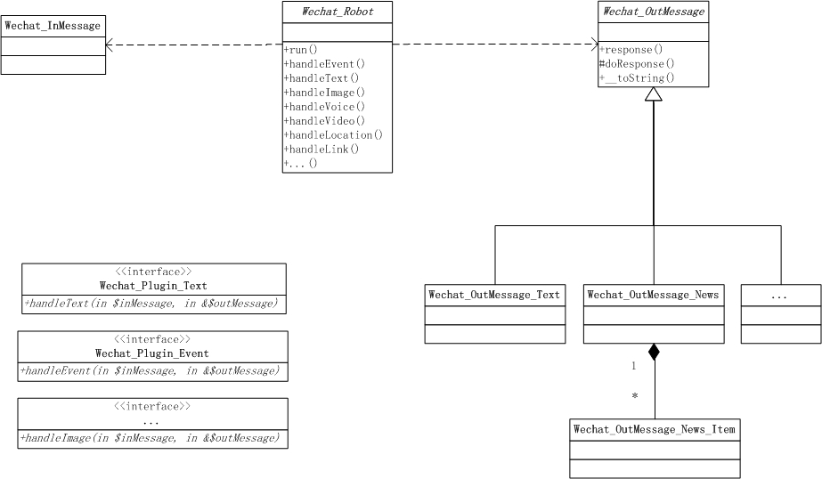  
图3-20 Wechat扩展的静态类结构图  

在左边，是各种微信消息类型，如文本消息、事件消息、图片消息等，属于进来的信息。在右边，是响应返回的消息类型，如文本消息、图文消息等，属于出去的信息。而在中间，则是我们的机器人，它会识别所接收的微信消息类型，继而调用对应消息类型的插件，最后返回插件提供的结果。

最后，再稍微来看一下此扩展类库单元测试的编写情况，如下，可以看到对于核心的业务类，也是有对应的单元测试的。  
```
$ tree ./Library/Wechat/Tests/
./Library/Wechat/Tests/
├── OutMessage
│   ├── Wechat_OutMessage_Image_Test.php
│   ├── Wechat_OutMessage_News_Test.php
│   └── Wechat_OutMessage_Text_Test.php
├── send_wechat_text.php
├── Wechat_InMessage_Test.php
└── Wechat_Robot_Test.php
```

#### (3) 基于PHPMailer的邮件发送扩展 

PHPMailer扩展是基于PHPMailer发送邮件的扩展，此扩展相对于上面的Task和Wechat扩展而言，其安装、配置和使用非常简单。最后，我们也稍微来看一下此扩展类库的实现方式。  

 + **PHPMailer扩展的安装**

下载PhalApi-Library扩展库后，将PHPMailer扩展目录拷贝到你的项目，如：
```
cp /path/to/PhalApi-Library/PHPMailer ./PhalApi/Library/ -R
```
  
到此安装完毕！接下是扩展的配置。

 + **PHPMailer扩展的配置**

需要在./Config/app.php配置文件中追加以下扩展配置。  
```
  'PHPMailer' => array(
    'email' => array(
        'host' => 'smtp.gmail.com',
        'username' => 'XXX@gmail.com',
        'password' => '******',
        'from' => 'XXX@gmail.com',
        'fromName' => 'PhalApi团队',
        'sign' => '<br/><br/>请不要回复此邮件，谢谢！<br/><br/>-- PhalApi团队敬上',
    ),
  ),
```
上面配置内容，可根据项目情况相应调整。其中，host是邮件服务器的域名，username是发件人的邮件地址，password为邮箱密码，from为发件人邮箱，fromName为发件人的名字，最后的sign是邮件内容里最后的签名，使用HTML格式。

 + **PHPMailer扩展的注册**

可以在初始化或入口文件处注册，也可以在需要时创建使用。由于邮件服务使用不多，可以在使用时再创建使用。例如：  
```
$mailer = new PHPMailer_Lite(true);
```

 + **PHPMailer扩展的使用**

创建好实例后，便可以发送邮件了。发送邮件，只需要一行代码，即指定收件人地址、邮件标题和邮件内容。  
```
$mailer->send('chanzonghuang@gmail.com', 'Test PHPMailer Lite', 'something here ...');
```

如果需要发送邮件给多个邮箱时，可以使用数组，例如： 
```
$addresses = array('chanzonghuang@gmail.com', 'test@phalapi.com');
$mailer->send($addresses, 'Test PHPMailer Lite', 'something here ...');
```

 + **PHPMailer扩展的实现方式**

此扩展是基于PHPMailer的邮件发送，PHPMailer开源类库的功能很简单，但在这里只封装了部分功能，即简单的邮件发送。对于这种通过封装，最后只提供复杂接口中的部分操作的场景，适合使用外观模式。开发人员可以在不深入了解PHPMailer开源类库的情况下，快速完成邮件的发送功能。  

与此类似，对于包装了第三方开源类库，或者第三方SDK的扩展类库，都适宜采用外观模式进行简化。  

### 3.7.4 从微架构到扩展类库的演进

在实际项目的开发过程中，也可以有意识地将一些通用的工具和操作与业务分离，方便后续可以在项目内的其他场景更好地重用。当抽离成工具或者通用类后，则可以进一步推广到其他项目使用，封装成扩展类库的形式，复用组件。如果允许，也可以发扬开源精神，分享给社区。这也是符合从微架构到应用构架、系统架构、乃至企业架构的演进之路。 

当需要开发新的扩展类库时，为了统一扩展类库的风格、便于用户快速上手，易于使用，这里建议： 

 + 代码：统一放置在Library目录下，一个扩展包一个目录，尽量以Lite.php文件为入口类，遵循PEAR包命名规范
 + 配置：统一放置在```DI()->config->get('app.扩展包名')```中，避免配置冲突
 + 文档：统一提供对扩展类库的功能、安装和配置、使用示例以及运行效果进行说明的文档


## 3.8 超越HTTP/HTTPS协议

PhalApi默认使用的是HTTP/HTTPS协议，正如我们所介绍的那样，PhalApi还可用于搭建微服务、RESTful接口或Web Services。这一节，我们将一起探讨如何超越HTTP/HTTPS协议，具体有如何使用FastRoute扩展构建RESTful API，使用PHPRPC协议，利用SOAP搭建Web Services，以及创建命令行CLI项目。  

使用不同的协议，或者采用不同的架构风格，主要是影响接口服务的访问方式，因此我们在切换到其他方案时，只要相应调整接口服务的请求与响应即可。接口服务的核心实现通常无须调整即可共用，但根据不同的使用场景，具体的内部实现需要相应调整。例如命令行CLI项目中不存在COOKIE，所以与COOKIE相关的处理代码会失效或需要移除。  

### 3.8.1 构建RESTful API

RESTful是一种架构风格，这里不过多介绍什么是RESTful API，而重点在于介绍如何使用FastRoute扩展快速构建RESTful API。

#### (1) FastRoute扩展的安装

FastRoute扩展是基于开源类库FastRoute开发实现的，需要PHP 5.4.0及以上版本，通过配置实现自定义路由配置可轻松映射到PhalApi中的service接口服务。 
> 参考：FastRoute - Fast request router for PHP：https://github.com/nikic/FastRoute

如前面扩展类库的安装说明，只需要把PhalApi-Library项目中的FastRoute目录拷贝到你项目的Library目录下即可，即：  
```
cp /path/to/PhalApi-Library/FastRoute/ ./PhalApi/Library/ -R
```

#### (2) FastRoute扩展的配置

随后，在项目配置文件./Config/app.php中追加快速路由配置，这部分可以根据项目的需要进行添加配置。  
```
    /**
     * 扩展类库 - 快速路由配置
     */
    'FastRoute' => array(
         /**
          * 格式：array($method, $routePattern, $handler)
          *
          * @param string/array $method 允许的HTTP请求方法，可以为：GET/POST/HEAD/DELETE 等
          * @param string $routePattern 路由的正则表达式
          * @param string $handler 对应PhalApi中接口服务名称，即：?service=$handler
          */
        'routes' => array(
            array('GET', '/user/get_base_info/{user_id:\d+}', 'User.GetBaseInfo'),
        ),
    ),
```
其中，routes数组中的每一个数组表示一条路由配置，第一个参数是允许的HTTP请求方法，可以为：GET/POST/HEAD/DELETE等；第二个参数是路由的正则表达式；第三个参数是对应的接口服务名称，即原来的servcie参数。如上面示例中，配置后访问```/user/get_base_info/1```等效于原来的```/?service=User.GetBaseInfo&user_id=1```。  

这里为了方便理解，假设前面的Shop商城项目中，现在需要添加评论功能，相应地需要提供评论接口服务。显然，评论功能需要发表评论、更新评论、删除评论以及获取评论这些基本功能。对应地，我们可以创建一个新的接口类Api_Comment，并添加对应的成员函数。为简化业务功能，突出RESTful API的构建，假设这里的评论功能很简单，只有评论ID和评论内容这两项。同时，模拟各接口的实现。实现方式很简单，获取相应的参数并简单返回，或者使用一些固定的测试数据。  
```
// $ vim ./Shop/Api/Comment.php
<?php
class Api_Comment extends PhalApi_Api {

    /**
     * 获取评论
     */
    public function get() {
        return array('id' => $this->id, 'content' => '模拟获取：评论内容');
    }

    /**
     * 添加评论
     */
    public function add() {
        return array('id' => 1, 'content' => '模拟添加：' . $this->content);
    }

    /**
     * 更新评论
     */
    public function update() {
        return array('id' => $this->id, 'content' => '模拟更新：' . $this->content);
    }

    /**
     * 删除评论
     */
    public function delete() {
        return array('id' => $this->id, 'content' => '模拟删除：评论内容');
    }
}
```
注意，这里只是为了演示而模拟了返回数据。实际项目中，这些返回字段需根据实际情况而定。 

上面这四个接口服务所需要的参数配置分别如下：  
```
class Api_Comment extends PhalApi_Api {

    public function getRules() {
        return array(
            'get' => array(
                'id' => array('name' => 'id', 'type' => 'int', 'require' => true),
            ),
            'add' => array(
                'content' => array('name' => 'content', 'require' => true),
            ),
            'update' => array(
                'id' => array('name' => 'id', 'type' => 'int', 'require' => true),
                'content' => array('name' => 'content', 'require' => true),
            ),
            'delete' => array(
                'id' => array('name' => 'id', 'type' => 'int', 'require' => true),
            ),
        );
    }

```

对于此评论功能，最终希望构建的RESTful API和原来访问方式的映射关系如下：  

表3-9 评论RESTful API的映射关系

接口服务|原来的HTTP/HTTPS访问方式|新的RESTful访问方式
---|---|---
获取评论|/shop/?service=Comment.Get|GET /shop/comment/{id}
添加评论|/shop/?service=Comment.Add|POST /shop/comment
更新评论|/shop/?service=Comment.Update|POST /shop/comment/{id}
删除评论|/shop/?service=Comment.Delete|DELETE /shop/comment/{id}

为此，我们需要在项目配置文件./Config/app.php中追加的路由配置为：  
```
    /**
     * 扩展类库 - 快速路由配置
     */
    'FastRoute' => array(
        'routes' => array(
            array('GET', '/shop/comment/{id:\d+}', 'Comment.Get'),
            array('POST', '/shop/comment', 'Comment.Add'),
            array('POST', '/shop/comment/{id:\d+}', 'Comment.Update'),
            array('DELETE', '/shop/comment/{id:\d+}', 'Comment.Delete'),
        ),
    ),
```

与其他扩展不同，这里除了需要在项目中进行代码配置外，还需要一项很重要的配置，即服务器的配置，需要把不存在的文件路径交给相应的入口文件进行处理。由于我们这里只是对Shop项目采用了RESTful，所以对于以/shop开头且不存在的URI，要交给./Public/shop/index.php文件进行处理。本书使用的是Nginx，所以在Nginx配置文件调整了文件处理的顺序，以及添加了对应的rewrite规则，下面是对应改动与新增的配置。  
```
    location / {
        try_files $uri $uri/ $uri/index.php;
        #index index.html index.htm index.php;
    }

    if (!-e $request_filename) {
        rewrite ^/shop/(.*)$ /shop/index.php/$1 last;
    }
```    
对于使用Apache或其他服务器的配置也类似，关键是当访问的URI不存在时，需要交由项目的入口文件进行处理。让我们通过示例来逐步分解这一过程，加深对这块的理解。  

例如，请求的URL为：  
```
http://api.phalapi.net/shop/comment
```
由于此路径是不存在的，所以会触发rewrite规则，变成了带有index.php的路径。  
```
http://api.phalapi.net/shop/index.php/comment
```

如果到了这一步，Nginx服务器还提供404，则需要注意是否配置了index.php处理的方式。例如404时出现这样的error.log错误日记：  
```
[error] 2300#0: *9 open() "/path/to/PhalApi/Public/shop/index.php/comment" failed (20: Not a directory), request: "GET /shop/comment HTTP/1.1", host: "api.phalapi.net"
```
这表示，rewrite规则已生效，但未交由/shop/index.php处理，此时可再添加这样的配置。  
```
    location / {
        try_files $uri $uri/ $uri/index.php;
        #index index.html index.htm index.php;
    }
```
根据Nginx的说明，try_files会先判断$uri这个文件是否存在，再判断$uri/这个目录是否存在，最后重定向到$uri/index.php这个文件。至此，再重新访问上面的URL，便可正常响应了。  
```
"GET /shop/comment/1 HTTP/1.1" 200
```

还有一点补充说明一下。由于本书使用的环境是PHP 5.3.10，而FastRoute需要PHP 5.4.0及以上版本。所以针对这一节中FastRoute的演示，我们专门部署了PHP 7.0.0RC环境。其他章节若无特殊说明，仍然使用本书约定的版本PHP 5.3.10。

#### (3) FastRoute扩展的注册

配置好后，接下来就是注册服务。根据情况，可以在初始化文件./Public/init.php注册，也可以在项目入口文件如这里的./Public/shop/index.php注册。而注册FastRoute扩展的具体位置比较关键，应该放置在接口服务响应前，在自定义```DI()->request```注册后，由于FastRoute扩展会对```DI()->request```产生副作用，因此在使用时如果不能满足项目需要，可进行相应调整。这里的注册代码是：  
```
// $ vim ./Public/shop/index.php 
// 显式初始化，并调用分发
DI()->fastRoute = new FastRoute_Lite();
DI()->fastRoute->dispatch();

/** ---------------- 响应接口请求 ---------------- **/
... ...
```

#### (4) FastRoute扩展的使用

最后，我们可以来体验一下FastRoute扩展所带来的RESTful访问效果。在完成前面的安装、配置、注册和具体的（模拟）业务功能开发的准备工作后，客户端便可以按照新的RESTful风格对接口服务进行访问了。    

例如，使用GET方式访问获取评论接口服务，并获取id为1的评论内容。  
```
$ curl "http://api.phalapi.net/shop/comment/1"

{
  "ret": 200,
  "data": {
    "id": 1,
    "content": "模拟获取：评论内容"
  },
  "msg": ""
}
```
等效于原来的：  
```
$ curl "http://api.phalapi.net/shop/?service=Comment.Get&id=1"
```

使用POST方式访问评论接口服务，并添加内容为“test”的评论。  
```
$ curl -d "content=test" "http://api.phalapi.net/shop/comment"

{
    "ret": 200,
    "data": {
        "id": 1,
        "content": "模拟添加：test"
    },
    "msg": ""
}
```
等效于原来的：  
```
$ curl -d "content=test" "http://api.phalapi.net/shop/?service=Comment.Add"
```

使用PUT方式访问更新评论接口服务，并把id为1的评论内容更新为“新的评论内容”。  
```
$ curl -X POST -d "content=新的评论内容" "http://api.phalapi.net/shop/comment/1" 

{
    "ret": 200,
    "data": {
        "id": 1,
        "content": "模拟更新：新的评论内容"
    },
    "msg": ""
}
```
等效于原来的： 
```
$ curl -X POST -d "id=1&content=新的评论内容" "http://api.phalapi.net/shop/?service=Comment.Update"
```

使用DELETE方式访问删除评论接口服务，并删除id为1的评论。  
```
$ curl -X DELETE "http://api.phalapi.net/shop/comment/1"

{
    "ret": 200,
    "data": {
        "id": 1,
        "content": "模拟删除：评论内容"
    },
    "msg": ""
}
```
等效于原来的： 
```
$ curl "http://api.phalapi.net/shop/?service=Comment.Delete&id=1"
```

一切运行良好！在不修改已有接口服务的前提下，通过新增FastRoute扩展，我们就可以轻松完成了RESTful API的构建工作。是不是觉得很有趣？  

如果请求的方法未在FastRoute路由规则配置时，会是怎样呢？我们可以尝试一下使用PUT方式访问上面的服务，例如：  
```
$ curl -X PUT "http://api.phalapi.net/shop/comment/1"  

{
    "ret": 405,
    "data": [],
    "msg": "快速路由的HTTP请求方法错误，应该为：GET/POST/DELETE"
}
```
可以看到，当请求的方法未匹配时，会得到ret = 405的错误返回，并且在提示信息中会注明所允许的访问方式。  

即使不使用FastRoute扩展，你也可以使用其他路由类库，或者自定制RESTful映射规则。这里关键的内容是，将RESTful的路由规则，最终转换成原来对应的service访问方式。此外，使用FastRoute扩展，同时会保留原来HTTP/HTTPS协议通过service指定接口服务的访问方式。  

### 3.8.2 使用PHPRPC协议

在需要使用phprpc协议对外提供接口服务时，可以快速利用PHPRPC扩展类库。你会发现，服务端接口服务已有的代码不需要做任何改动，只需要增加此扩展包和添加一个新入口便可完美切换到phprpc协议。

我们一直都建议在项目中恰当地使用设计模式，以便让代码更优雅。要产出优雅的代码，需要在合适的场景采用合适的设计模式，而不是为了“显学”而生硬套用。而更高层的设计原则和工程思想作为指导，能让设计模式发挥更大的作用。比如在设计PhalApi时，我们引入并应用了很多设计原则，有单一职责原则、开放-封闭原则等。因此，在PHPRPC扩展这里我们可以在phprpc的基础上，利用代理模式优雅地扩展实现phpcpr协议。  

> 参考：phprpc官网：http://www.phprpc.org/  

下面将来介绍如何使用PHPRPC扩展类库，通过phprpc协议对外提供接口服务。 

#### (1) PHPRPC扩展的安装

PHPRPC扩展的安装和其他扩展一样，从PhalApi-Library扩展库中拷贝PHPRPC到你项目的Library目录下即可。  
```
cp /path/to/PhalApi-Library/PHPRPC/ ./PhalApi/Library/ -R
```
到此PHPRPC扩展安装完毕！


#### (2) PHPRPC扩展的入口

和其他扩展不同，PHPRPC扩展不需要配置，也不需要注册DI服务，但需要单独提供一个使用phprpc协议的访问入口。主要区别是，把原来默认的响应处理```PhalApi::reponse()```改成PHPRPC扩展的响应处理```PHPRPC_Lite::response()```。PHPRPC扩展的入口可参考以下实现。  
```
// $ vim ./Public/shop/phprpc.php
<?php
require_once dirname(__FILE__) . '/../init.php';

// 装载你的接口
DI()->loader->addDirs('Shop');
 
$server = new PHPRPC_Lite();
$server->response();
```
和原来的入口文件一样，先加载初始化文件，再装载项目目录，最后使用PHPRPC扩展进行响应。如有其他的入口服务，可在相应的位置进行补充。  

至此，phprpc协议已准备就绪，可以开始使用了。

#### (3) 通过phprpc协议访问接口服务

以Shop项目中的Hello World接口服务```?service=Welcome.Say```为例，演示通过刚才配置的phprpc协议访问此接口服务。  

对于提供了phprpc协议的访问入口，如果再使用HTTP/HTTPS协议访问，会看到类似这样的返回。这表示应该更改成通过phprpc协议的访问方式。  
```
$ curl "http://api.phalapi.net/shop/phprpc.php?service=Welcome.Say"
phprpc_functions="YToxOntpOjA7czo4OiJyZXNwb25zZSI7fQ==";
```

在客户端，根据开发语言可以选择PHPRPC提供的对应的SDK包。这里以PHP版客户端为例，演示如何通过phprpc协议访问接口服务。  
```
<?php
require_once '/path/tophprpc/phprpc_client.php';

$client = new PHPRPC_Client();
$client->setProxy(NULL);
$client->setKeyLength(1000);
$client->setEncryptMode(3);
$client->setCharset('UTF-8');
$client->setTimeout(10);

// 设置phprpc入口链接
$client->useService('http://api.phalapi.net/shop/phprpc.php');

// 准备请求的参数
$params = array('service' => 'Welcome.Say');

// 请求
$data = $client->response(json_encode($params));
var_dump($data);

if ($data instanceof PHPRPC_Error) {
	// TODO: 异常处理
	var_dump($data);
}

// 处理返回的数据
var_dump($data);
```
注意，最后传递的参数，需要进行一次JSON编码后再传递，以便把全部的参数作为数据包一起发送。  

成功请求的情况下，可以看到这样的输出：  
```
array(3) {
  ["ret"]=>
  int(200)
  ["data"]=>
  string(11) "Hello World"
  ["msg"]=>
  string(0) ""
}
```
失败的情况下，则会返回一个PHPRPC_Error实例。类如当入口链接错误时，返回：  
```
object(PHPRPC_Error)#2 (2) {
  ["Number"]=>
  int(1)
  ["Message"]=>
  string(22) "Illegal PHPRPC server."
}
```

为了方便进行phprpc协议下接口服务调用的调试，PHPRPC扩展中提供了一个脚本，可用于通过phprpc协议发起接口服务的请求。例如，上面对Hello World接口服务的请求，可以：  
```
$ ./Library/PHPRPC/check.php "http://api.phalapi.net/shop/phprpc.php" "service=Welcome.Say"
array(3) {
  ["ret"]=>
  int(200)
  ["data"]=>
  string(11) "Hello World"
  ["msg"]=>
  string(0) ""
}
```
输出结果和上面手动编写客户端代码调用的结果一样。  

#### (4) 对客户端的调整

虽然服务端不需要作出太多的改动，但对于客户端来说，需要进行三方面的调整，才能通过phprpc协议调用接口服务，传递参数以及获取返回的结果。  

现分说如下。

 + 调用方式的改变  

首先是客户端调用方式的改变，但值得开心的是，phprpc对很多语言都有对应的SDK包支持。具体可以可参考phprpc官网。  

 + POST参数传递方式的改变

其次是对POST参数传递的改变。考虑到phprpc协议中对POST的数据有一定的复杂性，这里统一作了简化。在前面的示例中也进行了说明，即把全部的参数最后JSON编码传递。对应服务端的解释如下：  
```
    public function response($params = NULL) {
        $paramsArr = json_decode($params, TRUE);
        if ($paramsArr !== FALSE) {
            DI()->request = new PhalApi_Request(array_merge($_GET, $paramsArr));
        }
        ... ...
```
特此约定：通过第一个参数用JSON格式来传递全部原来需要POST的数据。当POST的数据和GET的数据冲突时，以POST为准。   

相应地，当需要传递POST参数时，客户需要这样调整（如PHP下）：
```
$client->response(json_encode($params)));
```
若无此POST参数，则可以忽略不传。

 + 返回结果格式的改变

最后，就是返回结果格式的改变。

在phprpc协议下，因为可以更轻松地获取接口返回的源数据，所以这里也同样不再通过字符串流式的序列返回，如原来的JSON或XML格式，而是直接返回接口的源数据 。如前面示例中，返回的是数组类型。这一点，需要特别注意。  

### 3.8.3 利用SOAP搭建Web Services

当需要使用SOAP时，需要在配置PHP时，通过```--enable-soap```参数开启SOAP。 

#### (1) SOAP扩展的安装

从PhalApi-Library扩展库中的SOAP目录拷贝到你项目的Library目录下即可。  
```
cp /path/to/PhalApi-Library/SOAP/ ./PhalApi/Library/ -R
```
到此SOAP扩展安装完毕！  

#### (2) SOAP扩展的配置

需要将以下扩展配置添加到项目配置文件./Config/app.php。  
```
    /**
     * 扩展类库 - SOAP配置
     * @see SoapServer::__construct ( mixed $wsdl [, array $options ] )
     */
    'SOAP' => array(
        'wsdl' => NULL,
        'options' => array(
            'uri' => 'http://api.phalapi.net/shop/soap.php',
            'port' => NULL,
        ),
    ),
```
其中，wsdl配置对应SoapServer构造函数的第一个参数，options配置则对应第二个参数，其中的uri须与下面的入口文件路径对应。  

#### (3) SOAP服务端访问入口 

SOAP扩展不需要注册DI服务，但需要单独实现访问入口，参考以下实现。
```
// $ vim ./Public/shop/soap.php 
<?php
require_once dirname(__FILE__) . '/../init.php';

// 装载你的接口
DI()->loader->addDirs('Shop');

$server = new SOAP_Lite();
$server->response();
```

至此，SOAP的服务端已搭建完毕。接下来，客户端便可通过SOAP进行访问了。

#### (4) SOAP客户端调用

SOAP客户端的使用，需要使用SoapClient类，其使用示例如下所示。
```
$url = 'http://api.phalapi.net/shop/soap.php';
$params = array('servcie' => 'Welcome.Say');

try {
    $client = new SoapClient(null,
        array(
            'location' => $url,
            'uri'      => $url,
        )
    );

    $data = $client->__soapCall('response', array(json_encode($params)));

    //处理返回的数据。。。
    var_dump($data);
}catch(SoapFault $fault){
    echo "Error: ".$fault->faultcode.", string: ".$fault->faultstring;
}
```
注意，客户端传递的接口参数，最后需要JSON编码后再传递。  

#### (5) SOAP调试脚本

SOAP扩展提供了一个可以发起SOAP访问的脚本，使用示例如下。  
```
$ ./Library/SOAP/check.php http://api.phalapi.net/shop/soap.php "service=Welcome.Say"
array(3) {
  ["ret"]=>
  int(200)
  ["data"]=>
  string(11) "Hello World"
  ["msg"]=>
  string(0) ""
}
```
#### (6) 对客户端的影响

当使用SOAP访问接口服务时，服务端可以通过使用SOAP扩展快速搭建Web Services，但对于客户端，如同使用PHPRPC协议一样，也要进行三方面的调整。这里简单说明一下。   

 + 调用方式的改变  

首先是客户端调用方式的改变，需要通过SOAP协议进行访问。  

 + POST参数传递方式的改变

其次是对POST参数传递的改变。和前面的PHPRPC协议一样，客户端需要把全部的参数JSON编码后再传递。当POST的数据和GET的数据冲突时，以POST为准。   

相应地，当需要传递POST参数时，客户需要这样调整：
```
$data = $client->__soapCall('response', array(json_encode($params)));
```
若无此POST参数，则可以忽略不传。

 + 返回结果格式的改变

和PHPRPC协议一样，客户端接收到的是接口服务直接返回的源数据，不再是序列化后返回的字符串。如前面示例中，返回的是数组类型。   


### 3.8.4 创建命令行CLI项目

虽然PhalApi专门为接口服务而设计，但若需要使用PhalApi构建命令行CLI项目，也是可以轻松定制实现的。这时需要使用到基于GetOpt的CLI扩展类库，其主要作用是完成命令行参数的解析和处理。  

> 参考：GetOpt的Github项目地址为：https://github.com/ulrichsg/getopt-php  

#### (1) CLI扩展类库的安装

从PhalApi-Library扩展库中的CLI目录拷贝到你项目的Library目录下即可。  
```
cp /path/to/PhalApi-Library/CLI/ ./PhalApi/Library/ -R
```
到此CLI扩展安装完毕！  

#### (2) 编写命令行入口文件

使用CLI扩展构建命令行项目，不需要添加扩展配置，也不需要进行DI服务注册，但需要编写一个单独的CLI入口文件。此CLI入口文件可参考原来项目入口文件的实现，如这里的./Public/shop/index.php。文件路径可根据项目需要放置，通常不建议放置外部可访问的目录Public内，但这为了方便演示，保存到了./Public/shop/cli文件。其代码主要有：  
```
// $ vim ./Public/shop/cli

#!/usr/bin/env php
<?php
require_once dirname(__FILE__) . '/../init.php';

// 装载你的接口
DI()->loader->addDirs('Shop');

$cli = new CLI_Lite();
$cli->response();
```
上面的CLI入口文件，与原来的入口文件类似，先是加载初始化文件，再装载项目目录，最后改用CLI扩展进行响应。 

创建好CLI入口文件后，记得需要为其添加执行权限，即：  
```
$ chmod +x ./Public/shop/cli
```

#### (3) 运行和使用

准备好CLI命令行入口后，便试运行一下。  
```
$ ./Public/shop/cli 
Usage: ./Public/shop/cli [options] [operands]
Options:
  -s, --service <arg>     接口服务
  --help 
```
可以看到，需要使用```--service```参数传递接口服务名称，或者使用```-s```缩写形式。  

例如，需要调用Hello World接口服务，可以：  
```
$ ./Public/shop/cli --service Welcome.Say
{"ret":200,"data":"Hello World","msg":""}
```
也可以使用缩写的形式：  
```
$ ./Public/shop/cli -s Welcome.Say
{"ret":200,"data":"Hello World","msg":""}
```

当需要传递更多接口参数时，可以在后面继续添加相应的参数。例如调用商品ID为1的快照信息，需要添加```--id 1```参数。  
```
$ ./Public/shop/cli --service Goods.Snapshot --id 1
```
又如，调用评论接口更新评论ID为1的内容时，需要添加```--id 1```和```--content "通过CLI 提供的评论内容"```这两个参数。  
```
$ ./Public/shop/cli --service Comment.Update --id 1 --content "通过CLI 提供的评论内容"
```
当参数存在空格时，可以像上面这样使用双引号。

再一次，可以看到，接口服务开发好后，通过使用扩展，可轻松切换成其他形式的访问，例如RESTful风格、phprpc协议、CLI命令行等。

#### (4) 获取帮助

命令行项目还有一个颇为有趣功能，那就是常用的帮助信息。当指定接口服务后，若需要查询需要哪些接口参数，可以使用```--help```查看帮助信息，即查看接口参数说明。  

例如，对于获取商品快照信息的```Goods.Snapshot```服务，若需要查看其接口参数有哪些，可以这样：  
```
$ ./Public/shop/cli -s Goods.Snapshot --help
Usage: ./Public/shop/cli [options] [operands]
Options:
  -s, --service <arg>     接口服务
  --help                  
  --id <arg>              商品ID
```
这里的使用说明，会根据配置的接口参数规则自动生成。  

让我们来把前面更新评论的接口服务参数规则再完善一下，补充参数说明，并添加一个带有默认值非必须的author参数。  
```
class Api_Comment extends PhalApi_Api {
    public function getRules() {
        return array(
            'update' => array(
                'id' => array('name' => 'id', 'type' => 'int', 'require' => true, 'desc' => '评论ID'),
                'content' => array('name' => 'content', 'require' => true, 'desc' => '待更新的评论内容'),
                'author' => array('name' => 'author', 'default' => 'nobody', 'desc' => '评论作者'),
            ),
			... ...		
```    
再次查看帮助，可以看到相应更新了。  
```
$ ./Public/shop/cli -s Comment.Update --help

Usage: ./Public/shop/cli [options] [operands]
Options:
  -s, --service <arg>     接口服务
  --help                  
  --id <arg>              评论ID
  --content <arg>         待更新的评论内容
  --author [<arg>]        评论作者
```  

### 3.8.5 小结

//TODO 各种协议、方案的对比。

保留原来的访问
对客户端的影响
接口参数传递
结果返回

## 本章小结
## 参考资料